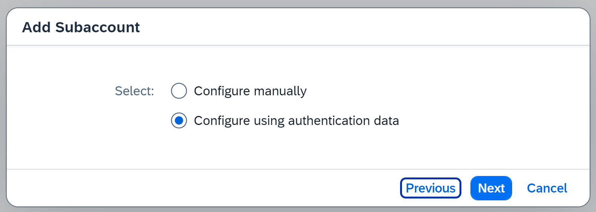
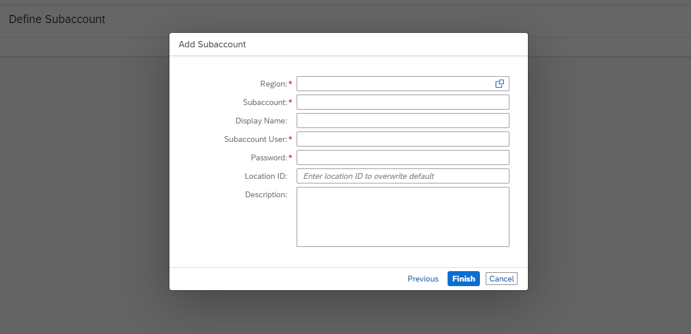
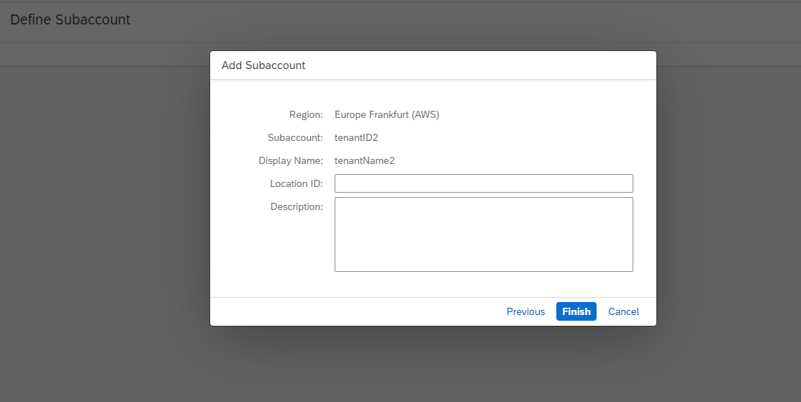
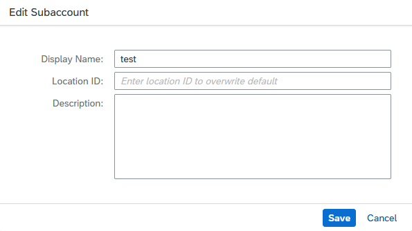

<!-- loiof16df12fab9f4fe1b8a4122f0fd54b6e -->

# Adding and Managing Subaccounts

Add and connect your SAP BTP subaccounts to the Cloud Connector.

> ### Note:  
> This topic refers to subaccount management in the Cloud Connector. If you are looking for information about managing subaccounts on SAP BTP \(Multi-Cloud or Neo environment\), see
> 
> -   [Account Administration](https://help.sap.com/viewer/65de2977205c403bbc107264b8eccf4b/Cloud/en-US/5d62ec89de39442f8f31d527855cbced.html "Learn how to manage global accounts, directories, and subaccounts on SAP BTP using different tools.") :arrow_upper_right: \(Multi-Cloud environment\)
> -   [Administration and Operations, Neo Environment](https://help.sap.com/viewer/ea72206b834e4ace9cd834feed6c0e09/Cloud/en-US/44bfcfbca3684f0eb716ae661c36eef6.html "Learn about the different account administration and application operation tasks which you can perform in the Neo environment.") :arrow_upper_right:

## Context

You can connect to several subaccounts within a single Cloud Connector installation. Those subaccounts can use the Cloud Connector concurrently with different configurations. By selecting a subaccount from the drop-down box, all tab entries show the configuration, audit, and state, specific to this subaccount. In case of audit and traces, cross-subaccount info is merged with the subaccount-specific parts of the UI.

> ### Note:  
> We recommend that you group only subaccounts with the same qualities in a single installation:
> 
> -   Productive subaccounts should reside on a Cloud Connector that is used for productive subaccounts only.
> -   Test and development subaccounts can be merged, depending on the group of users that are supposed to deal with those subaccounts. However, the preferred logical setup is to have separate development and test installations.

<a name="loiof16df12fab9f4fe1b8a4122f0fd54b6e__section_l3v_kv1_vfb"/>

## Prerequisites

You have assigned one of these roles/role collections to the subaccount user that you use for initial Cloud Connector setup, depending on the SAP BTP environment in which your subaccount is running:

<table>
<tr>
<th valign="top">

Environment

</th>
<th valign="top">

Required Roles/Role Collections

</th>
<th valign="top">

More Information

</th>
</tr>
<tr>
<td valign="top">

**Multi-Cloud**

</td>
<td valign="top">

Assign at least one of these *default role collections* \(all of them including the role `Cloud Connector Administrator`\):

-   `Subaccount Administrator`
-   `Cloud Connector Administrator`
-   `Connectivity and Destination Administrator`

Alternatively, you can assign a *custom role collection* to the user that includes the role `Cloud Connector Administrator`.

</td>
<td valign="top">

[Default Role Collections](user-roles-b922fc8.md#loiob922fc8ebe754b3a8184ac1b68231767__table_default_role_collections_setB)

[Role Collections and Roles in Global Accounts, Directories, and Subaccounts](https://help.sap.com/viewer/65de2977205c403bbc107264b8eccf4b/Cloud/en-US/0039cf082d3d43eba9200fe15647922a.html "SAP BTP provides a set of role collections to set up administrator access to your global account and subaccounts.") :arrow_upper_right:

</td>
</tr>
<tr>
<td valign="top">

**Neo**

</td>
<td valign="top">

Assign at least one of these *default roles*:

-   `Cloud Connector Admin` 
-   `Administrator`

Alternatively, you can assign a *custom role* to the user that includes the permission `manageSCCTunnels`.

</td>
<td valign="top">

[Managing Member Authorizations in the Neo Environment](https://help.sap.com/viewer/ea72206b834e4ace9cd834feed6c0e09/Cloud/en-US/a1ab5c4cc117455392cd0a512c7f890d.html "SAP BTP includes predefined platform roles that support the typical tasks performed by users when interacting with the platform. In addition, subaccount administrators can combine various scopes into a custom platform role that addresses their individual requirements.") :arrow_upper_right:

</td>
</tr>
</table>

After establishing the Cloud Connector connection, this user is not needed any more, since it serves only for initial connection setup. You may revoke the corresponding role assignment then and remove the user from the *Members* list.

> ### Note:  
> If the Cloud Connector is installed in an environment that is operated by SAP, SAP provides a user that you can add as member in your SAP BTP subaccount and assign the required role.

<a name="loiof16df12fab9f4fe1b8a4122f0fd54b6e__add"/>

## Adding a Subaccount

Press *Add Subaccount* to define a subaccount. This will open a dialog or wizard through which the Cloud Connector collects the following optional and required information:

1.  \(Optional\) Enter an HTTPS proxy. When in doubt, consult your network administrator to check if a proxy is required.

    > ### Note:  
    > Up to Cloud Connector 2.17.0, the Cloud Connector sends HEAD requests during the configuration process to track the status of the proxy in the Cloud Connector UI. As a prerequisite, the proxy must be configured to allow those HEAD requests. Otherwise, it closes the connection and you get the message *Proxy is not operational \(status code 503\)*.
    > 
    > As of Cloud Connector 2.17.1, HEAD requests will only be sent to the entered proxy in error situations, to create more meaningful error messages identifying the root cause of the error, for example, if the entered proxy is considered as unknown host, or if it does not run on the specified port.

    

2.  In the next step, you can choose between a *manual* configuration and a *file-based* configuration.

    *File-based* configuration lets you use an authentication data file downloaded from your subaccount on SAP BTP, Multi-Cloud Foundation to simplify and accelerate subaccount configuration in the Cloud Connector.

    > ### Restriction:  
    > The option *File-based configuration* does not work for subaccounts in the **Neo** environment.

    

3.  \(Skip if you have selected *file-based* configuration\) For *manual* configuration, the following dialog is shown:

    

    1.  The *<Region\>* field specifies the SAP BTP region that should be used such as *Europe \(Rot\)*, for example. Both a value help and a drop-down box with suggestions while typing are available.

        > ### Remember:  
        > The available regions and region domains depend on the SAP BTP environment you are using. For more information, see [Regions](https://help.sap.com/docs/btp/sap-business-technology-platform/regions?version=Cloud) \(Multi-Cloud environment\) or [Regions and Hosts Available for the Neo Environment](https://help.sap.com/docs/btp/sap-btp-neo-environment/regions-and-hosts-available-for-neo-environment?version=Cloud).

        > ### Note:  
        > You can also configure a region yourself, if it is not part of the standard list. Either insert the region host manually, or create a custom region, as described in [Configure Custom Regions](configure-custom-regions-a994a75.md).

    2.  For *<Subaccount\>*, enter the value you obtained when you registered your subaccount on SAP BTP.

        > ### Note:  
        > For a subaccount in the **Multi-Cloud** environment, you must enter the subaccount **ID** as *<Subaccount\>*, rather than its actual \(technical\) name. For information on getting the subaccount ID, see [Find Your Subaccount ID \(Multi-Cloud Environment\)](find-your-subaccount-id-multi-cloud-environment-b43eff2.md).

    3.  *<Subaccount User\>* and *<Password\>* require dedicated values, depending on the type of identity provider \(IDP\) you are using:

        > ### Note:  
        > For more information on IDPs in the **Multi-Cloud** environment, see [Trust and Federation with Identity Providers](https://help.sap.com/docs/btp/sap-business-technology-platform/trust-and-federation-with-identity-providers?version=Cloud).

        -   *SAP ID Service* \(Default\):

            -   User/password from SAP ID Service must be used.

                > ### Note:  
                > For a subaccount in the **Multi-Cloud** environment, you must provide your `Login E-mail` as *<Subaccount User\>* instead of a user ID. The user must be a member of the global account the subaccount belongs to.

            -   The user must be a member of the subaccount, and the subaccount must have the correct \(SAP ID Service\) user base.

            > ### Note:  
            > Alternatively, you can add a new subaccount user in the SAP BTP cockpit, assign the required authorization \(see section [Prerequisites](initial-configuration-db9170a.md#loiodb9170a7d97610148537d5a84bf79ba2__prereq)\), and use the new user and password.
            > 
            > For a **Neo** subaccount, you can also add a new subaccount user with the role `Cloud Connector Admin` from the *Members* tab in the SAP BTP cockpit and use the new user and password.

        -   *Custom IDP* \(IAS tenant\):
            -   **Neo** subaccount:
                -   User/password from the configured IAS tenant must be provided.
                -   The user must be a member of the subaccount, and the subaccount must have the correct \(IAS tenant\) user base.

            -   **Multi-Cloud** subaccount:
                -   For a subaccount in the **Multi-Cloud** environment, the Cloud Connector supports the use of a custom IDP via single sign-on \(SSO\) passcode.

                    For more information, see [Use a Custom IDP for Subaccount Configuration](use-a-custom-idp-for-subaccount-configuration-2022612.md).

        > ### Note:  
        > The Cloud Connector does not yet support *SAP Universal ID*. Please use your S-user or P-user credentials for the *<subaccount user\>* and *<password\>* fields instead.
        > 
        > For more information, see SAP note [3085908](https://me.sap.com/notes/3085908).

        For the **Neo** environment, see also [Add Members to Your Neo Subaccount](https://help.sap.com/viewer/ea72206b834e4ace9cd834feed6c0e09/Cloud/en-US/a253570f081e448d9f78fc2bfeedfdc3.html "Add users as members to a subaccount in the Neo environment and assign roles to them using the SAP BTP cockpit.") :arrow_upper_right:.

        For the **Multi-Cloud** environment, see also [Add Org Members](https://help.sap.com/viewer/65de2977205c403bbc107264b8eccf4b/Cloud/en-US/a4eeaf179ee646b99558f27c0bae7b3e.html "In the SAP BTP cockpit, add users as org members and assign roles to grant the users access to information, such as user and quota information in a Cloud Foundry org.") :arrow_upper_right:.

        > ### Tip:  
        > When using SAP Cloud Identity Services - Identity Authentication \(IAS\) as platform identity provider with two-factor authentication \(2FA / MFA\) for your subaccount, you can simply append the required token to the regular password. For example, if your password is "eX7?6rUm" and the one-time passcode is "123456", you must enter "eX7?6rUm123456" into the *<Password\>* field.
        > 
        > **Appending the two-factor authentication** \(2FA / MFA\) token to the regular password **is not required** when performing the initial configuration for a Cloud Connector subaccount in the **Neo environment**.

    4.  \(Optional\) You can define a *<Display Name\>* that lets you easily recognize a specific subaccount in the UI compared to the technical subaccount name.
    5.  \(Optional\) You can define a *<Location ID\>* identifying the location of this Cloud Connector for a specific subaccount. The location ID is used as routing information. It lets you connect multiple Cloud Connectors to a single subaccount. If you don't specify any value for *<Location ID\>*, the default \(empty string\) is used. The location ID must be unique per subaccount and should be an identifier that can be used in a URI. To route requests to a Cloud Connector with a location ID, the location ID must be configured in the respective destinations.
    6.  \(Optional\) You can provide a *<Description\>* of the subaccount that becomes a part of the subaccount's detail information.

        > ### Note:  
        > Location ID and description can be changed later on at any time.

    7.  Choose *Finish*.

4.  \(Skip if you have selected *manual* configuration\) For the *file-based* approach using authentication data, the following dialog is shown:

    

    > ### Note:  
    > The obtained subaccount authentication data you plan to apply is valid only for a few minutes. Therefore, you need to apply the subaccount authentication data immediately after fetching it from the cloud side.

    To download the authentication data file **from your subaccount in the SAP BTP cockpit**, perform the following steps:

    1.  Log on to the SAP BTP cockpit and choose the subaccount you'd like to connect to.
    2.  Go to section *Connectivity* \> *Cloud Connectors* and press *Download Authentication Data*.
    3.  Go back to the Cloud Connector *Add Subaccount* dialog and select *Add subaccount authentication data from file*.
    4.  Choose the file containing the authentication data and press *Next*.

        You can then review the data extracted from the file, as well as optionally enter a location ID and a description \(see steps 3d and 3e for details on the latter two properties\).

    If you have the authentication data **available as a string from your SaaS solution**:

    1.  Select *Enter subaccount authentication data*.
    2.  Paste it as text.
    3.  Press *Next*.

    

    When done, press *Finish*.

The Cloud Connector now starts a handshake with SAP BTP and attempts to establish a secure TLS tunnel to the server that hosts the subaccount in which your cloud applications are running. However, no requests are yet allowed to pass from the cloud side to any of your internal backend systems. To allow your cloud applications to access specific internal backend systems, proceed with [Configure Access Control](configure-access-control-f42fe44.md).

> ### Note:  
> The internal network must allow access to the port. Specific configuration for opening the respective port\(s\) depends on the firewall software used. The default ports are `80` for HTTP and `443` for HTTPS. For RFC communication, you must open a gateway port \(default: `33+<instance number>` and an arbitrary message server port. For a connection to a HANA Database \(on SAP BTP\) via JDBC, you must open an arbitrary *outbound* port in your network. Mail \(SMTP\) communication is not supported.

-   If you later want to change your proxy settings \(for example, because the company firewall rules have changed\), choose *Configuration* from the main menu and go to the *Cloud* tab, section*HTTPS Proxy*. Some proxy servers require credentials for authentication. In this case, you must provide the relevant user/password information.

    

-   If you want to change the description for your Cloud Connector \(don't confuse with the description of subaccounts\), choose *Configuration* from the main menu, go to the *Cloud* tab, section *Connector Info* and edit the description:

    

## Subaccount Dashboard

In the subaccount dashboard, you can check the state of all subaccount connections managed by this Cloud Connector at a glance.

In the screenshot above, the subaccount with display name **account2** \(the actual subaccount ID starts with *3b3feb49*-\) is already connected, but has no active resources exposed. All other subaccounts are connected with exposed resources and are fully operational. In addition, depending on the connection state, the dashboard allows you to do disconnect and connect subaccounts by pressing the respective button in the **Actions** column. You may also view details of, delete, or select a subaccount and navigate to its overview page with the respective buttons from the **Actions** column. The sort buttons for the columns **Subaccount** and **Display Name** let you sort the entries of the respective column either ascending or descending. The filter buttons in the column headers allow to filter based on the entries of the respective column.

The filter buttons above the dashboard let you filter the shown subaccounts based on the connection status, showing either *all subaccounts*, *all connected ones*, *all disconnected ones*, *all subaccounts currently in connecting or reconnecting status*, or *all subaccounts for which establishing the connection has failed*.

If you want to connect an additional subaccount with your on-premises landscape, press the *Add Subaccount* button.

> ### Remember:  
> Keep in mind that the specification of an HTTPS proxy is only offered when establishing the first connection.

## Next Steps

-   To modify an existing subaccount, choose the *Edit* icon and change the *<Display Name\>*, *<Location ID\>* and/or *<Description\>*.

    

-   You can also delete a subaccount from the list of connections.The subaccount will be disconnected and all configurations will be removed from the installation.
-   Navigate to the overview page of a subaccount using the rightmost action button of the dashboard table to see further details and perform more tasks, such as exporting or importing the subaccount configuration, for example:

    

**Related Information**  

[Managing Member Authorizations in the Neo Environment](https://help.sap.com/viewer/ea72206b834e4ace9cd834feed6c0e09/Cloud/en-US/a1ab5c4cc117455392cd0a512c7f890d.html "SAP BTP includes predefined platform roles that support the typical tasks performed by users when interacting with the platform. In addition, subaccount administrators can combine various scopes into a custom platform role that addresses their individual requirements.") :arrow_upper_right:

[Copy a Subaccount Configuration](copy-a-subaccount-configuration-513d129.md "Copy an existing subcaccount configuration in the Cloud Connector to another subaccount.")

[Renew the Certificate for a Subaccount](renew-the-certificate-for-a-subaccount-071708a.md "Certificates used by the Cloud Connector are issued with a limited validity period. To prevent a downtime while refreshing the certificate, you can renew it for your subaccount directly from the administration UI.")

[Find Your Subaccount ID \(Multi-Cloud Environment\)](find-your-subaccount-id-multi-cloud-environment-b43eff2.md "Get your subaccount ID to configure the Cloud Connector in the Multi-Cloud environment.")

[Configure Custom Regions](configure-custom-regions-a994a75.md "Configure regions that are not available in the standard selection.")

[Use a Custom IDP for Subaccount Configuration](use-a-custom-idp-for-subaccount-configuration-2022612.md "Enable custom identity provider (IDP) authentication to configure a Cloud Foundry subaccount in the Cloud Connector by using a one-time passcode.")

