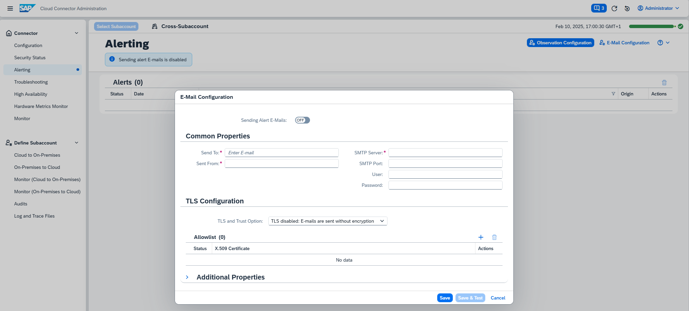
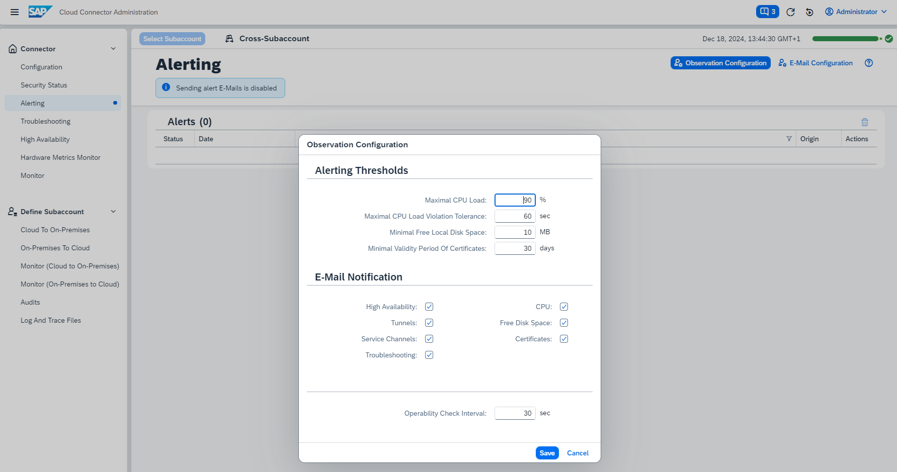

<!-- loio87bffd934192418bbb866aedd1442ad8 -->

# Alerting

Configure the Cloud Connector to send E-mail messages when situations occur that may prevent it from operating correctly.

To configure alert E-mails, choose *Alerting* from the top-left navigation menu.

You must specify the receivers of the alert E-mails \(*E-Mail Configuration*\) as well as the Cloud Connector resources and components that you want to monitor \(*Observation Configuration*\). The corresponding *Alert Messages* are also shown in the Cloud Connector administration UI.


## E-Mail Configuration

1.  Select *E-Mail Configuration* to specify the list of E-mail addresses to which alerts should be sent \(*Send To*\).

    > ### Note:  
    > You can assign E-mail addresses in compliance with RFC 2822. For example, john.doe@company.com or John Doe <j.doe@company.com\> are valid E-mail addresses.

2.  Enter the sender's E-mail address \(*<Sent From\>*\).
3.  In *<SMTP Server\>* provide the host of the mail server.
4.  You can specify an *<SMTP port\>*, if the server is not using the default ports. For details, contact your E-mail administrator or provider.
5.  If the SMTP server requires authentication, provide *<User\>* and *<Password\>*.
6.  Set up TLS Configuration as required. The default is sending E-mails without encryption. For more information, see [Configure Trust](configure-trust-13bfb28.md).
7.  In the *Additional Properties* section you can provide any property supported by the [Java Mail library](https://javaee.github.io/javamail/docs/api/com/sun/mail/smtp/package-summary.html). Additionally, you can set `mail.debug` to `true` in order to get SMTP protocol debug output. All specified properties will be passed to the SMTP client.
8.  Select *Save* to change the current configuration.

> ### Note:  
> Use the switch at the top of the dialog to enable or disable alert E-mails. Bear in mind that alert E-mails will not be sent out retroactively when switching on. Only alerts created while sending is enabled will trigger an E-mail.



> ### Note:  
> Connections to an SMTP server over TLS can cause TLS errors if the SMTP server uses an "untrusted" certificate. For more information on specifying a trust store, see [Configure Trust](configure-trust-13bfb28.md).
> 
> If you want to modify the JDK's trust storage, see the JDK documentation. Usually, the trust storage is done in the file *cacerts* in the Java directory \(`jre/lib/security/cacerts`\). For import, you can use the *keytool* utility:
> 
> ```
> keytool -import -storepass changeit -file <certificate used by SMTP server> -keystore cacerts -alias <for example, SMTP_xyz> 
> ```
> 
> For more information, see [https://docs.oracle.com/cd/E19830-01/819-4712/ablqw/index.html](https://docs.oracle.com/cd/E19830-01/819-4712/ablqw/index.html).


## Observation Configuration

In this section you can configure the surveillance of pivotal resources and components of the Cloud Connector: Alerts will be triggered as soon as any of the components or resources is deemed to malfunction, or is considered to be in a critical state. Additionally, E-mails will be sent as per E-mail configuration and the settings under *E-Mail Notification*.



-   *High Availability* alerts can occur in the context of an active high availability setup, meaning a shadow system is connected.
-   *Tunnels* and *Service Channels* refer to the state of the respective connections. Whenever such a connection cannot be opened or is lost, an alert is triggered.

    > ### Note:  
    > These alerts are only triggered in case of an error or exception, but not upon intentional disconnect action.

-   An excessively high *CPU* load over an extended period of time adversely affects performance and may be an indicator of serious issues that jeopardize the operability of the Cloud Connector. The CPU load is monitored and an alert is triggered whenever the CPU load exceeds and continues to exceed a given threshold percentage \(the default is 90%\) for more than a given period of time \(the default is 60 seconds\).
-   Although the Cloud Connector does not require nor consume large amounts of disk space, running out of it is a circumstance that you should avoid as Cloud Connector configuration files could get corrupted. An alert is triggered if the **Free Disk Space** falls below a critical value \(default is 10 megabytes\).
-   The Cloud Connector configuration contains various *Certificates*. Whenever one of those expires, scenarios might no longer work as expected so it's important to get notified about the expiration \(the default is 30 days\).

    > ### Caution:  
    > Trust store certificates are server certificates \(issued by a CA\) of systems that the Cloud Connector communicates with. As the Cloud Connector does not own those certificates, alerts are not triggered for the certificates in a trust store. Alerts are generated only for certificates, for which the Cloud Connector owns the private key as well.

-   As of version 2.18.0, there is a Troubleshooting feature that detects certain issues and provides diagnoses consisting of possible causes and potential fixes to resolve the respective issues. Whenever a new diagnosis is added, an alert is triggered.

    For more information, see [Monitoring, Logging, and Troubleshooting](monitoring-logging-and-troubleshooting-e7df7f1.md).


To configure the components to be monitored, proceed as follows:

1.  Choose suitable values for the **Alerting Thresholds**. The selected thresholds will be examined every 30 seconds by default as per **Operability Check Interval**.
2.  If you want to change the **Operability Check Interval**, enter the number of seconds of your choice into the respective field at the bottom.
3.  E-mails will be sent by default for all observation categories if **E-Mail Configuration** is set up to do so. Uncheck those for which you do not want to receive E-mail notification. Use the **Sending Alert E-Mails** switch \(of the **E-Mail Configuration** dialog\) if you want to enable or disable E-mail notification for all categories.
4.  Press Save to change the current configuration.


## Alert Messages

The Cloud Connector lists all alerts it triggers in a table on the main page, sorted by date \(most recent alerts first\). However, theCloud Connector does not dispatch the same alert repeatedly. That is, recurring issues or persistent critical situations do not reproduce the same alert over and over. As soon as an issue or a critical situation has been resolved or overcome, an informational alert is generated, sent out and listed, replacing the original alert.

You can remove alerts using *Delete* or *Delete All*. If you delete active \(unresolved\) alerts, they reappear in the list after the next health check interval.

