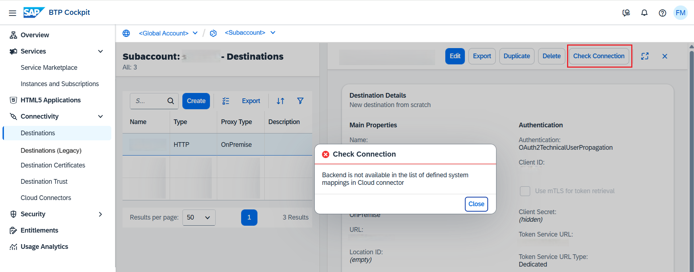

<!-- loio71ea3ccf4ebc4c63a3989c0b318e3e9b -->

# Check the Availability of a Destination

How to check the availability of a destination in the *Destinations* editor \(SAP BTP cockpit\).

## Prerequisites

You have logged into the cockpit and opened the *Destinations* editor.

## Context

You can use the *Check Connection* button in the *Destinations* editor of the cockpit to verify if the `URL` configured for an HTTP Destination is reachable and if the connection to the specified system is possible.

For each destination, the check button is available in the destination detail view.

> ### Note:  
> The check does not guarantee that the target system or service is operational. It only verifies if a connection is possible.

This check is supported for destinations with *<Proxy Type\>* `Internet` and `OnPremise`:

-   For `Internet` destinations:

    -   If the check receives an **HTTP status code above or equal to 500** from the targeted URL, the check is considered **failed**.
    -   Every **HTTP status code below 500** is treated as **successful**.

    > ### Restriction:  
    > The targeted URL cannot be a private endpoint \(for example, *localhost*\).

-   For `OnPremise` destinations:
    -   If the targeted backend is reached and returns an **HTTP status code below 500** the check is considered **successful**.

## Error Messages for OnPremise Destinations

<table>
<tr>
<th valign="top">

Error Message

</th>
<th valign="top">

Reason

</th>
<th valign="top">

Action

</th>
</tr>
<tr>
<td valign="top">

*Backend status could not be determined.* 

</td>
<td valign="top">

-   The Cloud Connector version is less than 2.7.1.
-   The Cloud Connector is not connected to the subaccount.
-   The backend returns an HTTP status code above or equal to 500 \(server error\).
-   The Cloud Connector is not configured properly.

</td>
<td valign="top">

-   Upgrade the Cloud Connector to version 2.7.1 or higher.

-   Connect the Cloud Connector to the corresponding subaccount.
-   Check the server status \(availability\) of the backend system.
-   Check the basic Cloud Connector configuration steps:

    [Initial Configuration](initial-configuration-db9170a.md)

</td>
</tr>
<tr>
<td valign="top">

*Backend is not available in the list of defined system mappings in Cloud Connector.* 

</td>
<td valign="top">

The Cloud Connector is not configured properly.

</td>
<td valign="top">

Check the basic Cloud Connector configuration steps:

[Initial Configuration](initial-configuration-db9170a.md)

</td>
</tr>
<tr>
<td valign="top">

*Resource is not accessible in Cloud Connector or backend is not reachable.* 

</td>
<td valign="top">

The Cloud Connector is not configured properly.

</td>
<td valign="top">

Check the basic Cloud Connector configuration steps:

[Initial Configuration](initial-configuration-db9170a.md)

</td>
</tr>
<tr>
<td valign="top">

*Backend is not reachable from Cloud Connector.* 

</td>
<td valign="top">

Cloud connector configuration is ok but the backend is not reachable.

</td>
<td valign="top">

Check the backend \(server\) availability.

</td>
</tr>
</table>

