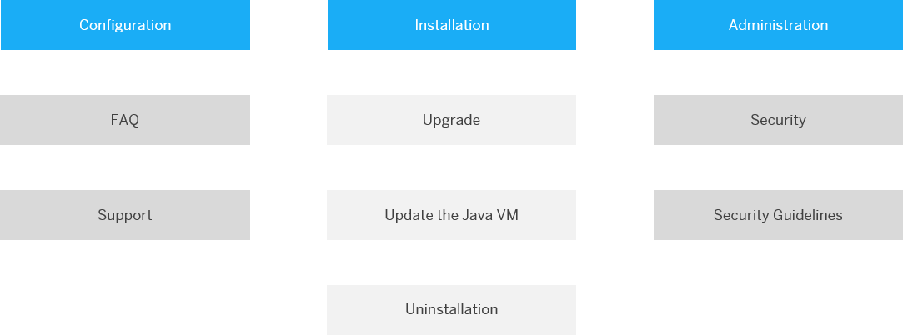
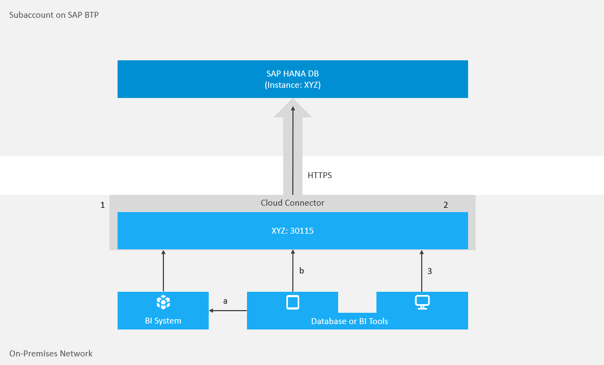

<!-- loioe6c7616abb5710148cfcf3e75d96d596 -->

# Cloud Connector

Learn more about the Cloud Connector: features, scenarios and setup.

> ### Note:  
> This documentation refers to SAP BTP, Multi-Cloud Foundation. If you are looking for information about the Neo environment, see [Connectivity for the Neo Environment](https://help.sap.com/viewer/b865ed651e414196b39f8922db2122c7/Cloud/en-US/5ceb84290d5644638f73d40fde3af5d0.html).

<a name="loioe6c7616abb5710148cfcf3e75d96d596__content"/>

## Content

**In this Topic**

Hover over the elements for a description. Click an element for more information.

**In this Guide**

Hover over the elements for a description. Click an element for more information.

<a name="loioe6c7616abb5710148cfcf3e75d96d596__context"/>

## Context

The Cloud Connector:

-   Serves as a link between SAP BTP applications and on-premises systems.
    -   Combines an easy setup with a clear configuration of the systems that are exposed to the SAP BTP.
    -   Lets you use existing on-premises assets without exposing the entire internal landscape.

-   Runs as on-premises agent in a secured network.
    -   Acts as a reverse invoke proxy between the on-premises network and SAP BTP.

-   Provides fine-grained control over:
    -   On-premises systems and resources that can be accessed by cloud applications.
    -   Cloud applications using the Cloud Connector.

-   Lets you use the features that are required for business-critical enterprise scenarios.
    -   Recovers broken connections automatically.
    -   Provides audit logging of inbound traffic and configuration changes.
    -   Can be run in a high-availability setup.

Back to [Content](cloud-connector-e6c7616.md#loioe6c7616abb5710148cfcf3e75d96d596__content)

<a name="loioe6c7616abb5710148cfcf3e75d96d596__advantages"/>

## Advantages

Compared to the approach of opening ports in the firewall and using reverse proxies in the DMZ to establish access to on-premises systems, the Cloud Connector offers the following benefits:

-   You don't need to configure the on-premises firewall to allow external access from SAP BTP to internal systems. For allowed outbound connections, no modifications are required.
-   The Cloud Connector supports HTTP as well as additional protocols. For example, the RFC protocol supports native access to ABAP systems by invoking function modules.
-   You can use the Cloud Connector to connect on-premises databases or BI tools to SAP HANA databases in the cloud.
-   The Cloud Connector lets you propagate the identity of cloud users to on-premises systems in a secure way.
-   Easy installation and configuration, which means that the Cloud Connector comes with a low TCO and is tailored to fit your cloud scenarios.
-   SAP provides standard support for the Cloud Connector.

Back to [Content](cloud-connector-e6c7616.md#loioe6c7616abb5710148cfcf3e75d96d596__content)

<a name="loioe6c7616abb5710148cfcf3e75d96d596__scenarios"/>

## Basic Scenarios

[Connecting Cloud Applications to On-Premises Systems](cloud-connector-e6c7616.md#loioe6c7616abb5710148cfcf3e75d96d596__onpremise)

[Connecting On-Premises Database Tools to SAP HANA Databases](cloud-connector-e6c7616.md#loioe6c7616abb5710148cfcf3e75d96d596__hana)

> ### Note:  
> This section refers to the Cloud Connector installation in a standard on-premises network. Find setup options for other system environments in [Extended Scenarios](cloud-connector-e6c7616.md#loioe6c7616abb5710148cfcf3e75d96d596__extended).

**Connecting Cloud Applications to On-Premises Systems**

1.  Install the Cloud Connector: [Installation](installation-57ae3d6.md)
2.  Set up the connection between Cloud Connector, back-end system and your SAP BTP subaccount : [Initial Configuration](initial-configuration-db9170a.md), [Adding and Managing Subaccounts](adding-and-managing-subaccounts-f16df12.md)
3.  Allow your cloud application to access a back-end system on the intranet: [Configure Access Control](configure-access-control-f42fe44.md)
4.  Connect your cloud application to an on-premises system:

    [Consuming the Connectivity Service](consuming-the-connectivity-service-313b215.md)\(Cloud Foundry environment\)

Back to [Basic Scenarios](cloud-connector-e6c7616.md#loioe6c7616abb5710148cfcf3e75d96d596__scenarios) 

Back to [Content](cloud-connector-e6c7616.md#loioe6c7616abb5710148cfcf3e75d96d596__content)

**Connecting On-Premises Database Tools to SAP HANA Databases**

> ### Restriction:  
> This scenario is only available for the Neo environment.

1.  Install and configure the Cloud Connector: [Installation](https://help.sap.com/docs/connectivity/sap-btp-connectivity-neo/installation?version=Cloud), [Initial Configuration](https://help.sap.com/docs/connectivity/sap-btp-connectivity-neo/cloud-connector-initial-configuration?version=Cloud), [Adding and Managing Subaccounts](https://help.sap.com/docs/connectivity/sap-btp-connectivity-neo/managing-subaccounts?version=Cloud)
2.  Access HANA databases on SAP BTP: [Configure a Service Channel for an SAP HANA Database](https://help.sap.com/viewer/b865ed651e414196b39f8922db2122c7/Cloud/en-US/3dc28b456bb64fad89084d2d10af602c.html "Using Cloud Connector service channels, you can establish a connection to an SAP HANA database in SAP BTP that is not directly exposed to external access.") :arrow_upper_right:
3.  Connect on-premises database or BI tools to a HANA database on SAP BTP: [Connect DB Tools to SAP HANA via Service Channels](https://help.sap.com/viewer/b865ed651e414196b39f8922db2122c7/Cloud/en-US/64d6a510e98941d28dbff2fc8179f175.html "") :arrow_upper_right:

> ### Note:  
> You can use service channels also for other purposes:
> 
> -   Connect to a virtual machine on SAP BTP \(**Neo** environment only\).
> -   Configure an RFC connection from your on-premises system to S/4HANA Cloud \(**Neo** and **Multi-Cloud** environment\).
> -   Connect to a service in a Kubernetes cluster \(**Multi-Cloud** environment only\)
> 
> See also:
> 
> [Using Service Channels](using-service-channels-16f6342.md) \(**Multi-Cloud** environment\)
> 
> [Using Service Channels](https://help.sap.com/docs/connectivity/sap-btp-connectivity-neo/using-service-channels?version=Cloud) \(**Neo** environment\)

Back to [Basic Scenarios](cloud-connector-e6c7616.md#loioe6c7616abb5710148cfcf3e75d96d596__scenarios) 

Back to [Content](cloud-connector-e6c7616.md#loioe6c7616abb5710148cfcf3e75d96d596__content)

<a name="loioe6c7616abb5710148cfcf3e75d96d596__extended"/>

## Extended Scenarios

Besides the standard setup: *SAP BTP - Cloud Connector - on-premises system/network*, you can also use the Cloud Connector to connect SAP BTP applications to other cloud-based environments, as long as they are operated in a way that is comparable to an on-premises network from a functional perspective. This is particularly true for infrastructure \(IaaS\) hosting solutions.

Here's an overview of all environments in which you can or cannot set up the Cloud Connector:

<table>
<tr>
<th valign="top">

Cloud Connector

</th>
<th valign="top">

Environment

</th>
<th valign="top">

Examples

</th>
</tr>
<tr>
<td valign="top" rowspan="3">

**Can** be set up in:

> ### Note:  
> Within extended scenarios that allow a Cloud Connector setup, special procedures may apply for configuration. If so, they are mentioned in the corresponding configuration steps.

</td>
<td valign="top">

Customer on-premises network \(see [Basic Scenarios](cloud-connector-e6c7616.md#loioe6c7616abb5710148cfcf3e75d96d596__scenarios)\)

</td>
<td valign="top">

SAP ERP, SAP S/4HANA

</td>
</tr>
<tr>
<td valign="top">

SAP Hosting

</td>
<td valign="top">

SAP HANA Enterprise Cloud \(HEC\)

</td>
</tr>
<tr>
<td valign="top">

Third-party **IaaS** providers \(hosting\)

</td>
<td valign="top">

Amazon Web Services \(AWS\), Microsoft Azure, Google Cloud

</td>
</tr>
<tr>
<td valign="top" rowspan="4">

**Cannot** be set up in:

</td>
<td valign="top">

SAP **SaaS** solutions

</td>
<td valign="top">

SAP SuccessFactors, SAP Concur, SAP Ariba

</td>
</tr>
<tr>
<td valign="top">

SAP cloud-based enterprise solutions

</td>
<td valign="top">

SAP S/4HANA Cloud \(public edition\), SAP C/4HANA

</td>
</tr>
<tr>
<td valign="top">

Third-party **PaaS** providers

</td>
<td valign="top">

AWS, Azure, Google Cloud

</td>
</tr>
<tr>
<td valign="top">

Third-party **SaaS** providers

</td>
<td valign="top">

 

</td>
</tr>
</table>

Back to [Content](cloud-connector-e6c7616.md#loioe6c7616abb5710148cfcf3e75d96d596__content)

<a name="loioe6c7616abb5710148cfcf3e75d96d596__tasks"/>

## Basic Tasks

The following steps are required to connect the Cloud Connector to your SAP BTP subaccount:

-   Install the Cloud Connector: [Installation](installation-57ae3d6.md)

-   Perform the initial configuration for the Cloud Connector: [Initial Configuration](initial-configuration-db9170a.md)
-   Register the Cloud Connector for your SAP BTP subaccount: [Adding and Managing Subaccounts](adding-and-managing-subaccounts-f16df12.md)

Back to [Content](cloud-connector-e6c7616.md#loioe6c7616abb5710148cfcf3e75d96d596__content)

<a name="loioe6c7616abb5710148cfcf3e75d96d596__whatsnew"/>

## What's New?

Follow the SAP BTP [Release Notes](https://help.sap.com/doc/43b304f99a8145809c78f292bfc0bc58/Cloud/en-US/98bf747111574187a7c76f8ced51cfeb.html?sel1=Connectivity) to stay informed about Cloud Connector and Connectivity updates.

Back to [Content](cloud-connector-e6c7616.md#loioe6c7616abb5710148cfcf3e75d96d596__content)

**Related Information**  

[Installation](installation-57ae3d6.md "Choose a procedure to install the Cloud Connector on your operating system.")

[Configuration](configuration-ec68ee2.md "Configure the Cloud Connector to make it operational for connections between your SAP BTP applications and on-premises systems.")

[Administration](administration-dfec06d.md "Learn more about operating the Cloud Connector, using its administration tools and optimizing its functions.")

[Security](security-cb50b61.md "Learn how Cloud Connector features help you manage security.")

[Upgrade](upgrade-7a7cc37.md "Upgrade your Cloud Connector and avoid connectivity downtime during the update.")

[Update the Java VM](update-the-java-vm-0eb9851.md "How to update the Java VM used by the Cloud Connector.")

[Uninstallation](uninstallation-d53395c.md "Uninstall an installer version or portable version of the Cloud Connector.")

[Frequently Asked Questions](frequently-asked-questions-f8d6f9a.md "Answers to the most common questions about the Cloud Connector.")

[REST APIs](rest-apis-ede0776.md "Find general information on the Cloud Connector REST APIs.")

