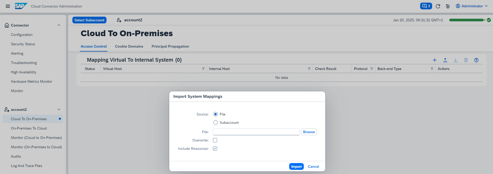

<!-- loiof42fe4471d6a4a5fb09b7f3bb83c66a4 -->

# Configure Access Control

Specify the backend systems that can be accessed by your cloud applications.

To allow your cloud applications to access a certain backend system on the intranet, you must specify this system in the Cloud Connector. The procedure is specific to the protocol that you are using for communication.

Find the detailed configuration steps for each communication protocol here:

[Configure Access Control \(HTTP\)](configure-access-control-http-e7d4927.md)

[Configure Access Control \(RFC\)](configure-access-control-rfc-ca58689.md)

[Configure Access Control \(LDAP\)](configure-access-control-ldap-e4ba9b3.md)

[Configure Access Control \(TCP\)](configure-access-control-tcp-befd437.md)

<a name="loiof42fe4471d6a4a5fb09b7f3bb83c66a4__section_r1n_z2k_kgb"/>

## Copy Access Control Settings

Adding a new subaccount is not of any use unless you expose the systems you want to be available for this subaccount in the access control settings. You can copy the complete access control settings from another subaccount on the same Cloud Connector, or from a file, by using the import/export mechanism provided by the Cloud Connector.

You can find detailed information, for example the entry creation date for access control or resource entries, by choosing the *Details* button in the **Actions** column.

## Export Access Control Settings

1.  From your subaccount menu, choose *Cloud To On-Premises* and select the tab *Access Control*.
2.  To store the current settings in a ZIP file, choose *Download* icon in the upper-right corner.
3.  You can later import this file into a different Cloud Connector.

<a name="loiof42fe4471d6a4a5fb09b7f3bb83c66a4__section_tkl_jsw_1bc"/>

## Import Access Control Settings

There are two locations from which you can import access control settings:

-   A file that was previously exported from a Cloud Connector
-   A different subaccount on the same Cloud Connector

Two additional options define the behavior of the import:

-   *Overwrite*: Select this checkbox if you want to replace existing system mappings with imported ones. Do not select this checkbox if you want to keep existing mappings and only import the ones that are not yet available \(default\).

    > ### Note:  
    > A system mapping is uniquely identified by the combination of virtual host and port.

-   *Include Resources*: When this checkbox is selected \(default\), the resources that belong to an imported system are also imported. Otherwise no resources are imported, that is, imported system mappings do not expose any resources.

<a name="loiof42fe4471d6a4a5fb09b7f3bb83c66a4__section_ukl_jsw_1bc"/>

## Backend Types

When creating a new access control entry, you can select one of the following backend types :

<table>
<tr>
<th valign="top">

Type

</th>
<th valign="top">

Supported Protocols

</th>
<th valign="top">

Type-Specific Features

</th>
</tr>
<tr>
<td valign="top">

ABAP System

</td>
<td valign="top">

HTTP\(S\), RFC\(S\), TCP\(S\)

</td>
<td valign="top">

Supports:

-   ABAP-specific connection check features
-   [URL mangling for BSPs](https://community.sap.com/t5/additional-blogs-by-sap/bsp-in-depth-url-mangling/ba-p/12859663) 

</td>
</tr>
<tr>
<td valign="top">

Non-SAP System

</td>
<td valign="top">

HTTP\(S\), TCP\(S\), LDAP\(S\)

</td>
<td valign="top">

 

</td>
</tr>
<tr>
<td valign="top">

Other SAP System

</td>
<td valign="top">

HTTP\(S\), TCP\(S\)

</td>
<td valign="top">

 

</td>
</tr>
<tr>
<td valign="top">

SAP Application Server Java

</td>
<td valign="top">

HTTP\(S\)

</td>
<td valign="top">

 

</td>
</tr>
<tr>
<td valign="top">

SAP Business Connector

</td>
<td valign="top">

HTTP\(S\)

</td>
<td valign="top">

 

</td>
</tr>
<tr>
<td valign="top">

SAP Composition Environment

</td>
<td valign="top">

HTTP\(S\)

</td>
<td valign="top">

 

</td>
</tr>
<tr>
<td valign="top">

SAP Gateway

</td>
<td valign="top">

HTTP\(S\), RFC\(S\), TCP\(S\)

</td>
<td valign="top">

Supports:

-   [URL mangling for BSPs](https://community.sap.com/t5/additional-blogs-by-sap/bsp-in-depth-url-mangling/ba-p/12859663)

</td>
</tr>
<tr>
<td valign="top">

SAP HANA

</td>
<td valign="top">

HTTP\(S\), TCP\(S\)

</td>
<td valign="top">

 

</td>
</tr>
<tr>
<td valign="top">

SAP Process Integration

</td>
<td valign="top">

HTTP\(S\)

</td>
<td valign="top">

 

</td>
</tr>
</table>

**Related Information**  

[Configure Access Control \(HTTP\)](configure-access-control-http-e7d4927.md "Specify the backend systems that can be accessed by your cloud applications using HTTP.")

[Configure Access Control \(RFC\)](configure-access-control-rfc-ca58689.md "Specify the backend systems that can be accessed by your cloud applications using RFC.")

[Configure Access Control \(LDAP\)](configure-access-control-ldap-e4ba9b3.md "Add a specified system mapping to the Cloud Connector if you want to use an on-premises LDAP server or user authentication in your cloud application.")

[Configure Access Control \(TCP\)](configure-access-control-tcp-befd437.md "Add a specified system mapping to the Cloud Connector if you want to use the TCP protocol for communication with a backend system.")

[Configure Accessible Resources](configure-accessible-resources-3b12086.md "Configure backend systems and resources in the Cloud Connector, to make them available for a cloud application.")

[Configure Domain Mappings for Cookies](configure-domain-mappings-for-cookies-b7d257b.md "")

