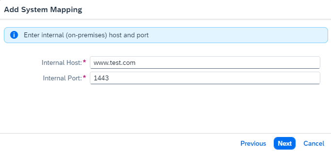
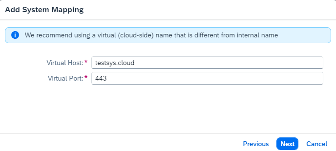
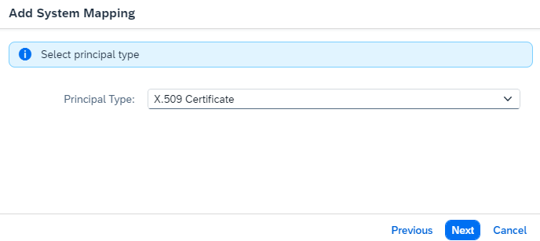
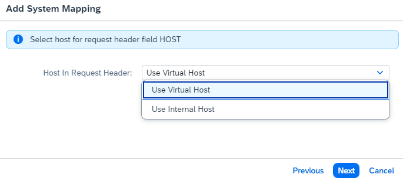
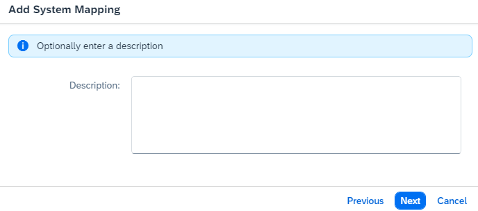
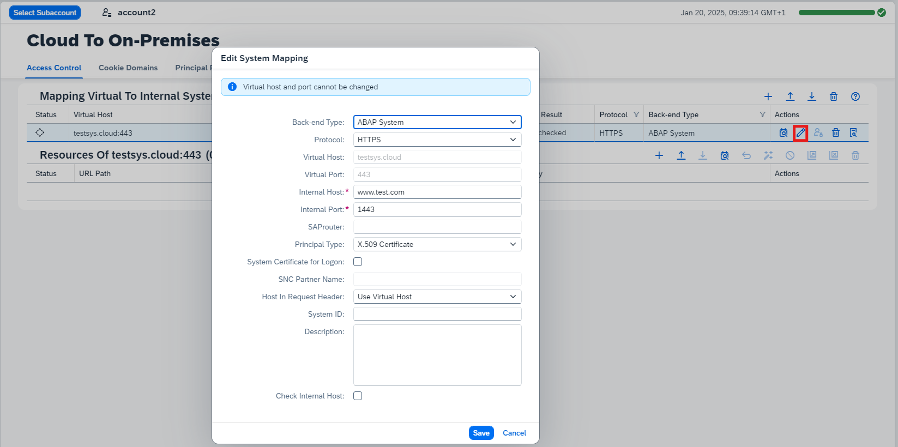
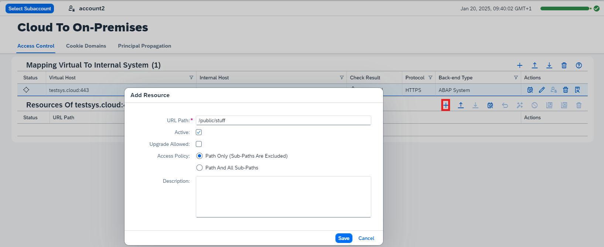

<!-- loioe7d4927dbb571014af7ef6ebd6cc3511 -->

# Configure Access Control \(HTTP\)

Specify the backend systems that can be accessed by your cloud applications using HTTP.

To allow your cloud applications to access a certain backend system on the intranet via HTTP, you must specify this system in the Cloud Connector.

> ### Note:  
> Make sure that also redirect locations are configured as internal hosts.
> 
> If the target server responds with a redirect HTTP status code \(30x\), the cloud-side HTTP client usually sends the redirect over the Cloud Connector as well. The Cloud Connector runtime then performs a reverse lookup to rewrite the location header that indicates where to route the redirected request.
> 
> If the redirect location is ambiguous \(that is, several mappings point to the same internal host and port\), the first one found is used. If none is found, the location header stays untouched.

<a name="loioe7d4927dbb571014af7ef6ebd6cc3511__content"/>

## Tasks

[Expose Intranet Systems](configure-access-control-http-e7d4927.md#loioe7d4927dbb571014af7ef6ebd6cc3511__expose)

[Limit the Accessible Services for HTTP\(S\)](configure-access-control-http-e7d4927.md#loioe7d4927dbb571014af7ef6ebd6cc3511__limit)

[Activate or Suspend Resources](configure-access-control-http-e7d4927.md#loioe7d4927dbb571014af7ef6ebd6cc3511__fly)

<a name="loioe7d4927dbb571014af7ef6ebd6cc3511__expose"/>

## Expose Intranet Systems

Insert a new entry in the Cloud Connector access control management:

1.  Choose *Cloud To On Premise* from your *Subaccount* menu.
2.  Choose *Add*. A wizard will open and ask for the required values.
3.  *Backend Type*: Select the description that matches best the addressed backend system.

    When you are done, choose *Next*.

    

4.  *Protocol*: This field allows you to decide whether the Cloud Connector should use `HTTP` or `HTTPS` for the connection to the backend system. Note that this is completely independent from the setting on cloud side. Thus, even if the HTTP destination on cloud side specifies "`http://`" in its URL, you can select `HTTPS`. This way, you are ensured that the entire connection from the cloud application to the actual backend system \(provided through the TLS tunnel\) is TLS-encrypted. The only prerequisite is that the backend system supports HTTPS on that port. For more information, see [Initial Configuration \(HTTP\)](initial-configuration-http-3f974ea.md).

    -   If you specify HTTPS and there is a "system certificate" imported in the Cloud Connector, the latter attempts to use that certificate for performing a client-certificate-based logon to the backend system.
    -   If there is no system certificate imported, the Cloud Connector opens an HTTPS connection without client certificate.

    

5.  *Internal Host* and *Internal Port* specify the actual host and port under which the target system can be reached within the intranet. It needs to be an existing network address that can be resolved on the intranet and has network visibility for the Cloud Connector without any proxy. Cloud Connector will try to forward the request to the network address specified by the internal host and port, so this address needs to be real.

    

6.  *Virtual Host* identifies the host name exactly as specified in the *<URL\>* property of the HTTP destination configuration in SAP BTP.

    See: [Create HTTP Destinations](create-http-destinations-783fa1c.md) \(Cloud Foundry environment\)

    The virtual host can be a fake name and does not need to exist.

    > ### Note:  
    > In some scenarios, underscores \("\_"\) may not be allowed for the virtual host name. In these cases, an *HTTP 400 Bad Request* error message will be shown.

    The *Virtual Port* allows you to distinguish between different entry points of your backend system, for example, `HTTP`/`80` and `HTTPS`/`443`, and to have different sets of access control settings for them. For example, some non-critical resources may be accessed by HTTP, while some other critical resources are to be called using HTTPS only. The fields are prepopulated with the values of the *Internal Host* and *Internal Port*. If you don't modify them, you must provide your internal host and port also in the cloud-side destination configuration or in the URL used for your favorite HTTP client.

    

7.  *Allow Principal Propagation* \(available as of Cloud Connector 2.15\): Defines if any kind of principal propagation should be allowed over this mapping. If not selected, go to step 9.

    

8.  *Principal Type* 
    -   *Procedure for Cloud Connector version 2.15 and higher:*

        Defines what kind of principal is sent to the backend within the HTTP request. For the principal type `X.509 Certificate` \(if a principal is sent from the cloud side\), the principal is injected as an HTTP header \(`SSL_CLIENT_CERT`\) and forwarded to the backend. There, depending on the backed configuration, it can be used for authentication.

        

    -   *Procedure for Cloud Connector versions below 2.15:*

        You can use two different variants of an X.509 certificate to define the principal type that is sent to the backend within the HTTP request: `X.509 Certificate (General Usage)` or `X.509 Certificate (Strict Usage)`. The latter was introduced with Cloud Connector 2.11.

        If a principal is sent from the cloud side, it is injected in both cases as an HTTP header \(`SSL_CLIENT_CERT`\) and forwarded to the backend. If the backend is configured correctly for principal propagation, this certificate can be used for authentication.

        However, if the cloud side does not send a principal, the variants behave differently:

        -   *General Usage* \(as well as *<Principal Type\>* = `None`\) allows to alternatively use the *system* certificate for the *TLS handshake* \(actually used for trust\) also for authentication.
        -   *Strict Usage* does not allow this. In this case, another authentication type \(specified in an additional header\) is used instead, for example, basic authentication.

        This setting also applies to HTTP authentication types other than principal propagation.

        > ### Note:  
        > The recommended variant is `X.509 Certificate (Strict Usage)` as this lets you use principal propagation and, for example, basic authentication over the same access control entry, regardless of the logon order settings in the target system.

        To prevent the use of principal propagation to the target system, choose `None` as *<Principal Type\>*. In this case, no principal is injected.

        For more information on principal propagation, see [Configuring Principal Propagation](configuring-principal-propagation-c84d4d0.md).

9.  *System Certificate for Logon* \(available as of Cloud Connector 2.15\): Specifies if the Cloud Connector's system certificate should be used for authentication at the backend, if

    1.  No principal is received, or

    2.  Principal propagation is not allowed over this mapping at all.

    If *activated*, the system certificate of the TLS handshake used for trust is also used for authentication.

    If *not activated*, an additional HTTP header \(`SSL_CLIENT_CERT`\) is sent. It indicates to the target system that the system certificate used for trust must not be used for authentication.

    While unselected, another authentication method is used, for example, basic authentication.

    > ### Note:  
    > We recommend that you **keep this option deactivated**, as this lets you use principal propagation and basic authentication over the same access control entry, regardless of the logon order settings in the target system.

    

10. *Host In Request Header* lets you define, which host is used in the host header that is sent to the target server. By choosing `Use Internal Host`, the actual host name is used. When choosing `Use Virtual Host`, the virtual host is used. In the first case, the virtual host is still sent via the `X-Forwarded-Host` header.

    

11. \(Optional\): You can enter the *System ID*:

    

12. You can enter an optional description at this stage. The respective description will be shown when pressing the *Info* button of the access control entry \(table *Mapping Virtual to Internal System*\).

    

13. The summary shows information about the system to be stored and when saving the host mapping, you can trigger a ping from the Cloud Connector to the internal host, using the *Check availability of internal host* checkbox. This allows you to make sure the Cloud Connector can indeed access the internal system, and allows you to catch basic things, such as spelling mistakes or firewall problems between the Cloud Connector and the internal host.

    If the ping to the internal host is successful \(that is, the host is reachable via TLS\), the state ***Reachable*** is shown. If it fails, a warning pops up. You can view issue details by choosing the *Details* button, or check them in the log files.

    This check also tries to perform client authentication if possible, regardless of the host's availability. Find additional information and hints by choosing the *Details* button. You can check, for example, if the system certificate acting as a client certificate is configured correctly, and if the ABAP backend trusts it.

    You can execute the availability check for all selected systems in the *Access Control* overview by pressing the button  \(*Check availability...*\) in column *Actions*.

    

14. Optional: You can later edit such a system mapping \(via *Edit*\) to make the Cloud Connector route the requests for `sales-system.cloud:443` to a different backend system. This can be useful if the system is currently down and there is a back-up system that can serve these requests in the meantime. However, you cannot edit the virtual name of this system mapping. If you want to use a different fictional host name in your cloud application, you must delete the mapping and create a new one.

    

Back to [Tasks](configure-access-control-http-e7d4927.md#loioe7d4927dbb571014af7ef6ebd6cc3511__content)

<a name="loioe7d4927dbb571014af7ef6ebd6cc3511__limit"/>

## Limit the Accessible Services for HTTP\(S\)

In addition to allowing access to a particular host and port, you also must specify which URL paths \(*Resources*\) are allowed to be invoked on that host. The Cloud Connector uses very strict allowlists for its access control. Only those URLs for which you explicitly granted access are allowed. All other HTTP\(S\) requests are denied by the Cloud Connector.

To define the permitted URLs for a particular backend system, choose the line corresponding to that backend system and choose *Add* in section *Resources Accessible On...* below. A dialog appears prompting you to enter the specific URL path that you want to allow to be invoked.

> ### Note:  
> The path name is case sensitive.

The Cloud Connector checks that the path part of the URL \(up to but not including a possible question mark \(`?`\) that may denote the start of optional CGI-style query parameters\) is exactly as specified in the configuration. If it is not, the request is denied. If you select option *Path and all sub-paths*, the Cloud Connector allows all requests for which the URL path \(not considering any query parameters\) starts with the specified string.

The *Active* checkbox lets you specify, if that resource is initially enabled or disabled. See the section below for more information on enabled and disabled resources.

The *Upgrade Allowed* checkbox lets you specify, whether that resource allows a protocol upgrade, for example, upgrade an HTTPS connection to a WebSocket connection.

Back to [Tasks](configure-access-control-http-e7d4927.md#loioe7d4927dbb571014af7ef6ebd6cc3511__content)

<a name="loioe7d4927dbb571014af7ef6ebd6cc3511__fly"/>

## Activate or Suspend Resources

In some cases, it is useful for testing purposes to temporarily disable certain resources without having to delete them from the configuration. This allows you to easily reprovide access to these resources at a later point of time without having to type in everything once again.

-   To suspend a resource, select it and choose the *Suspend* button:

    The status icon turns red, and from now on, the Cloud Connector will deny all requests coming in for this resource.

    

-   To activate the resource again, select it and choose the *Activate* button.
-   By choosing *Upgrade Allowed*, this is possible for the protocol upgrade setting as well.
-   It is also possible to mark multiple lines and then suspend or activate all of them in one go by clicking the *Activate/Suspend* icons in the top row. The same is true for the corresponding *Upgrade Allowed* checkboxes.

`Examples:`

-   */production/accounting* and *Path only \(sub-paths are excluded\)* are selected. Only requests of the form `GET /production/accounting` or `GET /production/accounting?name1=value1&name2=value2...` are allowed. \(`GET` can also be replaced by `POST`, `PUT`, `DELETE`, and so on.\)
-   */production/accounting* and *Path and all sub-paths* are selected. All requests of the form `GET /production/accounting-plus-some-more-stuff-here?name1=value1...` are allowed.
-   */* and *Path and all sub-paths* are selected. All requests to this server are allowed.

Back to [Tasks](configure-access-control-http-e7d4927.md#loioe7d4927dbb571014af7ef6ebd6cc3511__content)

**Related Information**  

[Configure Domain Mappings for Cookies](configure-domain-mappings-for-cookies-b7d257b.md "")

[Consume Backend Systems (Java Web or Java EE 6 Web Profile)](https://help.sap.com/viewer/b865ed651e414196b39f8922db2122c7/Cloud/en-US/e76f9e75bb571014a7218bcd30a8771b.html "") :arrow_upper_right:

