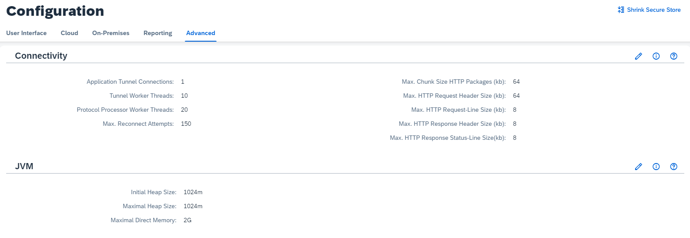

<!-- loio3975253c1a884638bf6f408f55ea349e -->

# Configure Advanced Connectivity

Adapt connectivity settings that control the throughput and HTTP connectivity to on-premises systems.

> ### Caution:  
> Do not change these parameters unless you are absolutely sure that changes are indispensable for your scenarios. Setting inadequate values may increase the risk of DoS \(Denial of Service\) attacks.

The Cloud Connector allows to set some sensible parameters controlling the HTTP connectivity to on-premises systems.

Find a brief description of these critical configuration parameters below:

<table>
<tr>
<th valign="top">

Parameter

</th>
<th valign="top">

Description

</th>
<th valign="top">

Default Value

</th>
</tr>
<tr>
<td valign="top">

Max. Chunk Size HTTP Packages \(kb\)

</td>
<td valign="top">

Max. size of chunks transmitted in HTTP streaming. The chunk size affects the throughput of HTTP communication.

</td>
<td valign="top">

64kb

</td>
</tr>
<tr>
<td valign="top">

Max. HTTP Request Header Length \(kb\)

</td>
<td valign="top">

Max. allowed size of HTTP request headers. Headers containing authentication information like SAML or JWT could require this size.

</td>
<td valign="top">

64kb

</td>
</tr>
<tr>
<td valign="top">

Max. Size HTTP Request \(kb\)

</td>
<td valign="top">

Size for the request line of HTTP request. HTTP Body is not included.

</td>
<td valign="top">

8kb

</td>
</tr>
<tr>
<td valign="top">

Max. HTTP Response Header Length \(kb\)

</td>
<td valign="top">

Max. allowed size of HTTP response headers.

</td>
<td valign="top">

8kb

</td>
</tr>
<tr>
<td valign="top">

Max. Size HTTP Response \(kb\)

</td>
<td valign="top">

Size for the response line of the HTTP response. HTTP Body is not included.

</td>
<td valign="top">

8kb

</td>
</tr>
</table>

