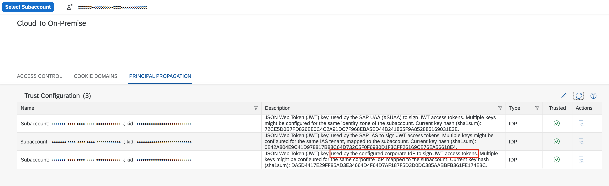

<!-- loiodfecfb4be336426bb31cd2843baeb8d4 -->

# Configure Principal Propagation via Corporate IdP-Embedded Token

Configure a corporate IdP-embedded token for principal propagation \(user propagation\) from your application to an on-premise system.

> ### Note:  
> The on-premise use cases described in this guide are also applicable to virtual private cloud \(VPC\) environments.

> ### Restriction:  
> Principal Propagation via corporate IdP-embedded token is not supported with IAS proxy authorization. In this case, the corporate IdP token should be sent directly with the "SAP-Connectivity-Authentication" header.
> 
> For more information, see [Authentication to the On-Premise System](authentication-to-the-on-premise-system-67b0b94.md).
> 
> The IAS login token can be exchanged for a corporate IdP token via the automation functionalities of the Destination service.
> 
> For more information, see [Using an IAS User Token for Corporate IdP Token Principal Propagation to On-Premise Systems](using-an-ias-user-token-for-corporate-idp-token-principal-propagation-to-on-premise-e50acf1.md).


<a name="loiodfecfb4be336426bb31cd2843baeb8d4__tasks"/>

## Tasks


<table>
<tr>
<th valign="top">

Task Type

</th>
<th valign="top">

Task

</th>
</tr>
<tr>
<td valign="top">


Operator and/or Developer

</td>
<td valign="top">

[Scenario](configure-principal-propagation-via-corporate-idp-embedded-token-dfecfb4.md#loiodfecfb4be336426bb31cd2843baeb8d4__scenario) 

</td>
</tr>
<tr>
<td valign="top">


Operator

</td>
<td valign="top">

[Prerequisites](configure-principal-propagation-via-corporate-idp-embedded-token-dfecfb4.md#loiodfecfb4be336426bb31cd2843baeb8d4__prereq) 

</td>
</tr>
<tr>
<td valign="top">


Developer

</td>
<td valign="top">

[Solutions](configure-principal-propagation-via-corporate-idp-embedded-token-dfecfb4.md#loiodfecfb4be336426bb31cd2843baeb8d4__solutions)

</td>
</tr>
</table>


<a name="loiodfecfb4be336426bb31cd2843baeb8d4__scenario"/>

## Scenario

For a Cloud Foundry application that uses the Connectivity service, you want the currently logged-in user to be propagated to an on-premise system via token from your trusted corporate IdP \(identity provider\).

For more information, see [Principal Propagation](principal-propagation-e2cbb48.md).

Back to [Tasks](configure-principal-propagation-via-corporate-idp-embedded-token-dfecfb4.md#loiodfecfb4be336426bb31cd2843baeb8d4__tasks) 


<a name="loiodfecfb4be336426bb31cd2843baeb8d4__prereq"/>

## Prerequisites

-   Cloud Connector 2.13 \(or newer\) must be used.
-   The Cloud Connector must be connected to a subaccount that is configured with the corporate IdP, issuing the tokens.

    After the configuration, the issued XSUAA token contains an embedded token, which is extracted and propagated by the Connectivity service.

    For more information, see [Include Tokens from Corporate Identity Providers or Identity Authentication in Tokens of the SAP Authorization and Trust Management Service](https://help.sap.com/docs/authorization-and-trust-management-service/authorization-and-trust-management/include-tokens-from-corporate-identity-providers-or-identity-authentication-in-tokens-of-sap-authorization-and-trust-management-service?version=Cloud).

-   After the configuration, the issued XSUAA token contains an embedded token, which is extracted and propagated by the Connectivity service.
-   Trust configuration for that subaccount must be synchronized in the Cloud Connector to obtain the JSON web key set from the configured corporate IdP that is used to verify the token.

    For more information, see [Set Up Trust](set-up-trust-a4ee70f.md).

    


Back to [Tasks](configure-principal-propagation-via-corporate-idp-embedded-token-dfecfb4.md#loiodfecfb4be336426bb31cd2843baeb8d4__tasks) 


<a name="loiodfecfb4be336426bb31cd2843baeb8d4__solutions"/>

## Solutions

You have two options to implement the user propagation via embedded corporate IdP token:

1.  **Recommended**. The application sends one header containing the user exchange token to the Connectivity proxy:

    -   The application sends one HTTP header `Proxy-Authorization`.
    -   The original *user token* is exchanged for a special *user exchange access token* following the OAuth2 JWT Bearer grant type.

        For more information, see [Using JWTs as Authorization Grants](https://www.rfc-editor.org/rfc/rfc7523#section-2.1).

    -   The *user exchange access token* is send through the `Proxy-Authorization` header to consume the Connectivity service.
    -   The embedded corporate token which contains the user details must be present in the obtained *user exchange access token*.

    ```
    Header: "Proxy-Authorization" : "Bearer <userExchangeAccessToken>"
    
    ```

    For more information on how to obtain a user exchange access token with an embedded IAS corporate IdP token, see [SAP Authorization and Trust Management Service in the Cloud Foundry Environment](https://help.sap.com/docs/CP_AUTHORIZ_TRUST_MNG/ae8e8427ecdf407790d96dad93b5f723/6373bb7a96114d619bfdfdc6f505d1b9.html?version=Cloud) and [Generate the Authentication Token](configure-principal-propagation-via-user-exchange-token-39f538a.md#loio39f538ad62e144c58c056ebc34bb6890__generate).

2.  The application sends two headers to the Connectivity proxy:

    -   The application sends two HTTP headers: `SAP-Connectivity-Authentication` and `Proxy-Authorization`.
    -   The embedded corporate token which contains the user details must be present in the user token provided via `SAP-Connectivity-Authentication`.
    -   The access token is provided via `Proxy-Authorization`.

    ```
    Header: "SAP-Connectivity-Authentication" : "Bearer <userToken>"
    Header: "Proxy-Authorization" : "Bearer <accessToken>"
    ```


The Cloud Connector validates the token, extracts the available user data, and enables further processing through a configured subject pattern for the resulting short-lived X.509 client certificate.

Back to [Tasks](configure-principal-propagation-via-corporate-idp-embedded-token-dfecfb4.md#loiodfecfb4be336426bb31cd2843baeb8d4__tasks) 

