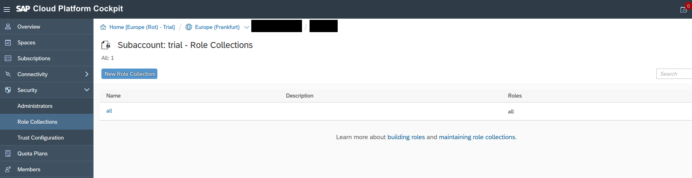

<!-- loioa6ce7e7069b14fee98898abd76f79f92 -->

# Configure Roles and Trust

Configure a role that enables your user to access your Web application.

1.  From the subaccount menu, choose *Trust Configuration*.
2.  If you don't have a trust configuration, follow the steps in [Manually Establish Trust and Federation Between SAP Authorization and Trust Management Service and SAP Cloud Identity Services](https://help.sap.com/docs/btp/sap-business-technology-platform/manually-establish-trust-and-federation-between-uaa-and-identity-authentication?version=Cloud).
3.  To add and assign roles, choose *Security* \> *Role Collections* from the subaccount menu:

    

4.  Create a *New Role Collection* with the name `all`.
5.  Select *all* \> *Edit* and add yourself as user.
6.  Choose *Save*.

<a name="loioa6ce7e7069b14fee98898abd76f79f92__section_xsy_nkc_cgb"/>

## Next Steps

-   [Set Up an Application Router](set-up-an-application-router-f9f8eb2.md)
-   [Configure the RFC Destination](configure-the-rfc-destination-cfd3fea.md)
-   [Monitoring Your Web Application](monitoring-your-web-application-9bd8f7d.md) \(Optional\)

**Related Information**  

[Working with Role Collections](https://help.sap.com/viewer/65de2977205c403bbc107264b8eccf4b/Cloud/en-US/393ea0b222754311884123ce564779bd.html "As an administrator, you group application roles in role collections. You then assign role collections to application users.") :arrow_upper_right:

