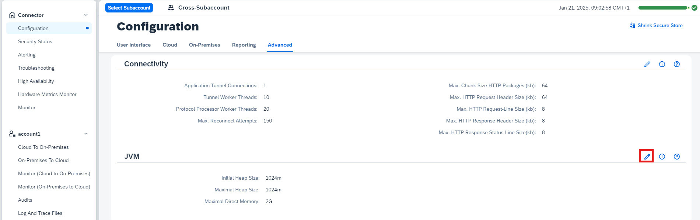

<!-- loio09e62bcd6eee41a5828dfbb23c7c2970 -->

# Configure the Java VM

Adapt the JVM settings that control memory management.

If required, you can adjust the following parameters for the Java VM by changing their default values:

-   Initial Heap Size \(default: 1024 MB\)

-   Maximal Heap Size \(default: 1024 MB\)

-   Maximal Direct Memory \(default: 2 GB\)

> ### Note:  
> A restart is required when changing JVM settings. Unsuitable memory settings may result in a Cloud Connector start-up failure. In this case, you must manually adapt the file `props.ini` located in the Cloud Connector installation directory. Contact your system administrator when in doubt.

> ### Tip:  
> We recommended that you set the initial heap size equal to the maximal heap size to avoid memory fragmentation.

To change the parameter values, proceed as follows:

1.  From the Cloud Connector main menu, choose *Configuration* \> *Advanced*. In section *JVM*, select *Edit*.

    

2.  In the *Edit JVM Settings* dialog, change the parameter values as required.

    > ### Note:  
    > At most four digits are accepted. Providing a unit is mandatory. Use k or K for kilobyte, m or M for megabyte, or g or G for gigabyte. Do not insert spaces between digits and unit.

3.  Choose *Save*.

**Related Information**  

[Sizing for the Master Instance](sizing-for-the-master-instance-89e5122.md "Learn more about the basic criteria for the sizing of your Cloud Connector master instance.")

