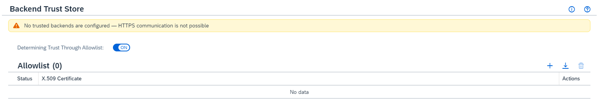
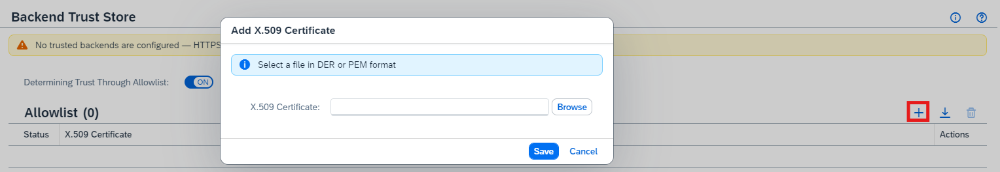
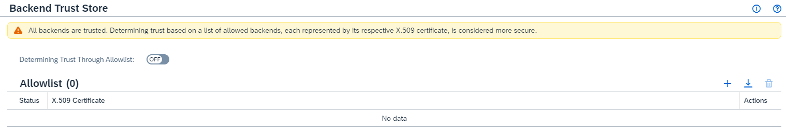
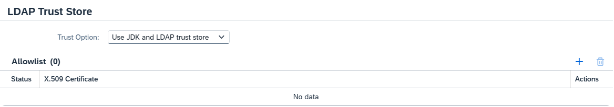
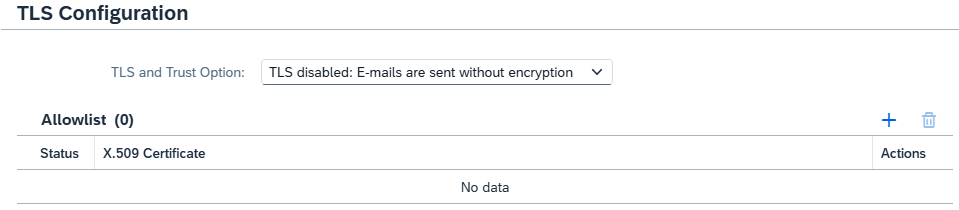

<!-- loio13bfb28fd5bc4c71a82af698ee8d876f -->

# Configure Trust

Set up a trust store for on-premises systems in the Cloud Connector.

<a name="loio13bfb28fd5bc4c71a82af698ee8d876f__section_TrustStore"/>

## Configure the Trust Store

To configure the trust store, choose *Configuration* from the main menu, and go to tab *On Premises*, section *Backend Trust Store*.

By default, the Cloud Connector **does not trust any** on-premises system when connecting to it via TLS:

To enable secured backend communication, you must add trusted certificates to the allowlist. Any TLS server certificate that holds one of these certificates in its certificate chain, as intermediate or root certificate, will be considered trusted. Otherwise, the server will be considered untrusted and the connection will fail.

> ### Note:  
> You must provide the CA's X.509 certificates in `DER` or `PEM` format.

> ### Caution:  
> If you don't want to specify explicit certificates you are going to trust, but rather **trust all certificates used by your backends**, you can switch off the trust store, so the allowlist is being ignored. However, this is considered insecure, since any server certificate is trusted in this case.
> 
> As a result, the risk of certain attacks on the hop between Cloud Connector and internal systems is increased. **Therefore, we strongly recommend that you *don't do this in productive installations***.
> 
> 
> 
> By clicking on the *Download* button, you can download all or only specific CAs again.

<a name="loio13bfb28fd5bc4c71a82af698ee8d876f__section_vbv_vzd_32c"/>

## LDAP Trust

When configuring LDAP for User Administration \(see tab *User Interface* of *Configuration*\), either in draft or active mode, the **LDAP Trust Store** can be set up by adding certificates to the **Allowlist** and choosing a *Trust Option*.

> ### Note:  
> The LDAP trust store is used by all LDAP user stores.

There are three trust options:

1.  *Trust all*: All certificates are trusted. This is the least secure option which does not take into account any trusted certificates, in the allowlist or otherwise, and simply trusts all certificates.
2.  *Use LDAP trust store only*: Only the certificates listed in the allowlist are trusted.
3.  *Use JDK and LDAP trust store*: The certificates in the allowlist and those of the JDK are trusted.

<a name="loio13bfb28fd5bc4c71a82af698ee8d876f__section_npl_vzd_32c"/>

## E-Mail Trust

E-mail trust, or more precisely the **TLS Configuration**, is part of the **E-Mail Configuration** of *Alerting*. Choose the appropriate *TLS and Trust Option*, and add certificates to the **Allowlist** if required.

There are four TLS and trust options:

1.  *TLS disabled: E-mails are sent without encryption*: E-mails are sent as plain text. No certificates are involved.
2.  *TLS enabled: Trust all*: No trusted certificates are taken into account, and thus all certificates are trusted.
3.  *TLS enabled: Use E-mail trust store only*: Only the certificates listed in the allowlist are trusted.
4.  *TLS enabled: Use JDK and E-mail trust store*: The certificates in the allowlist and those of the JDK are trusted.

