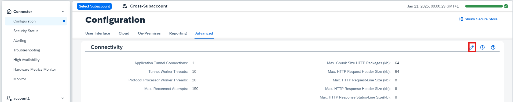

<!-- loio6069899a04c647768ba546fad3d88bc1 -->

# Configure Tunnel Connections

Adjust tunnel parameters for the Cloud Connector.

If required, you can adjust the following parameters for the communication tunnel by changing their default values:

-   Application Tunnel Connections \(default: 1\)

    > ### Note:  
    > This parameter specifies the default value for the maximal number of tunnel connections *per application*. The value must be higher than 0.

-   Tunnel Worker Threads \(default: 10\)

-   Protocol Processor Worker Threads \(default: 20\)

For detailed information on connection configuration requirements, see [Configuration Setup](configuration-setup-7437cd6.md).

To change the parameter values, do the following:

1.  From the Cloud Connector main menu, choose *Configuration* \> *Advanced*. In section *Connectivity*, select *Edit*.

    

2.  In the *Edit Connectivity Settings* dialog, change the parameter values as required.
3.  Choose *Save*.

Additionally, you can specify the number of allowed tunnel connections for each application that you have specified as a [trusted application](set-up-trust-a4ee70f.md#loioa4ee70f0274248f8bbc7594179ef948d__trust_cloud_apps).

> ### Note:  
> If you don't change the value for a trusted application, it keeps the default setting specified above. If you change the value, it may be higher or lower than the default and must be higher than 0.

**Related Information**  

[Configuration Setup](configuration-setup-7437cd6.md "Choose the right connection configuration options to improve the performance of the Cloud Connector.")

