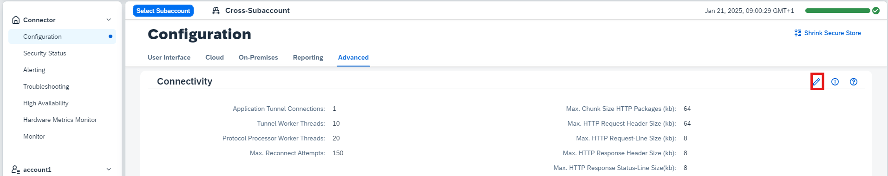

<!-- loio6069899a04c647768ba546fad3d88bc1 -->

# Configure Tunnel Connections

Adjust tunnel parameters for the Cloud Connector.

If required, you can adjust the following parameters influencing the tunnel behavior by changing their default values:

-   Application Tunnel Connections \(default: 1\): This parameter specifies the default value for the maximal number of tunnel connections *per application*. The value must be higher than 0.

-   Tunnel Worker Threads \(default: 10\): The number of threads per subaccount that are available for processing incoming packages from the cloud.

-   Protocol Processor Worker Threads \(default: 20\): The number of threads used for protocol-specific processing per subaccount.

    > ### Note:  
    > The thread pool size for RFC is derived from that value. The thread pool size will be 5 times of the protocol worker thread size, meaning that at most this number of concurrent requests can be performed for the subaccount.

-   Max. Reconnect Attempts \(default: 150\): Whenever the tunnel connection to a subaccount breaks, the Cloud Connector will perform that many reconnect attempts in order to re-establish the tunnel to the Connectivity service.

    > ### Note:  
    > The reconnect procedure will be triggered only if the connection has been established successfully before. If the connection fails directly after startup, it will stay disconnected to avoid unnecessary connection attempts.

For detailed information on connection configuration requirements, see [Configuration Setup](configuration-setup-7437cd6.md).

To change the parameter values, do the following:

1.  From the Cloud Connector main menu, choose *Configuration* \> *Advanced*. In section *Connectivity*, select *Edit*.

    

2.  In the *Edit Connectivity Settings* dialog, change the parameter values as required.
3.  Choose *Save*.

For the **Neo** environment only: Additionally, you can specify the number of allowed tunnel connections for each application that you have specified as a [trusted application](set-up-trust-a4ee70f.md#loioa4ee70f0274248f8bbc7594179ef948d__trust_cloud_apps).

> ### Note:  
> If you don't change the value for a trusted application, it keeps the default setting specified above. If you change the value, it may be higher or lower than the default and must be higher than 0.

**Related Information**  

[Configuration Setup](configuration-setup-7437cd6.md "Choose the right connection configuration options to improve the performance of the Cloud Connector.")

