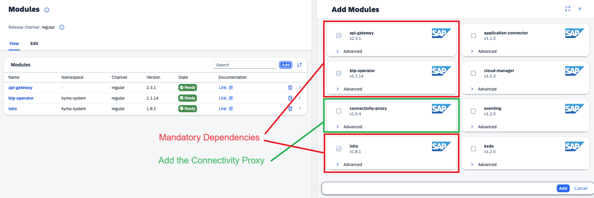
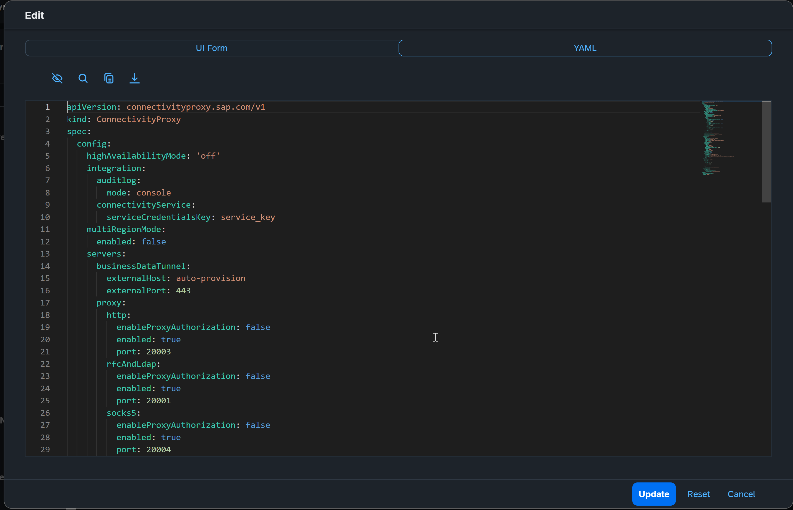
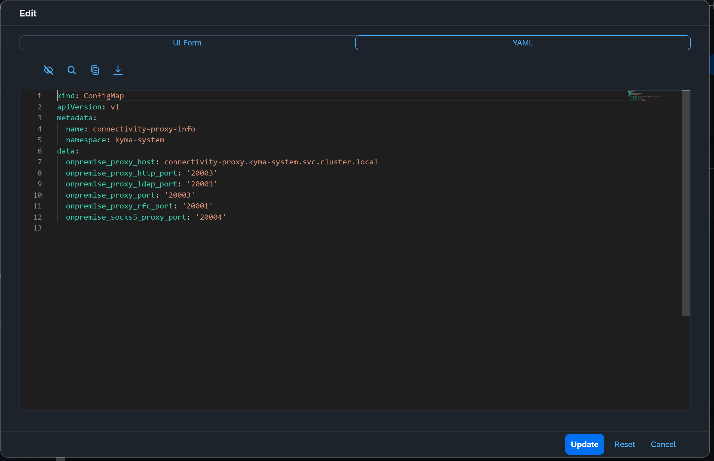

<!-- loio8dd1690aa475477ab44624626f45524b -->

# Connectivity Proxy in the Kyma Environment

Find information on installing Connectivity Proxy in the the Kyma environment, providing easier installation and setup.

<a name="loio8dd1690aa475477ab44624626f45524b__section_asl_5yg_q1c"/>

## Prerequisites

-   The service plan *"connectivity\_proxy"* of the *"connectivity"* service is assigned to your subaccount as an entitlement.

    For more information, see [Configure Entitlements and Quotas for Subaccounts](https://help.sap.com/docs/btp/sap-business-technology-platform/configure-entitlements-and-quotas-for-subaccounts).

    > ### Note:  
    > For subaccounts created after the February 15, 2024, this entitlement is assigned automatically.

-   You have added the *btp-operator* module.

    For more information, see [Add and Delete a Kyma Module](https://help.sap.com/docs/btp/sap-business-technology-platform/enable-and-disable-kyma-module#loio1b548e9ad4744b978b8b595288b0cb5c).

<a name="loio8dd1690aa475477ab44624626f45524b__section_sh3_5yg_q1c"/>

## Context

The *connectivity-proxy* Kyma module installs the needed components to establish a secure tunnel between the Kyma environment and the systems in your on-premise network, exposed via [Cloud Connector](cloud-connector-e6c7616.md). The module is based on the [Connectivity Proxy for Kubernetes](connectivity-proxy-for-kubernetes-e661713.md). It supports both *on-premise-to-cloud* and *cloud-to-on-premise* scenarios.

<a name="loio8dd1690aa475477ab44624626f45524b__section_sq2_5yg_q1c"/>

## Add the Connectivity Proxy module

The Connectivity Proxy is a standard Kyma module. You can add the module as described in [Add and Delete a Kyma Module](https://help.sap.com/docs/btp/sap-business-technology-platform/enable-and-disable-kyma-module#loio1b548e9ad4744b978b8b595288b0cb5c).

> ### Note:  
> The modules `api-gateway`, `btp-operator` and `istio` are required dependencies. They must be added to make the Connectivity Proxy work properly.

The Kubernetes resource that facilitates this installation in the background is a `ConnectivityProxy` resource. This is a custom resource, defined by the module. It holds the configuration for the Connectivity Proxy components.

For more information, see [Configuration Guide](configuration-guide-eaa8204.md).

> ### Note:  
> Not all configuration options of the Connectivity Proxy are supported by the Kyma module.
> 
> See [Limitations](connectivity-proxy-in-the-kyma-environment-8dd1690.md#loio8dd1690aa475477ab44624626f45524b__limits) below for more details.

> ### Caution:  
> **Do not** create additional resources of type `ConnectivityProxy`. Only one Connectivity Proxy installation per cluster is supported.

<a name="loio8dd1690aa475477ab44624626f45524b__section_urz_tyg_q1c"/>

## Result

The module will be added and will result in an installation of the [Connectivity Proxy for Kubernetes](connectivity-proxy-for-kubernetes-e661713.md) and its supporting workloads.

As part of this installation, a `ServiceInstance` and a `ServiceBinding` resource will be created in the cluster. These are *BTP Operator* resources which result in the creation of a *Connectivity* service instance with service plan *connectivity\_proxy*, and in a service binding in your subaccount. This is needed to pair the Connectivity Proxy with the SAP BTP Connectivity service.

For more information, see [Connectivity Service](connectivity-service-0edfc0b.md).

> ### Caution:  
> Do not interact with the created service instance and service binding, as they are only meant for usage by the Connectivity Proxy. Any modification may cause a loss of functionality.

The installation also exposes the public facing endpoint of the Connectivity Proxy via the built-in Istio Ingress controller \(TLS certificates are generated automatically during this process\). This endpoint is used by the Cloud Connector to reach the proxy.

The `Ingress` endpoint is propagated transparently for *cloud-to-on-premise* scenarios.

For *on-premise-to-cloud* connections, you must look it up manually. You can find it in the created `Gateway` resource of the *kyma-system* namespace. Look for the *Istio* `Gateway` resource with name `connectivity-proxy-tunnel`. The exact auto-provisioned host will be shown in the `Servers` section.

**Capabilities**

If no settings are modified, the following specifics and features are available in the *connectivity\_proxy* Kyma module:

-   All proxy servers are enabled \(HTTP, RFC, LDAP, SOCKS5\).
-   The [Service Channels: On-Premise-to-Cloud Connectivity](service-channels-on-premise-to-cloud-connectivity-bbd3040.md) feature is enabled.
-   Operational mode is [single tenant, trusted](operational-modes-148bbad.md#loio148bbad274e545efa10de8a356dd474d__single).
-   [Automatic Pickup on Resource Changes](automatic-pickup-on-resource-changes-78ddb8f.md) is enabled.
-   [High Availability](high-availability-3c7f10d.md) is set to *off* by default, but can be activated in "path" mode.

-   Auto-scaling \(only applicable if *High Availability* is turned on\) is disabled by default, but can be activated.

**Limitations**

The following features of the Connectivity Proxy are not available via the *connectivity-proxy* Kyma module:

-   [High Availability](high-availability-3c7f10d.md)
-   [Multi-Region Mode](installing-the-connectivity-proxy-in-multi-region-mode-72072ca.md)
-   Support for Ingress controllers other than Istio
-   An externally exposed health check endpoint

<a name="loio8dd1690aa475477ab44624626f45524b__section_tbj_tyg_q1c"/>

## Consume an On-Premise System Through the Connectivity Proxy

**Integration with the Transparent Proxy**

We recommend that you consume an on-premise system through a combination of SAP BTP Connectivity software components and services. While the Connectivity Proxy is used to establish the connection to the on-premise system/VPC, the Transparent Proxy provides an abstraction enabling seamless consumption of the target system. Transparent Proxy and Connectivity Proxy integrate automatically with each other when both are available as modules in a Kyma instance.

For more information, see [Transparent Proxy in the Kyma Environment](transparent-proxy-in-the-kyma-environment-1700cfe.md).

**Standalone Usage of the Connectivity Proxy**

As part of the installation, a special `ConfigMap` will be created in the *kyma-system* namespace, called *connectivity-proxy-info*. It contains the host of the Connectivity Proxy and all its proxy ports.

To use the Connectivity Proxy, you must set the appropriate host and port as proxy configuration.

For more information, see [Using the Connectivity Proxy](using-the-connectivity-proxy-f3c1ef4.md).

> ### Caution:  
> Every workload using the Connectivity Proxy to call the on-premise system must have the Istio sidecar proxy injection enabled. Otherwise, the Connectivity Proxy does not work correctly.

