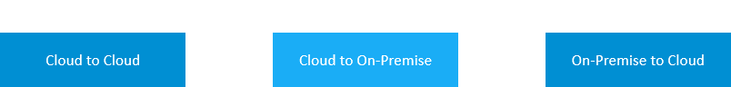

<!-- loio1e4b878a6a1942d8967442205e02f955 -->

# Connectivity Scenarios

Basic connectivity scenarios in SAP BTP, Multi-Cloud Foundation.

Connections between SAP BTP applications and their target applications \(inside or outside SAP BTP\) can be established in different ways - depending on the location of the target application and on the direction of communication.

The communication can be classified into three basic scenarios:

-   [In the cloud-to-cloud scenario, an SAP BTP application connects to a target application running on a cloud-based infrastructure. The target can be an SAP BTP application or any other cloud-based application.](connectivity-scenarios-1e4b878.md#loio1e4b878a6a1942d8967442205e02f955__c2c)
-   [In this scenario, you perform calls from your SAP BTP application to a target application located in your local on-premise network.](connectivity-scenarios-1e4b878.md#loio1e4b878a6a1942d8967442205e02f955__c2op)
-   [The on-premise-to-cloud scenario corresponds to the cloud-to-on-premise connection, but the communication direction is different: You perform a call from an on-premise application to SAP BTP.](connectivity-scenarios-1e4b878.md#loio1e4b878a6a1942d8967442205e02f955__op2c)

*Hover over the elements for a description. Click an element for more information.*

> ### Note:  
> The on-premise use cases described in this guide are also applicable to virtual private cloud \(VPC\) environments.

In this section, we describe the key elements and procedures of these scenarios, indicating the relevant parts in documentation for more information.

<a name="loio1e4b878a6a1942d8967442205e02f955__c2c"/>

## Scenario: Cloud to Cloud

In the *cloud-to-cloud* scenario, an SAP BTP application connects to a target application running on a cloud-based infrastructure \(platform, server\). The target can be an SAP BTP application or any other cloud-based application.

For this scenario, you must configure at least one destination containing the essential communication data, such as target host \(URL\), communication protocol, and authentication type.

> ### Note:  
> A commonly used authentication method is *principal propagation* \(also known as *user propagation*\), which lets you propagate the identity of the logged-on user to the target application.
> 
> For more information on authentication methods, see [Configuring Authentication](http-destinations-42a0e6b.md#loio42a0e6b966924f2e902090bdf435e1b2__config).

For more information on these procedures, see:

-   [Managing Destinations](managing-destinations-84e45e0.md)
-   [Principal Propagation](principal-propagation-e2cbb48.md)
    -   [Scenario: Cloud to Cloud](scenario-cloud-to-cloud-65b11d4.md)
        -   [Manage Trust](manage-trust-82dbeca.md)

Some common *principal propagation* scenarios for communication between an SAP BTP Multi-Cloud \(Cloud Foundry\) application and different target applications are described in detail here:

-   [User Propagation from the Cloud Foundry Environment to SAP S/4HANA Cloud](user-propagation-from-the-cloud-foundry-environment-to-sap-s-4hana-cloud-9af03a0.md)
-   [User Propagation from the Cloud Foundry Environment to SAP SuccessFactors](user-propagation-from-the-cloud-foundry-environment-to-sap-successfactors-67a3b83.md)
-   [User Propagation between Cloud Foundry Applications](user-propagation-between-cloud-foundry-applications-8ebf60c.md)
-   [User Propagation from the Cloud Foundry Environment to the Neo Environment](user-propagation-from-the-cloud-foundry-environment-to-the-neo-environment-95dde76.md)

<a name="loio1e4b878a6a1942d8967442205e02f955__c2op"/>

## Scenario: Cloud to On-Premise

In this scenario, you want to perform calls from your SAP BTP application to a target application located in your local *on-premise* network. While the basic procedures are similar to the *cloud-to-cloud* scenario \(including some configuration that is specific to on-premise communication\), this connection type requires the Cloud Connector as additional component, to be installed an managed within your local on-premise network. The Cloud Connector provides a secure tunnel for communication between your local apps and SAP BTP.

> ### Note:  
> A commonly used authentication method is *principal propagation* \(also known as *user propagation*\), which lets you propagate the identity of the logged-on user to the target application.
> 
> For more information on authentication methods, see [Configuring Authentication](http-destinations-42a0e6b.md#loio42a0e6b966924f2e902090bdf435e1b2__config).

Find more information about the basic procedures for cloud-to-on-premise communication in these sections:

-   [Cloud Connector](cloud-connector-e6c7616.md)
-   [Managing Destinations](managing-destinations-84e45e0.md)
-   [Principal Propagation](principal-propagation-e2cbb48.md)
    -   [Scenario: Cloud to On-Premise](scenario-cloud-to-on-premise-70b8ef3.md)

<a name="loio1e4b878a6a1942d8967442205e02f955__op2c"/>

## Scenario: On-Premise to Cloud

The *on-premise-to-cloud* scenario corresponds to the *cloud-to-on-premise* connection in terms of the app location \(one app/service is residing on SAP BTP, and the connected app in your local network\). However, the communication direction is different: In this case, you want to perform a call from an on-premise application to SAP BTP, for example, to

-   Connect your local database tools to an SAP HANA database residing on SAP BTP.

Other examples for on-premise-to-cloud connections are:

-   Calls from your on-premise system to SAP BTP ABAP environment using the RFC protocol
-   Connections to a service running in an SAP BTP Kubernetes cluster

On-premise-to-cloud communication requires a special setup that can be configured using the so-called Cloud Connector *service channels*. These service channels provide access from your local network to specific services on SAP BTP, or to an ABAP Cloud system, while the called services are not exposed to direct access from the Internet.

To learn more about specific use cases and procedures for the on-premise-to-cloud scenario, see:

-   [Cloud Connector](cloud-connector-e6c7616.md)
    -   [Using Service Channels](using-service-channels-16f6342.md)

