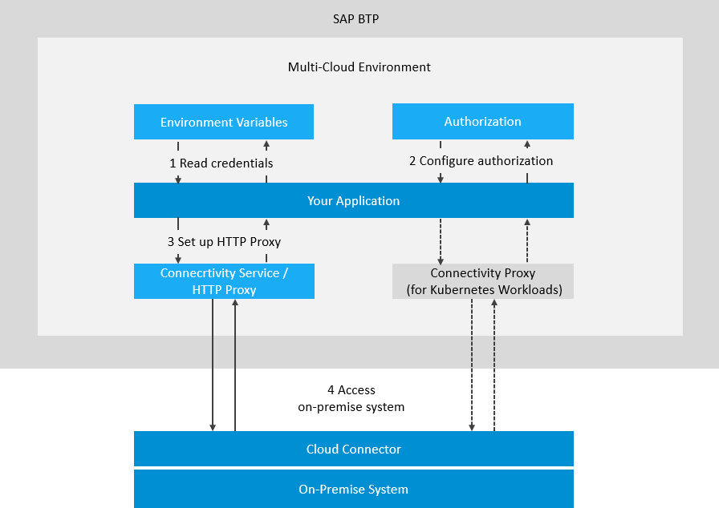
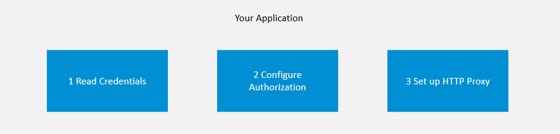

<!-- loio313b215066a8400db461b311e01bd99b -->

# Consuming the Connectivity Service

Connect your cloud application to an on-premise system via HTTP.

> ### Note:  
> The on-premise use cases described in this guide are also applicable to virtual private cloud \(VPC\) environments.

> ### Note:  
> To use the Connectivity service with a protocol other than HTTP, see
> 
> -   [Invoking ABAP Function Modules via RFC](invoking-abap-function-modules-via-rfc-fa4adc9.md)
> -   [Using the TCP Protocol for Cloud Applications](using-the-tcp-protocol-for-cloud-applications-cd15837.md)


<a name="loio313b215066a8400db461b311e01bd99b__tasks_CS"/>

## Tasks


<table>
<tr>
<th valign="top">

Task Type

</th>
<th valign="top">

Task

</th>
</tr>
<tr>
<td valign="top" rowspan="2">


Operator and/or Developer

</td>
<td valign="top">

[Overview](consuming-the-connectivity-service-313b215.md#loio313b215066a8400db461b311e01bd99b__overview)

</td>
</tr>
<tr>
<td valign="top">

[Prerequisites](consuming-the-connectivity-service-313b215.md#loio313b215066a8400db461b311e01bd99b__prerequisites_CS)

</td>
</tr>
<tr>
<td valign="top">


Developer

</td>
<td valign="top">

[Basic Steps](consuming-the-connectivity-service-313b215.md#loio313b215066a8400db461b311e01bd99b__basic_steps)

1.  [Read Credentials from the Environment Variables](consuming-the-connectivity-service-313b215.md#loio313b215066a8400db461b311e01bd99b__section_EnvironmentVariables)
2.  [Configure Authorization](consuming-the-connectivity-service-313b215.md#loio313b215066a8400db461b311e01bd99b__section_RequiredInformation)
3.  [Set up the HTTP Proxy for On-Premise Connectivity](consuming-the-connectivity-service-313b215.md#loio313b215066a8400db461b311e01bd99b__section_HttpProxy)


</td>
</tr>
<tr>
<td valign="top">


Operator and/or Developer

</td>
<td valign="top">

[Additional Steps](consuming-the-connectivity-service-313b215.md#loio313b215066a8400db461b311e01bd99b__auth)

-   [Authentication against the On-Premise System](consuming-the-connectivity-service-313b215.md#loio313b215066a8400db461b311e01bd99b__auth)
-   [Specify a Cloud Connector Location ID](consuming-the-connectivity-service-313b215.md#loio313b215066a8400db461b311e01bd99b__location)
-   [Multitenancy in the Connectivity Service](consuming-the-connectivity-service-313b215.md#loio313b215066a8400db461b311e01bd99b__multi)


</td>
</tr>
</table>


<a name="loio313b215066a8400db461b311e01bd99b__overview"/>

## Overview


Using the Connectivity service, you can connect your Cloud Foundry application to an on-premise system through the Cloud Connector. To achieve this, you must provide the required information about the target system \(destination\), and set up an HTTP proxy that lets your application access the on-premise system.



Back to [Tasks](consuming-the-connectivity-service-313b215.md#loio313b215066a8400db461b311e01bd99b__tasks_CS)


<a name="loio313b215066a8400db461b311e01bd99b__prerequisites_CS"/>

## Prerequisites


-   You have installed and configured a Cloud Connector in your on-premise landscape for to the scenario you want to use. See [Installation](installation-57ae3d6.md) and [Configuration](configuration-ec68ee2.md).
-   You have deployed an application in a landscape of the Cloud Foundry environmentthat complies with the [Business Application Pattern](https://help.sap.com/viewer/65de2977205c403bbc107264b8eccf4b/Cloud/en-US/a1de162dffea417eb9cccd7855c607b7.html "In the Cloud Foundry environment, SAP is promoting a pattern for building applications. We use the term Business Application to distinguish from single applications in the context of the Cloud Foundry environment.") :arrow_upper_right:.
-   The Connectivity service is a regular service in the Cloud Foundry environment. Therefore, to consume the Connectivity service from an application, you must create a service instance and bind it to the application. See [Create and Bind a Connectivity Service Instance](create-and-bind-a-connectivity-service-instance-a2b88cf.md).

> ### Note:  
> When connecting to HTTP\(S\) on-premise resources, the call from the cloud application must always use HTTP. If HTTPS is used, a 405 response will be returned. The tunnel used by the Cloud Connector is TLS-encrypted, hence the traffic between cloud and on-premise network is protected regardless of the used protocol.

> ### Caution:  
> There is a limit of **8192** bytes for the size of the HTTP lines \(for example, request line or header\) that you send via the Connectivity service. If this limit is exceeded, you receive an HTTP error of type 4xx. This issue is usually caused by the size of the *path* + *query* string of the request.

Back to [Tasks](consuming-the-connectivity-service-313b215.md#loio313b215066a8400db461b311e01bd99b__tasks_CS)


<a name="loio313b215066a8400db461b311e01bd99b__basic_steps"/>

## Basic Steps


To consume the Connectivity service from your Cloud Foundry application, perform the following basic steps:

1.  [Read Credentials from the Environment Variables](consuming-the-connectivity-service-313b215.md#loio313b215066a8400db461b311e01bd99b__section_EnvironmentVariables)
2.  [Configure Authorization](consuming-the-connectivity-service-313b215.md#loio313b215066a8400db461b311e01bd99b__section_RequiredInformation)
3.  [Set up the HTTP Proxy for On-Premise Connectivity](consuming-the-connectivity-service-313b215.md#loio313b215066a8400db461b311e01bd99b__section_HttpProxy)



Back to [Tasks](consuming-the-connectivity-service-313b215.md#loio313b215066a8400db461b311e01bd99b__tasks_CS)


<a name="loio313b215066a8400db461b311e01bd99b__section_EnvironmentVariables"/>

## Read Credentials from the Environment Variables


Consuming the Connectivity service requires credentials from a *connectivity* or an *identity* service instance \(see [Authorization](consuming-the-connectivity-service-313b215.md#loio313b215066a8400db461b311e01bd99b__section_RequiredInformation)\) which are bound to the application. By binding the application to service instances as described in the prerequisites, these credentials become part of the environment variables of the application. You can access them like this:

> ### Sample Code:  
> ```
> JSONObject jsonObj = new JSONObject(System.getenv("VCAP_SERVICES"));
> JSONArray jsonArr = jsonObj.getJSONArray("<service name, not the instance name>");
> JSONObject credentials = jsonArr.getJSONObject(0).getJSONObject("credentials");
> ```

> ### Note:  
> If you have multiple instances of the same service bound to the application, you must perform additional filtering to extract the correct credential from `jsonArr`. You must go through the elements of `jsonArr` and find the one matching the correct instance name.

This code stores a JSON object in the credentials variable. Additional parsing is required to extract the value for a specific key.

Back to [Tasks](consuming-the-connectivity-service-313b215.md#loio313b215066a8400db461b311e01bd99b__tasks_CS)


<a name="loio313b215066a8400db461b311e01bd99b__section_RequiredInformation"/>

## Configure Authorization


To make calls to on-premise systems configured in the Cloud Connector, the cloud application must be authorized at the proxy endpoint\(s\). The Connectivity service supports authorization tokens issued by Authorization and Trust Management service \(XSUAA\) and Identity Authentication service \(IAS\).

**Authorization and Trust Management Service \(XSUAA\)**

XSUAA-based authentication is enabled for all service instances out of the box without preparation steps. The needed credentials for obtaining the token are within the service key / binding of the Connectivity service instance that you want to use.

For more information, see [Create and Bind a Connectivity Service Instance](create-and-bind-a-connectivity-service-instance-a2b88cf.md).

*Example: Obtaining an XSAA proxy authorization token*

Request:

```
POST <token_service_url for the connectivity service binding>/oauth/token
Accept: application/json
Content-Type: application/x-www-form-urlencoded
 
client_id=<clientid>
client_secret=<clientsecret>
grant_type=client_credentials
```

Response:

```
{
    "access_token" : "<JWT>",
    "token_type" : "Bearer",
    "expires_in" : 3600
}
```

> ### Note:  
> "token\_service\_url" replaces the deprecated property "url", which will be removed soon.

**Identity Authentication Service \(IAS\)** 

To enable your application for consuming the Connectivity service via IAS, you need to perform the following steps:

1.  Establish trust between your subaccount and your tenant of the Cloud Identity Services service using OpenID Connect.

    For more information, see [Establish Trust and Federation Between SAP Authorization and Trust Management Service and SAP Cloud Identity Services](https://help.sap.com/docs/btp/sap-business-technology-platform/establish-trust-and-federation-between-uaa-and-identity-authentication?version=Cloud).

2.  Create or update an existing Connectivity service instance and bind it to the application.

    For more information, see [Create and Bind a Connectivity Service Instance](create-and-bind-a-connectivity-service-instance-a2b88cf.md).

3.  \(Optional\) Verify that the Connectivity binding JSON contains the property "token-type" with value \["xsuaa", "ias"\].
4.  Create or update an existing Cloud Identity Services instance and bind it to the application. During the creation/update you must set the "consumed-services" property to an array that contains the name of the Connectivity service instance.

    For more information, see [Getting Started with the Identity Service of SAP BTP](https://help.sap.com/docs/cloud-identity-services/cloud-identity-services/getting-started-with-identity-service-of-sap-btp?version=Cloud) and [Reference Information for the Identity Service of SAP BTP](https://help.sap.com/docs/cloud-identity-services/cloud-identity-services/reference-information-for-identity-service-of-sap-btp?version=Cloud).


For obtaining an IAS proxy authorization token you should use the Cloud Identity Services binding information. The token request must contain an additional parameter - "resource" with value "urn:sap:identity:application:service:id:<instance\_id\>", where <instance\_id\> is the value of the root-level property "instance\_guid" in the Connectivity binding JSON .

*Example: Obtaining an IAS proxy authorization token*

Request:

```
POST <ias url>/oauth2/token
Accept: application/json
Content-Type: application/x-www-form-urlencoded
 
client_id=<clientid>
client_secret=<clientsecret>
grant_type=client_credentials
resource=urn:sap:identity:application:service:id:<instance_id>
```

Response:

```
{
    "access_token" : "<JWT>",
    "token_type" : "Bearer",
    "expires_in" : 3600
}
```

Back to [Tasks](consuming-the-connectivity-service-313b215.md#loio313b215066a8400db461b311e01bd99b__tasks_CS)


<a name="loio313b215066a8400db461b311e01bd99b__section_HttpProxy"/>

## Set up the HTTP Proxy for On-Premise Connectivity


**Required Information** 

To consume the connectivity service, you must be aware of some information about your on-premise system and the system mappings for it in the Cloud Connector. You need:

-   The endpoint in the Cloud Connector \(virtual host and virtual port\) and accessible URL paths on it \(destinations\). For more information, see [Configure Access Control \(HTTP\)](configure-access-control-http-e7d4927.md).
-   The required authentication type for the on-premise system. For more information, see [HTTP Destinations](http-destinations-42a0e6b.md).
-   Depending on the authentication type, you might need a username and password for accessing the on-premise system. For more details, see [HTTP Destinations](http-destinations-42a0e6b.md).
-   Optionally, you can use a `LocationId`. For more details on this, see [Specify a Cloud Connector Location ID](consuming-the-connectivity-service-313b215.md#loio313b215066a8400db461b311e01bd99b__location).

We recommend that you use the Destination service \(see [Consuming the Destination Service](consuming-the-destination-service-7e30625.md)\) to procure this information. However, this is optional and you can also provide it in a different way.

**Proxy Setup**

The Connectivity service provides a standard HTTP proxy for on-premise connectivity that is accessible by any application. Proxy host and port are available as the environment variables `<onpremise_proxy_host>` and `<onpremise_proxy_http_port>`. You can set up the on-premise HTTP proxy like this:

> ### Sample Code:  
> ```
> // get value of "onpremise_proxy_host" and "onpremise_proxy_http_port" from the environment variables
> // and create on-premise HTTP proxy
> String connProxyHost = connectivityCredentials.getString("onpremise_proxy_host");
> int connProxyPort = Integer.parseInt(credentials.getString("onpremise_proxy_http_port"));
> Proxy proxy = new Proxy(Proxy.Type.HTTP, new InetSocketAddress(connProxyHost, connProxyPort));
>  
>  
> // create URL to the remote endpoint you like to call:
> // virtualhost:1234 is defined as an endpoint in the Cloud Connector, as described in the Required Information section
> URL url = new URL("http://virtualhost:1234");
>  
>  
> // create the connection object to the endpoint using the proxy
> // this does not open a connection but only creates a connection object, which can be later modified before actually connecting
> urlConnection = (HttpURLConnection) url.openConnection(proxy);
> urlConnection.setRequestProperty("Proxy-Authorization",  "Bearer " + "<token for proxy authorization, as described in the Authorization section>");
> ```

> ### Note:  
> `"onpremise_proxy_http_port"` replaces the deprecated variable `"onpremise_proxy_port"`, which will be removed soon.

Back to [Tasks](consuming-the-connectivity-service-313b215.md#loio313b215066a8400db461b311e01bd99b__tasks_CS)


<a name="loio313b215066a8400db461b311e01bd99b__auth"/>

## Authentication against the On-Premise System


Depending on the required authentication type for the desired on-premise resource, you may have to set an additional header in your request. This header provides the required information for the authentication process against the on-premise resource. See [Authentication to the On-Premise System](authentication-to-the-on-premise-system-67b0b94.md).

Back to [Tasks](consuming-the-connectivity-service-313b215.md#loio313b215066a8400db461b311e01bd99b__tasks_CS)


<a name="loio313b215066a8400db461b311e01bd99b__location"/>

## Specify a Cloud Connector Location ID


> ### Note:  
> This is an advanced option when using more than one Cloud Connector for a subaccount. For more information how to set the `location ID` in the Cloud Connector, see [Adding and Managing Subaccounts](adding-and-managing-subaccounts-f16df12.md), step 4 in section *Subaccount Dashboard*.

You can connect multiple Cloud Connectors to a subaccount if their `location ID` is different. Using the header `SAP-Connectivity-SCC-Location_ID` you can specify the Cloud Connector over which the connection should be opened. If this header is not specified, the connection is opened to the Cloud Connector that is connected without any `location ID`. For example:

> ### Sample Code:  
> ```
> // Optionally, if configured, add the SCC location ID. 
> urlConnection.setRequestProperty("SAP-Connectivity-SCC-Location_ID", "orlando");
> ```

Back to [Tasks](consuming-the-connectivity-service-313b215.md#loio313b215066a8400db461b311e01bd99b__tasks_CS)


<a name="loio313b215066a8400db461b311e01bd99b__multi"/>

## Multitenancy in the Connectivity Service


To consume the Connectivity service from an SaaS application in a multitenant way, the only requirement is that the SaaS application returns the Connectivity service as a dependent service in its dependencies list.

For more information about the subscription flow, see [Develop the Multitenant Application](https://help.sap.com/viewer/65de2977205c403bbc107264b8eccf4b/Cloud/en-US/ff540477f5404e3da2a8ce23dcee602a.html).

Back to [Tasks](consuming-the-connectivity-service-313b215.md#loio313b215066a8400db461b311e01bd99b__tasks_CS)

**Related Information**  


[Cloud Connector](cloud-connector-e6c7616.md "Learn more about the Cloud Connector: features, scenarios and setup.")

[Set Up an Application as a Sample Backend System](https://help.sap.com/viewer/b865ed651e414196b39f8922db2122c7/Cloud/en-US/e59dc589bb57101480939e290c55e680.html "") :arrow_upper_right:

[Create and Bind a Connectivity Service Instance](create-and-bind-a-connectivity-service-instance-a2b88cf.md "To use the Connectivity service in your application, you need an instance of the service.")

[Authentication to the On-Premise System](authentication-to-the-on-premise-system-67b0b94.md "Provide authentication information for the authentication type you use.")

[Consuming the Destination Service](consuming-the-destination-service-7e30625.md "Retrieve and store externalized technical information about the destination to consume a target remote service from your application.")

[What Is the SAP Authorization and Trust Management Service?](https://help.sap.com/viewer/65de2977205c403bbc107264b8eccf4b/Cloud/en-US/649961f8d4ad463daca33b3a20deba4c.html "Get a high-level overview of the concepts that underpin the SAP Authorization and Trust Management service for SAP BTP in the Cloud Foundry environment.") :arrow_upper_right:

[Multitarget Applications in the Cloud Foundry Environment](https://help.sap.com/viewer/65de2977205c403bbc107264b8eccf4b/Cloud/en-US/d04fc0e2ad894545aebfd7126384307c.html "A Multitarget application (MTA) is essentially a single application that consists of multiple parts. These parts are created using various technologies and share the same lifecycle.") :arrow_upper_right:

[Invoking ABAP Function Modules via RFC](invoking-abap-function-modules-via-rfc-fa4adc9.md "Call a remote-enabled function module in an on-premise or cloud ABAP server from your application, using the RFC protocol.")

[Using the TCP Protocol for Cloud Applications](using-the-tcp-protocol-for-cloud-applications-cd15837.md "Access on-premise systems from an application via TCP-based protocols, using a SOCKS5 Proxy.")

