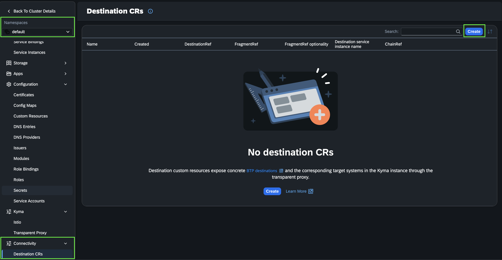
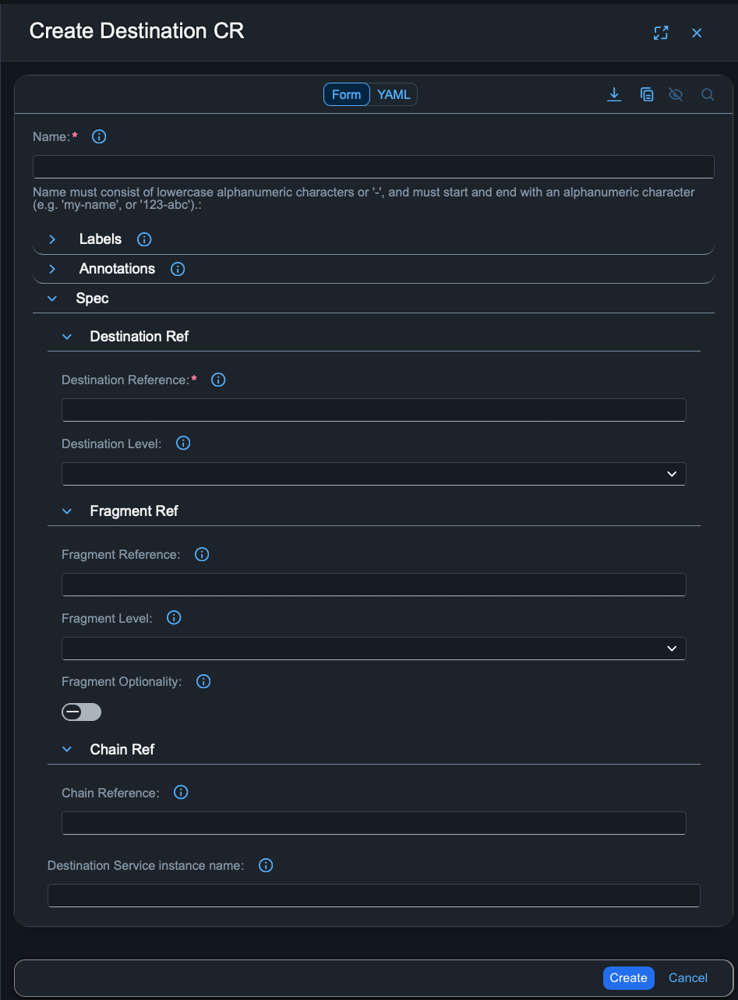

<!-- loio65cf4337392743358423f02659305fc0 -->

# Create a Destination Custom Resource in the Kyma Environment

Create a Destination Custom Resource in the Kyma environment to expose SAP BTP destinations as Kyma-internal endpoints.

## Prerequisites

You have added Transparent Proxy module in the Kyma instance.

For more information, see [Add the Transparent Proxy module](transparent-proxy-in-the-kyma-environment-1700cfe.md#loio1700cfe070704d2e80aa76de1033a6c4__section_tpm_wxc_zxb).

## Procedure

1.  After adding the Transparent Proxy module, navigate to a namespace of your choice in the Kyma instance.
2.  In the left navigation bar, choose and expand *Connectivity*.
3.  Select *Destination CRs* and choose *Create*.
4.  In the open form you can enter the following properties:

**Mandatory fields:**

-   `Name`: The name of the Destination CR. Must consist of lowercase alphanumeric characters or '-', and must start and end with an alphanumeric character \(e.g. 'my-name', or '123-abc'\).
-   `Destination Reference`: Reference an SAP BTP destination or add a wildcard symbol "\*" to lookup one or more destinations dynamically.

**Optional fields:**

-   `Fragment Reference`: Extend a destination with a fragment. Destination fragments enable more flexible technical connection configuration. For more information, see [Extending Destinations with Fragments](extending-destinations-with-fragments-f56600a.md).
-   `Destination Level`: Specify a certain level from which the destination will be retrieved. For more information, see [Referring Resources Using the Consume REST API](referring-resources-using-the-consume-rest-api-78ba73a.md).
-   `Fragment Level`: Specify a certain level from which the fragment will be retrieved. For more information, see [Referring Resources Using the Consume REST API](referring-resources-using-the-consume-rest-api-78ba73a.md).
-   `Fragment Optionality`: Specify whether the fragment is optional \(true\) or mandatory \(false\).
-   `Destination Service Instance Name`: The local name of the Destination service instance, provided in the Transparent Proxy configuration. For more information, see [Configuration Guide](configuration-guide-2a22cd7.md).
-   `Chain Reference`: Reference a chain of destinations. For more information, see [Destination Chaining](destination-chaining-08a09f5.md).

