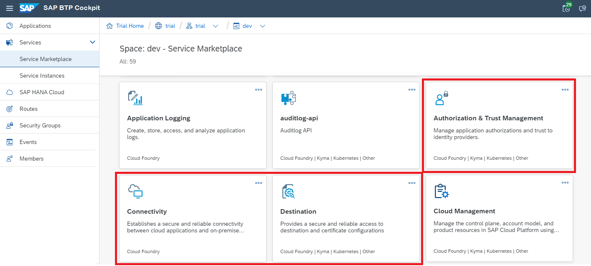
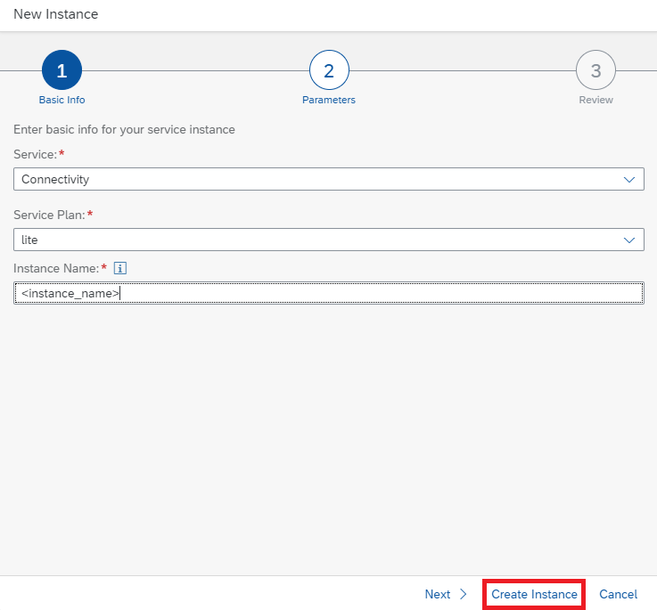

<!-- loio6dd5e268b2c74867a162188a0270c3c7 -->

# Create and Bind Service Instances

You must create and bind several service instances, before you can use your application.


<a name="loio6dd5e268b2c74867a162188a0270c3c7__procedure_rfc"/>

## Procedure

1.  Logon to the cloud cockpit and choose your subaccount.
2.  Choose the space where you want to deploy your demo application.
3.  Choose *Service Marketplace* and find these 3 services:

    -   *Connectivity*
    -   *Destination*
    -   *Authorization & Trust Management* \(XSUAA\)

    

4.  Create and bind a service instance for each of these services.
    -   [Connectivity service](create-and-bind-service-instances-6dd5e26.md#loio6dd5e268b2c74867a162188a0270c3c7__Connectivity)
    -   [Destination service](create-and-bind-service-instances-6dd5e26.md#loio6dd5e268b2c74867a162188a0270c3c7__Destination)
    -   [Authorization & Trust Management \(XSUAA service\)](create-and-bind-service-instances-6dd5e26.md#loio6dd5e268b2c74867a162188a0270c3c7__XSUAA)


<a name="loio6dd5e268b2c74867a162188a0270c3c7__Connectivity"/>

## Connectivity Service

1.  Choose *Connectivity* \> *Create Instance*.
2.  Insert an instance name \(for example, `connectivity_jco`\) and choose *Create Instance*.

    


Back to [Procedure](create-and-bind-service-instances-6dd5e26.md#loio6dd5e268b2c74867a162188a0270c3c7__procedure_rfc)


<a name="loio6dd5e268b2c74867a162188a0270c3c7__Destination"/>

## Destination Service

1.  Choose *Destination* \> *Create Instance*.
2.  Insert an instance name \(for example, `destination_jco`\) and choose *Create Instance*.

Back to [Procedure](create-and-bind-service-instances-6dd5e26.md#loio6dd5e268b2c74867a162188a0270c3c7__procedure_rfc)


<a name="loio6dd5e268b2c74867a162188a0270c3c7__XSUAA"/>

## Authorization & Trust Management \(XSUAA Service\)

1.  Choose *Authorization & Trust Management* \> *Create Instance* 
2.  Select *<Service Plan\>* `application`.
3.  Enter an *<Instance Name\>* and choose *Next*.

    > ### Note:  
    > The instance name must match the one defined in the manifest file.

4.  In the next tab *Parameters*, insert the following as a JSON file:

    > ### Sample Code:  
    > ```
    > 
    > {
    > 
    >     "xsappname" : "jco-demo-p1234",
    > 
    >     "tenant-mode": "dedicated",
    > 
    >     "scopes": [
    > 
    >         {
    > 
    >             "name": "$XSAPPNAME.all",
    > 
    >             "description": "all"
    > 
    >         }
    > 
    >     ],
    > 
    >     "role-templates": [
    > 
    >         {
    > 
    >             "name": "all",
    > 
    >             "description": "all",
    > 
    >             "scope-references": [
    > 
    >                 "$XSAPPNAME.all"
    > 
    >             ]
    > 
    >         }
    > 
    >     ]
    > 
    > }
    > 
    > ```

5.  Go to tab *Review* and choose *Create Instance*.

Back to [Procedure](create-and-bind-service-instances-6dd5e26.md#loio6dd5e268b2c74867a162188a0270c3c7__procedure_rfc)


<a name="loio6dd5e268b2c74867a162188a0270c3c7__section_xsy_nkc_cgb"/>

## Next Steps

-   [Deploy the Application](deploy-the-application-9d19a9d.md)
-   [Configure Roles and Trust](configure-roles-and-trust-e862ab7.md)
-   [Set Up an Application Router](set-up-an-application-router-b14eeb9.md)
-   [Configure the RFC Destination](configure-the-rfc-destination-296f457.md)
-   [Configure the Cloud Connector](configure-the-cloud-connector-783a96e.md)
-   [Monitoring Your Web Application](monitoring-your-web-application-e2ce724.md) \(Optional\)

