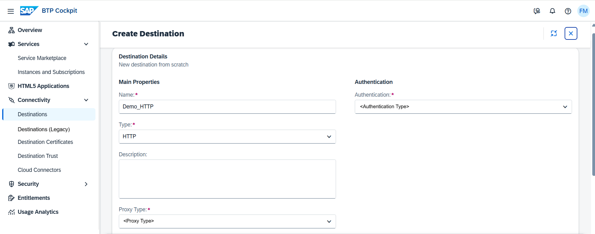

<!-- loio783fa1c418a244d0abb5f153e69ca4ce -->

# Create HTTP Destinations

Create HTTP destinations in the *Destinations* editor \(SAP BTP cockpit\).

## Prerequisites

You have logged into the cockpit and opened the *Destinations* editor from your subaccount menu \(choose *Connectivity* \> *Destinations*\).

> ### Note:  
> The on-premise use cases described in this guide are also applicable to virtual private cloud \(VPC\) environments.

<a name="loio783fa1c418a244d0abb5f153e69ca4ce__steps_j4g_jfb_pn"/>

## Procedure

1.  Choose *Create* \> *From Scratch* \> *Create*.

    

2.  Enter a destination name.

3.  From the *<Type\>* dropdown menu, choose `HTTP`.

4.  The *<Description\>* field is optional.

5.  From the *<Proxy Type\>* dropdown box, select `Internet`, `OnPremise`, or `PrivateLink`, depending on the connection type you want to provide for your application.

    

    > ### Note:  
    > For more information, see also [HTTP Destinations](http-destinations-42a0e6b.md).

6.  Specify the destination URL.

7.  From the *<Authentication\>* dropdown box, select the authentication type you want to use for the connection.

    For details, see [HTTP Destinations](http-destinations-42a0e6b.md).

    > ### Note:  
    > If you set an `HTTPS` destination, you need to also add a Trust Store. For more information, see [Manage Destination Certificates](manage-destination-certificates-df1bb55.md).

8.  \(Optional\) For *Internet* and *PrivateLink* connections only: You can enter a trust store location and password, or use the default client trust store.

9.  \(Optional\) For *OnPremise* connections only: If you are using more than one Cloud Connector for your subaccount, you must enter the *<Location ID\>* of the target Cloud Connector.

    See also [Adding and Managing Subaccounts](adding-and-managing-subaccounts-f16df12.md) \(section **Procedure**, step 4\).

10. \(Optional\) You can enter additional properties.

    1.  In the *Additional Properties* panel, choose *New Property*.

    2.  Enter a key \(name\) or choose one from the dropdown menu and specify a value for the property. You can add as many properties as you need.

    3.  To delete a property, choose the *Delete* icon next to it.

    > ### Note:  
    > For a detailed description of specific properties for SAP Business Application Studio \(formerly known as SAP Web IDE\), see [Connecting to External Systems](https://help.sap.com/viewer/9d1db9835307451daa8c930fbd9ab264/Cloud/en-US/7e49887e6fd34182bebeca5a6841a0cc.html).

11. When you are done, choose *Create*.

**Related Information**  

[Edit and Delete Destinations](edit-and-delete-destinations-372dee2.md "How to edit and delete destinations in the Destinations editor (SAP BTP cockpit).")

[Destination Examples](destination-examples-3a2d575.md "Find configuration examples for HTTP and RFC destinations in SAP BTP, using different authentication types.")

