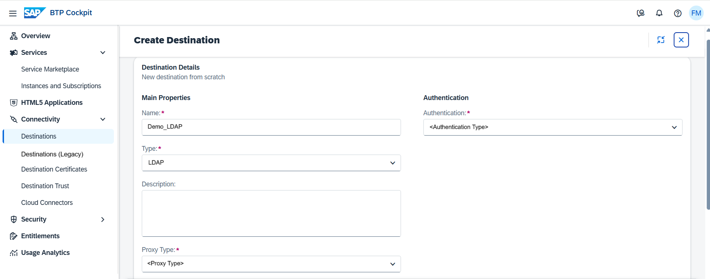

<!-- loio2d11ff6cfca94555aa4aec7560dd46dd -->

# Create LDAP Destinations

Create LDAP destinations in the *Destinations* editor \(SAP BTP cockpit\).

## Prerequisites

You have logged into the cockpit and opened the *Destinations* editor from your subaccount menu \(choose *Connectivity* \> *Destinations*\).

> ### Note:  
> The on-premise use cases described in this guide are also applicable to virtual private cloud \(VPC\) environments.

<a name="loio2d11ff6cfca94555aa4aec7560dd46dd__steps_j4g_jfb_pn"/>

## Procedure

1.  Choose *Create* \> *From Scratch* \> *Create*.

    

2.  Enter a destination name.

3.  From the *Type* dropdown menu, choose `LDAP`.

4.  The *Description* field is optional.

5.  From the *Proxy Type* dropdown box, select `Internet`, `OnPremise`, or `PrivateLink`, depending on the connection type you want to provide for your application.

    

6.  Specify the target *URL* of the LDAP server.

7.  \(Optional\) For *OnPremise* connections only: If more than one Cloud Connector is connected to your subaccount, enter the location ID of the Cloud Connector that is used to connect to the target LDAP server.

8.  Choose *Authentication* type `NoAuthentication` or `BasicAuthentication`. For a detailed parameter description, see [Configuring Authentication](http-destinations-42a0e6b.md#loio42a0e6b966924f2e902090bdf435e1b2__config).

9.  \(Optional\) You can enter additional properties.

    1.  In the *Additional Properties* panel, choose *Add Property*.

    2.  Enter a key \(name\) or choose one from the dropdown menu and specify a value for the property. You can add as many properties as you need.

    3.  To delete a property, choose the *Delete* icon next to it.

10. When you are done, choose *Create*.

**Related Information**  

[Edit and Delete Destinations](edit-and-delete-destinations-372dee2.md "How to edit and delete destinations in the Destinations editor (SAP BTP cockpit).")

[Destination Examples](destination-examples-3a2d575.md "Find configuration examples for HTTP and RFC destinations in SAP BTP, using different authentication types.")

[Cloud Connector](cloud-connector-e6c7616.md "Learn more about the Cloud Connector: features, scenarios and setup.")

