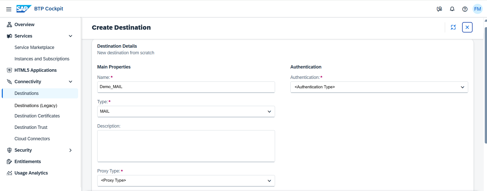

<!-- loio6442cb4f8b0f41178abce14c35f5def4 -->

# Create MAIL Destinations

Create MAIL destinations in the *Destinations* editor \(SAP BTP cockpit\).

## Prerequisites

You have logged into the cockpit and opened the *Destinations* editor from your subaccount menu \(choose *Connectivity* \> *Destinations*\).

> ### Note:  
> The on-premise use cases described in this guide are also applicable to virtual private cloud \(VPC\) environments.

<a name="loio6442cb4f8b0f41178abce14c35f5def4__steps_j4g_jfb_pn"/>

## Procedure

1.  Choose *Create* \> *From Scratch* \> *Create*.

    

2.  Enter a destination name.

3.  From the *Type* dropdown menu, choose `MAIL`.

4.  The *Description* field is optional.

5.  From the *Proxy Type* dropdown box, select `Internet`, `OnPremise`, or `PrivateLink`, depending on the connection type you want to provide for your application.

    

    > ### Note:  
    > To access a mail server located in your own network \(via Cloud Connector\), choose `OnPremise`. To access an external mail server, choose `Internet`.

6.  Choose the *Authentication* type to be used for the destination and enter the required parameters. For a detailed parameter description, see [Configuring Authentication](http-destinations-42a0e6b.md#loio42a0e6b966924f2e902090bdf435e1b2__config).

7.  Enter an *additional property* to specify the address of the target mail server.

    1.  In the *Additional Properties* panel, choose *Add Property*.

    2.  Depending on the protocol you want to use, enter *mail.imap4.host*, *mail.pop3.host*, or *mail.smtp.host* and specify a value for the property.

8.  \(Optional\) You can enter more additional properties.

    1.  In the *Additional Properties* panel, choose *Add Property*.

    2.  Enter a key \(name\) or choose one from the dropdown menu and specify a value for the property. You can add as many properties as you need. Each key of an additional property must start with "`mail.`".

    3.  To delete a property, choose the *Delete* icon next to it.

9.  When you are done, choose *Create*.

**Related Information**  

[MAIL Destinations](mail-destinations-e3de817.md "Find information about MAIL destinations for Internet or on-premise connections from an SAP BTP subaccount.")

