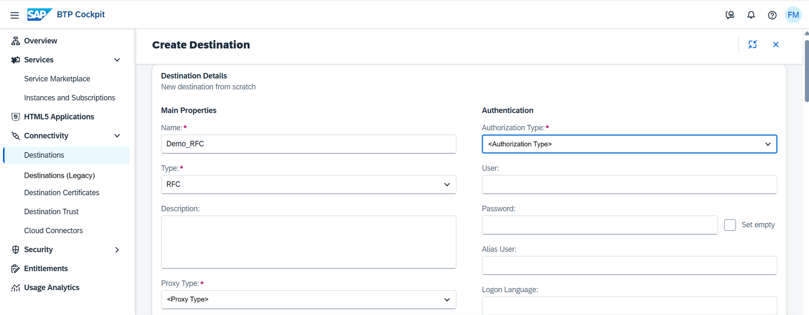

<!-- loio9b3cc683cca944bd98346bef3181630e -->

# Create RFC Destinations

How to create RFC destinations in the *Destinations* editor \(SAP BTP cockpit\).

## Prerequisites

You have logged into the cockpit and opened the *Destinations* editor from your subaccount menu \(choose *Connectivity* \> *Destinations*\).

> ### Note:  
> The on-premise use cases described in this guide are also applicable to virtual private cloud \(VPC\) environments.

<a name="loio9b3cc683cca944bd98346bef3181630e__steps_j4g_jfb_pn"/>

## Procedure

1.  Choose *Create* \> *From Scratch* \> *Create*.

    

2.  Enter a destination name.

3.  From the *<Type\>* dropdown menu, choose `RFC`.

4.  The *<Description\>* field is optional.

5.  From the *<Proxy Type\>* dropdown box, select `Internet`, `OnPremise`, or `Local`, depending on the connection type you want to provide for your application.

    

    > ### Note:  
    > When using *<Proxy Type\>* `Internet` , you can connect your application to any target service that is exposed to the Internet. *<Proxy Type\>* `OnPremise` requires the Cloud Connector to access resources within your on-premise network.

6.  \(Optional\) For *OnPremise* connections only: If you are using more than one Cloud Connector for your subaccount, you must enter the *<Location ID\>* of the target Cloud Connector.

    See also [Adding and Managing Subaccounts](adding-and-managing-subaccounts-f16df12.md) \(section **Procedure**, step 4\).

7.  As *Authorization Type*, choose `CONFIGURED_USER`, `PrincipalPropagation` \(for *OnPremise* connections only\), or `TechnicalUserPropagation` \(for *OnPremise* connections only\), and enter the required parameters for the selected authentication type.

    See also [User Logon Properties](user-logon-properties-8b1e1c3.md).

8.  In section *Target System Configuration*, enter the required target system information.

    See also [Target System Configuration](target-system-configuration-ab6eac9.md).

9.  \(Optional\) In section *Repository Configuration*, you can define the repository behavior.

    See also [Repository Configuration](repository-configuration-4c4b83b.md).

10. \(Optional\) In section *Pooling Configuration*, you can define the pooling behavior for the RFC destination.

    See also [Pooling Configuration](pooling-configuration-7add680.md).

11. \(Optional\) In section *Communication Behavior Configuration*, you can control the connection to an ABAP system.

    See also [Parameters Influencing Communication Behavior](parameters-influencing-communication-behavior-cce126a.md).

12. \(Optional\) You can enter additional properties.

    1.  In the *Additional Properties* panel, choose *New Property*.

    2.  Enter a key \(name\) or choose one from the dropdown menu and specify a value for the property. You can add as many properties as you need.

    3.  To delete a property, choose the *Delete* icon next to it.

    For a detailed description of RFC-specific properties \(JCo properties\), see [RFC Destinations](rfc-destinations-238d027.md).

13. When you are done, choose *Create*.

**Related Information**  

[Edit and Delete Destinations](edit-and-delete-destinations-372dee2.md "How to edit and delete destinations in the Destinations editor (SAP BTP cockpit).")

[Destination Examples](destination-examples-3a2d575.md "Find configuration examples for HTTP and RFC destinations in SAP BTP, using different authentication types.")

[Cloud Connector](cloud-connector-e6c7616.md "Learn more about the Cloud Connector: features, scenarios and setup.")

