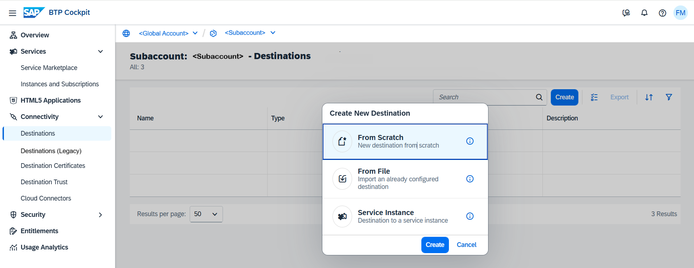

<!-- loiofe8306ad9274444ebef5af927ed71144 -->

# Create TCP Destinations

Create TCP destinations in the *Destinations* editor \(SAP BTP cockpit\).

## Prerequisites

You have logged into the cockpit and opened the *Destinations* editor from your subaccount menu \(choose *Connectivity* \> *Destinations*\).

> ### Note:  
> The on-premise use cases described in this guide are also applicable to virtual private cloud \(VPC\) environments.

<a name="loiofe8306ad9274444ebef5af927ed71144__steps_j4g_jfb_pn"/>

## Procedure

1.  Choose *Create* \> *From Scratch* \> *Create*.

    

2.  Enter a destination name.

3.  From the *<Type\>* dropdown menu, choose `TCP`.

4.  The *<Description\>* field is optional.

5.  From the *<Proxy Type\>* dropdown box, select `Internet`, `OnPremise`, or `PrivateLink`, depending on the connection type you want to provide for your application.

    

    > ### Note:  
    > For more information, see also [TCP Destinations](tcp-destinations-f6d753f.md).

6.  Specify the destination *Address*.

7.  \(Optional\) If you selected *<Proxy Type\>* `OnPremise`, and you are using more than one Cloud Connector for your subaccount, you must enter the *<Location ID\>* of the target Cloud Connector.

    See also [Adding and Managing Subaccounts](adding-and-managing-subaccounts-f16df12.md) \(section **Procedure**, step 4\).

8.  \(Optional\) You can enter additional properties.

    1.  In the *Additional Properties* panel, choose *Add Property*.

    2.  Enter a key \(name\) or choose one from the dropdown menu and specify a value for the property. You can add as many properties as you need.

    3.  To delete a property, choose the *Delete* icon next to it.

9.  When you are done, choose *Create*.

**Related Information**  

[Edit and Delete Destinations](edit-and-delete-destinations-372dee2.md "How to edit and delete destinations in the Destinations editor (SAP BTP cockpit).")

[TCP Destinations](tcp-destinations-f6d753f.md "Create and manage SAP BTP destinations using the TCP protocol for communication.")

