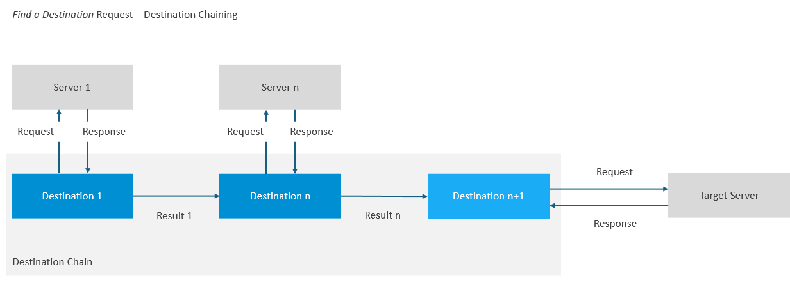

<!-- loio08a09f5ae5e049dc851b6e095debed8f -->

# Destination Chaining

Invoke multiple destinations with a single *Find a Destination* request.

Destination chaining is a mechanism that lets you invoke multiple destinations with a single *Find a Destination* request, automatically using the result of one destination as input for the next one, except for the final destination of the chain, which points to the actual target server.


<a name="loio08a09f5ae5e049dc851b6e095debed8f__section_cvn_hs4_42c"/>

## Example



When calling this chain, the Destination service will first call **Server 1**, defined in **Destination 1**. It will use the output of this call to call **Server n**, defined in **Destination n**. It will then return the response of **Server n**, along with the contents of **Destination n+1** to you, so you can build and execute your request to the **Target Server**.


<a name="loio08a09f5ae5e049dc851b6e095debed8f__section_dnt_ns4_42c"/>

## Process

You can use destination chaining by calling the *Find a Destination* API for a given destination and providing the HTTP header `X-chain-name`, which defines the chain in use.

The concrete chain might define more HTTP headers you need to provide when calling the API. They start with `X-chain-var-<variable_name>` and are specific for each chain. In order to check what headers you need to provide when you use destination chaining, check the dedicated documentation page of the specific chain.

Overview of the *Find a Destination* API request:

> ### Sample Code:  
> ```
> curl https://<destination-service-host>/destination-configuration/v1/destinations/<final-destination-name> --request GET \
>   --header 'Authorization: Bearer <destination-service-access-token>' \
>   --header 'X-chain-name: <chain-name>' \
>   --header 'X-chain-var-chainVariable1: <value of chainVariable1>'
> ```

> ### Restriction:  
> Destination chaining is only applicable for requests to a *Find a Destination* REST API endpoint.

> ### Restriction:  
> Currently, only predefined chains are supported by the Destination service.

**Related Information**  


[Calling the Destination Service REST API](calling-the-destination-service-rest-api-84c5d38.md "Prerequisites and steps to get access to the Destination service REST API.")

[Predefined Destination Chains](predefined-destination-chains-3c82ad5.md "Find a list of predefined destination chains that can be consumed through requests to the Destination service.")

["Find a Destination" Response Structure](find-a-destination-response-structure-83a3f3b.md "Overview of data that are returned by the Destination service for the call type &quot;Find a Destination&quot;.")

[Token Retrieval Using IAS-Signed SAML2.0 Assertions](token-retrieval-using-ias-signed-saml2-0-assertions-a943bb7.md "Retrieve access tokens from token servers using IAS (Identity Authentication service)-signed SAML2.0 assertions.")

