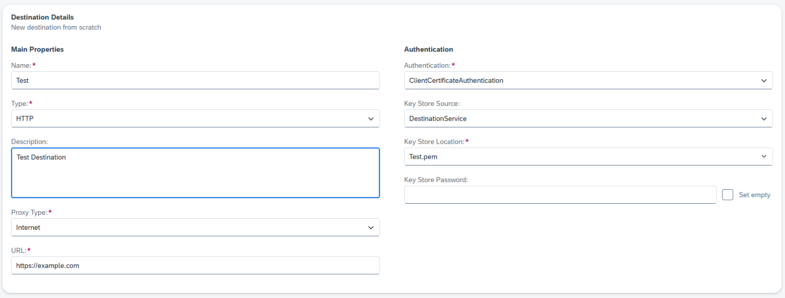
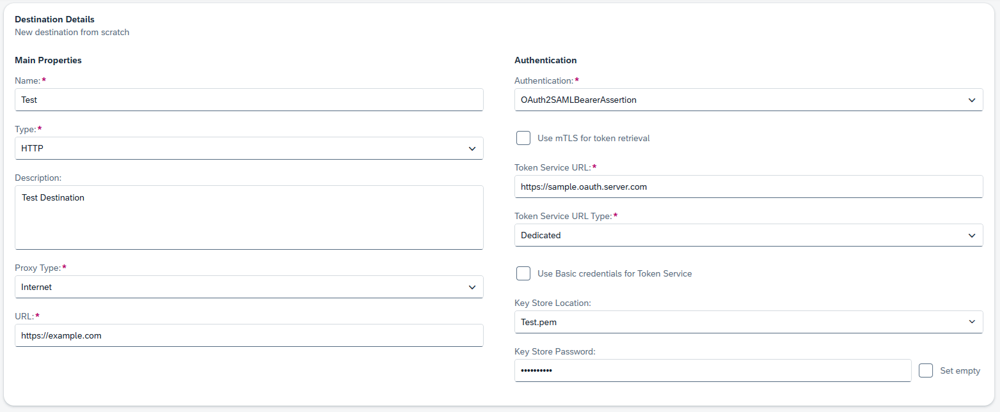
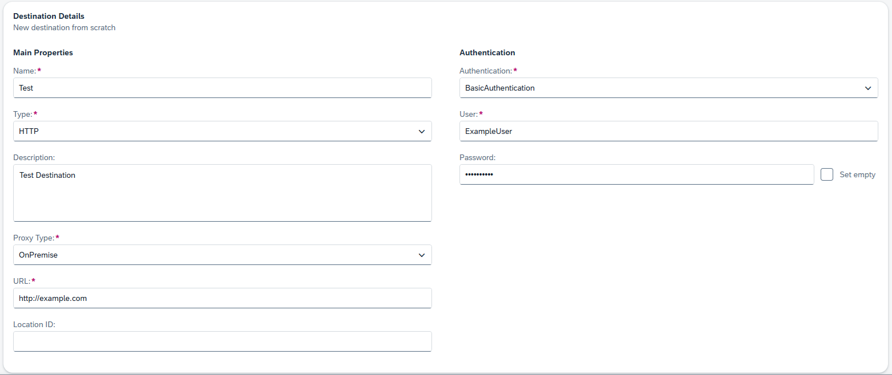
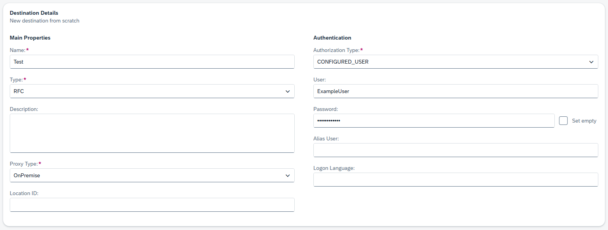
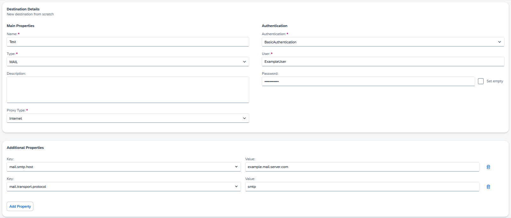

<!-- loio3a2d57580d474da6960a644462a92861 -->

# Destination Examples

Find configuration examples for HTTP and RFC destinations in SAP BTP, using different authentication types.

<a name="loio3a2d57580d474da6960a644462a92861__content"/>

## Content

[HTTP Destination \(Internet, Client Certificate Authentication\)](destination-examples-3a2d575.md#loio3a2d57580d474da6960a644462a92861__http_client)

[HTTP Destination \(Internet, OAuth2SAMLBearerAssertion\)](destination-examples-3a2d575.md#loio3a2d57580d474da6960a644462a92861__http_oauth)

[HTTP Destination \(On-Premise\)](destination-examples-3a2d575.md#loio3a2d57580d474da6960a644462a92861__http_op)

[RFC Destination](destination-examples-3a2d575.md#loio3a2d57580d474da6960a644462a92861__rfc)

[Mail Destination \(Internet\)](destination-examples-3a2d575.md#loio3a2d57580d474da6960a644462a92861__mail_internet)

<a name="loio3a2d57580d474da6960a644462a92861__http_client"/>

## Example: HTTP Destination \(Internet, Client Certificate Authentication\)

Back to [Content](destination-examples-3a2d575.md#loio3a2d57580d474da6960a644462a92861__content)

<a name="loio3a2d57580d474da6960a644462a92861__http_oauth"/>

## Example: HTTP Destination \(Internet, OAuth2SAMLBearerAssertion\)

Back to [Content](destination-examples-3a2d575.md#loio3a2d57580d474da6960a644462a92861__content)

<a name="loio3a2d57580d474da6960a644462a92861__http_op"/>

## Example: HTTP Destination \(On-Premise\)

Back to [Content](destination-examples-3a2d575.md#loio3a2d57580d474da6960a644462a92861__content)

<a name="loio3a2d57580d474da6960a644462a92861__rfc"/>

## Example: RFC Destination

Back to [Content](destination-examples-3a2d575.md#loio3a2d57580d474da6960a644462a92861__content)

<a name="loio3a2d57580d474da6960a644462a92861__mail_internet"/>

## Example: Mail Destination \(Internet\)

Back to [Content](destination-examples-3a2d575.md#loio3a2d57580d474da6960a644462a92861__content)

**Related Information**  

[HTTP Destinations](http-destinations-42a0e6b.md "Find information about HTTP destinations for Internet and on-premise connections.")

[RFC Destinations](rfc-destinations-238d027.md "")

[MAIL Destinations](mail-destinations-e3de817.md "Find information about MAIL destinations for Internet or on-premise connections from an SAP BTP subaccount.")

