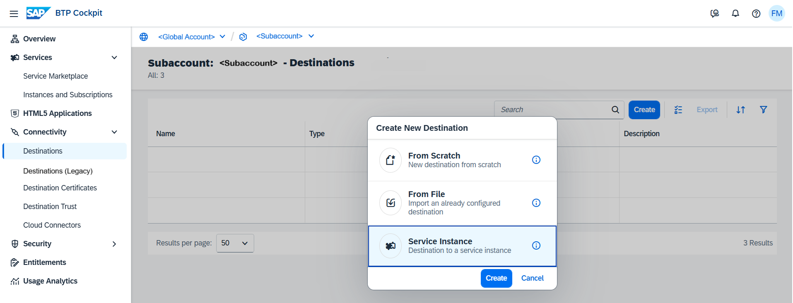
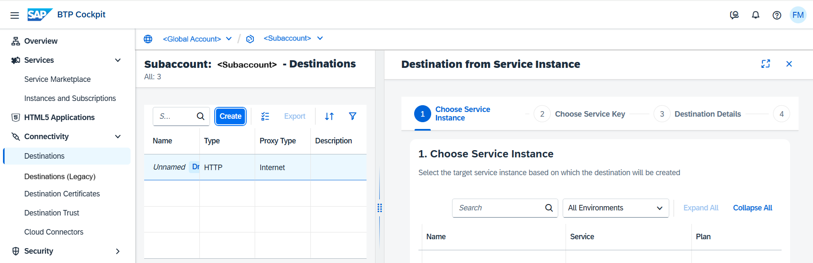

<!-- loio685f383cebb54c009b2fac633b32c90f -->

# Destinations Pointing to Service Instances

Create a destination for subscription-based scenarios that points to your service instance.

> ### Note:  
> This feature is applicable for a selected set of the most commonly used services \(from a Destination service perspective\). If you would like to use this feature for a service which is not yet supported, let us know by opening a support ticket, see [Connectivity Support](connectivity-support-e5580c5.md).
> 
> In the meantime, you can follow the steps described in [Create Destinations from Scratch](create-destinations-from-scratch-5eba623.md).

Usually, in the Cloud Foundry environment, you consume service instances by binding them to your applications. However, in subscription-based scenarios this is not always possible. If you have purchased a subscription to an SaaS application that runs in a provider's subaccount, you cannot bind your service instance to this application.

In this case, you must create a destination that points to your service instance. Applications can consume this destination through a subscription to gain access to your service instance.

If you create such a destination from scratch, you must provide a service key for your instance, look up the credentials, and enter these values in the newly created destination.

Using the *Destinations Pointing to Service Instances* template, you only have to select the corresponding service instance.

> ### Note:  
> This procedure only applies for HTTP destinations on subaccount level.

<a name="loio685f383cebb54c009b2fac633b32c90f__section_uyl_2x4_slb"/>

## Prerequisites

-   You have a service instance which you want to make accessible to applications you are subscribed to.

-   You have the Space Developer role in the space where this service instance resides \(only relevant for Cloud Foundry environment\).

-   You have logged in to the cockpit and opened the *Destinations* editor on *subaccount* level. See [Access the Destinations Editor](access-the-destinations-editor-82ca377.md).

## Procedure

1.  Choose *Create* \> *Service Instance* \> *Create*.

    

2.  Select a service instance and choose *Next*.

    

3.  Choose an existing service key or generate a new one for the selected service instance. Choose *Next*.
4.  Enter destination details and choose *Next*.

    For more information, see [Create Destinations from Scratch](create-destinations-from-scratch-5eba623.md).

5.  Review destination data.
6.  Choose *Create*.

<a name="loio685f383cebb54c009b2fac633b32c90f__section_cml_nx4_slb"/>

## Result

You have a destination pointing to your service instance.

> ### Caution:  
> If you delete the used service instance or its service key, the destination will stop working.

