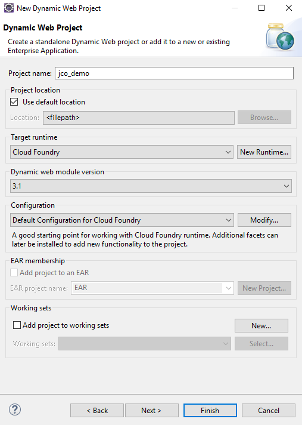

<!-- loioa799669caada43e595581fb7b674c536 -->

# Develop a Sample Web Application

Create a Web application to call an ABAP function module via RFC.


<a name="loioa799669caada43e595581fb7b674c536__Steps_Develop"/>

## Steps

1.  [Create a Dynamic Web Project](develop-a-sample-web-application-7808d1d.md#loio7808d1d32c994a9e860ab342e2188763__Dynamic)
2.  [Include JCo Dependencies](develop-a-sample-web-application-7808d1d.md#loio7808d1d32c994a9e860ab342e2188763__Include)
3.  [Create a Sample Servlet](develop-a-sample-web-application-7808d1d.md#loio7808d1d32c994a9e860ab342e2188763__Servlet)


<a name="loioa799669caada43e595581fb7b674c536__Dynamic"/>

## Create a Dynamic Web Project

1.  Open the *Java EE* perspective of the Eclipse IDE.
2.  On the *Project Explorer* view, choose *New* \> *Dynamic Web Project* in the context menu.
3.  Enter `jco_demo` as the project name.
4.  In the *Target Runtime* pane, select `Cloud Foundry` . If it is not yet in the list of available runtimes, choose *New Runtime* and select it from there.
5.  In the *Configuration* pane, leave the default configuration.
6.  Choose *Finish*.



Back to [Steps](develop-a-sample-web-application-7808d1d.md#loio7808d1d32c994a9e860ab342e2188763__Steps_Develop) 


<a name="loioa799669caada43e595581fb7b674c536__Include"/>

## Include JCo Dependencies

To use JCo functionality seamlessly at compile time in Eclipse, you must include the JCo dependencies into your web project. Therefore, you must convert it into a maven project.

1.  In the *Project Explorer* view, right-click on the project`jco-demo` and choose *Configure* \> *Convert to Maven Project*.
2.  In the dialog window, leave the default settings unchanged and choose *Finish*.
3.  Open the `pom.xml` file and include the following dependency:

```
<dependencies>

  <dependency>

    <groupId>com.sap.cloud</groupId>

    <artifactId>neo-java-web-api</artifactId>

    <version>[3.71.8,4.0.0)</version>

    <scope>provided</scope>

  </dependency>

</dependencies>

```

Back to [Steps](develop-a-sample-web-application-7808d1d.md#loio7808d1d32c994a9e860ab342e2188763__Steps_Develop) 


<a name="loioa799669caada43e595581fb7b674c536__Servlet"/>

## Create a Sample Servlet

1.  From the *jco\_demo* project node, choose *New* \> *Servlet* in the context menu.
2.  Enter `com.sap.demo.jco` as the *<package\>* and `ConnectivityRFCExample`Java as the *<Class name\>*. Choose *Next*.
3.  Choose *Finish* to create the servlet and open it in the Java editor.
4.  Replace the entire servlet class to make use of the JCo API. The JCo API is visible by default for cloud applications. You do not need to add it explicitly to the application class path.

    > ### Sample Code:  
    > ```
    > 
    > package com.sap.demo.jco;
    > 
    >  
    > 
    > import java.io.IOException;
    > 
    > import java.io.PrintWriter;
    > 
    >  
    > 
    > import javax.servlet.ServletException;
    > 
    > import javax.servlet.annotation.WebServlet;
    > 
    > import javax.servlet.http.HttpServlet;
    > 
    > import javax.servlet.http.HttpServletRequest;
    > 
    > import javax.servlet.http.HttpServletResponse;
    > 
    >  
    > 
    > import com.sap.conn.jco.AbapException;
    > 
    > import com.sap.conn.jco.JCoDestination;
    > 
    > import com.sap.conn.jco.JCoDestinationManager;
    > 
    > import com.sap.conn.jco.JCoException;
    > 
    > import com.sap.conn.jco.JCoFunction;
    > 
    > import com.sap.conn.jco.JCoParameterList;
    > 
    > import com.sap.conn.jco.JCoRepository;
    > 
    >  
    > 
    > /**
    > 
    >  * Sample application that makes use of the capability to invoke a function module in an ABAP system
    > 
    >  * via RFC
    > 
    >  *
    > 
    >  * Note: The JCo APIs are available under <code>com.sap.conn.jco</code>.
    > 
    >  */
    > 
    > 
    > @WebServlet("/ConnectivityRFCExample/*")
    > 
    > public class ConnectivityRFCExample extends HttpServlet {
    > 
    >     private static final long serialVersionUID = 1L;
    > 
    >  
    > 
    >     protected void doGet(HttpServletRequest request, HttpServletResponse response)
    > 
    >             throws ServletException, IOException {
    > 
    >         PrintWriter responseWriter = response.getWriter();
    > 
    >         try {
    > 
    >             // access the RFC Destination "JCoDemoSystem"
    > 
    >             JCoDestination destination = JCoDestinationManager.getDestination("JCoDemoSystem");
    > 
    >  
    > 
    >             // make an invocation of STFC_CONNECTION in the backend;
    > 
    >             JCoRepository repo = destination.getRepository();
    > 
    >             JCoFunction stfcConnection = repo.getFunction("STFC_CONNECTION");
    > 
    >  
    > 
    >             JCoParameterList imports = stfcConnection.getImportParameterList();
    > 
    >             imports.setValue("REQUTEXT", "SAP BTP Connectivity runs with JCo");
    > 
    > 
    >             stfcConnection.execute(destination);
    > 
    >             JCoParameterList exports = stfcConnection.getExportParameterList();
    > 
    >             String echotext = exports.getString("ECHOTEXT");
    > 
    >             String resptext = exports.getString("RESPTEXT");
    > 
    > 
    >             response.addHeader("Content-type", "text/html");
    > 
    >             responseWriter.println("<html><body>");
    > 
    >             responseWriter.println("<h1>Executed STFC_CONNECTION in system JCoDemoSystem</h1>");
    > 
    >             responseWriter.println("<p>Export parameter ECHOTEXT of STFC_CONNECTION:<br>");
    > 
    >             responseWriter.println(echotext);
    > 
    >             responseWriter.println("<p>Export parameter RESPTEXT of STFC_CONNECTION:<br>");
    > 
    >             responseWriter.println(resptext);
    > 
    >             responseWriter.println("</body></html>");
    > 
    >         } catch (AbapException ae) {
    > 
    >             // just for completeness: As this function module does not have an exception
    > 
    >             // in its signature, this exception cannot occur. But you should always
    > 
    >             // take care of AbapExceptions
    > 
    >         } catch (JCoException e) {
    > 
    >             response.addHeader("Content-type", "text/html");
    > 
    >             responseWriter.println("<html><body>");
    > 
    >             responseWriter
    > 
    >                     .println("<h1>Exception occurred while executing STFC_CONNECTION in system JCoDemoSystem</h1>");
    > 
    >             responseWriter.println("<pre>");
    > 
    >             e.printStackTrace(responseWriter);
    > 
    >             responseWriter.println("</pre>");
    > 
    >             responseWriter.println("</body></html>");
    > 
    >         }
    > 
    >     }
    > 
    > }
    > 
    > ```

5.  Save the Java editor and make sure that the project compiles without errors.

Back to [Steps](develop-a-sample-web-application-7808d1d.md#loio7808d1d32c994a9e860ab342e2188763__Steps_Develop) 


<a name="loioa799669caada43e595581fb7b674c536__section_xsy_nkc_cgb"/>

## Next Steps

-   [Create and Bind Service Instances](create-and-bind-service-instances-67a42bb.md)
-   [Deploy the Application](deploy-the-application-3ab2b13.md)
-   [Configure Roles and Trust](configure-roles-and-trust-a6ce7e7.md)
-   [Set Up an Application Router](set-up-an-application-router-f9f8eb2.md)
-   [Configure the RFC Destination](configure-the-rfc-destination-cfd3fea.md)
-   [Monitoring Your Web Application](monitoring-your-web-application-9bd8f7d.md) \(Optional\)

