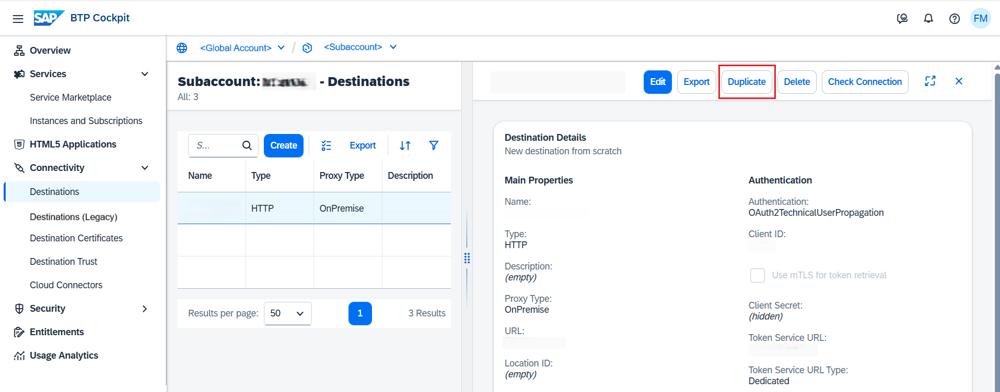

<!-- loiob80786e5b6b8428cbbd3fcd648957c17 -->

# Duplicate Destinations

How to duplicate destinations in the *Destinations* editor \(SAP BTP cockpit\).

## Prerequisites

You have previously created an HTTP destination in the *Destinations* editor of the cockpit.

## Procedure

1.  In the *Destinations* editor, select the existing destination which you want to duplicate, and open the detail view.

2.  Choose *Duplicate*.

    

3.  The editor automatically creates and opens a new destination that contains all the properties of the selected one.

4.  You can modify some parameters if you need to.

5.  When you are done, choose *Create*.

**Related Information**  

[Export Destinations](export-destinations-707b49e.md "Export destinations from the Destinations editor in the SAP BTP cockpit to backup or reuse a destination configuration.")

[Destination Examples](destination-examples-3a2d575.md "Find configuration examples for HTTP and RFC destinations in SAP BTP, using different authentication types.")

