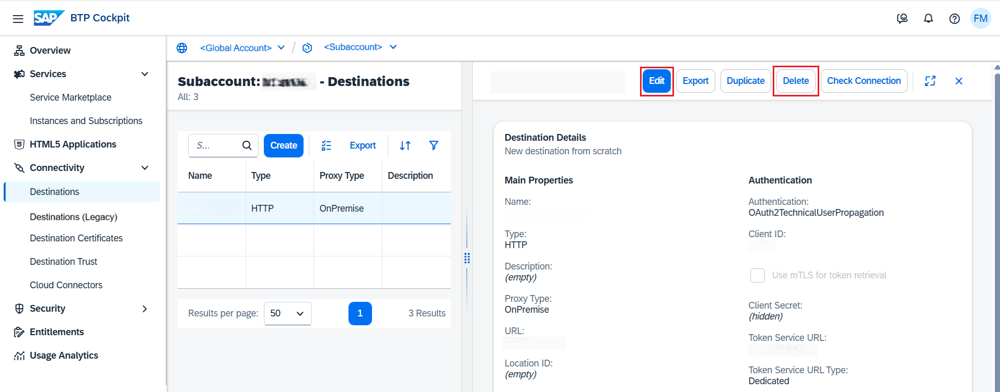

<!-- loio372dee2f52b24c44af1160600265123f -->

# Edit and Delete Destinations

How to edit and delete destinations in the *Destinations* editor \(SAP BTP cockpit\).

## Prerequisites

You have previously created an HTTP destination in the *Destinations* editor of the cockpit.

## Procedure

-   Edit a destination:
    1.  To edit an existing destination, select the destination to open its detail view.
    2.  Choose *Edit*.

        

    3.  You can edit the main parameters as well as the additional properties of a destination.
    4.  When you are done, choose *Save*. The changes will take effect in up to five minutes.

        > ### Tip:  
        > For complete consistency, we recommend that you first stop your application, then apply your destination changes, and then start again the application. Also, bear in mind that these steps will cause an application downtime.

-   Delete a destination:

    To remove an existing destination, choose *Delete* in the detail view. The changes will take effect in up to five minutes.

**Related Information**  

[Export Destinations](export-destinations-707b49e.md "Export destinations from the Destinations editor in the SAP BTP cockpit to backup or reuse a destination configuration.")

[Destination Examples](destination-examples-3a2d575.md "Find configuration examples for HTTP and RFC destinations in SAP BTP, using different authentication types.")

