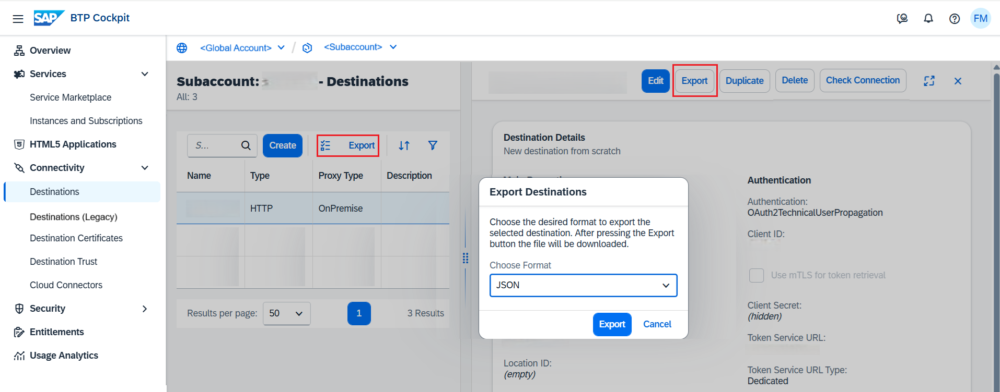

<!-- loio707b49e752df4741bf678bc27523af7a -->

# Export Destinations

Export destinations from the *Destinations* editor in the SAP BTP cockpit to backup or reuse a destination configuration.

## Prerequisites

You have created a destination in the *Destinations* editor.

## Procedure

1.  Log into the cockpit and open the *Destinations* editor.

2.  To export a single destination, select it and choose *Export* in the detail view. To export several destinations at once, choose *Turn on bulk actions* and select all destinations you want to export. Then choose *Export* in the destination overview list.

    

3.  Select the file format you want to use for download and choose *Export*. A file will be downloaded to your default download folder.

    The download includes the destination data in the selected file format. When downloading several destinations at once, their data will be downloaded as an archive file.

**Related Information**  

[Edit and Delete Destinations](edit-and-delete-destinations-372dee2.md "How to edit and delete destinations in the Destinations editor (SAP BTP cockpit).")

[Destination Examples](destination-examples-3a2d575.md "Find configuration examples for HTTP and RFC destinations in SAP BTP, using different authentication types.")

