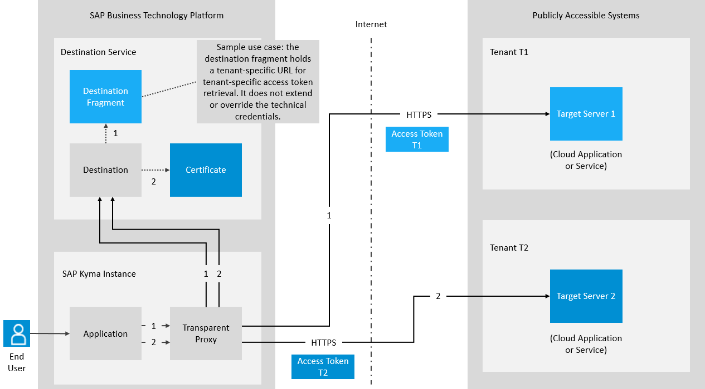
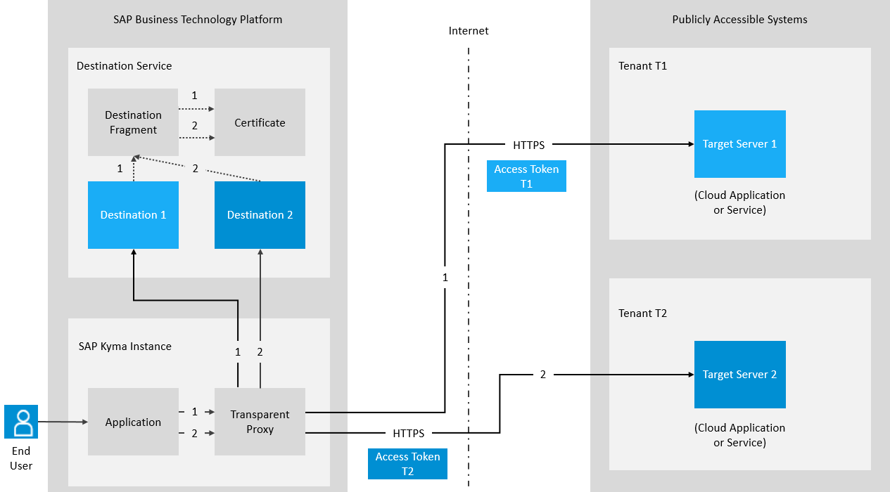
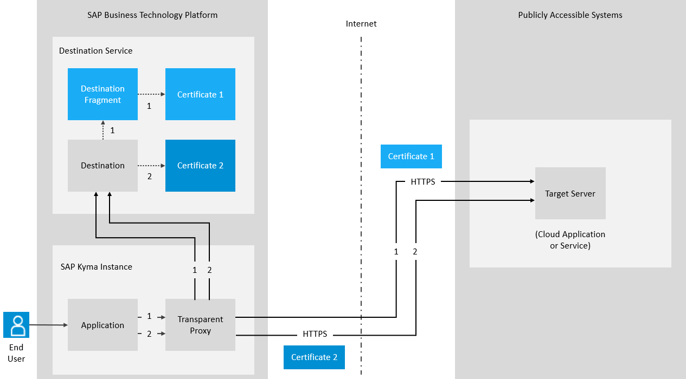

<!-- loiof56600ab82b748fe95b2d985ebda08c6 -->

# Extending Destinations with Fragments

Use the “Find Destination” API to extend your destination with a destination fragment.


<a name="loiof56600ab82b748fe95b2d985ebda08c6__section_tjz_tjw_fcc"/>

## Overview

Destination fragments let you manage technical connection configurations \(also known as destinations\) in a more flexible and dynamic way compared to the regular usage of destinations. You can use the destination fragment to extend an existing destination with additional properties, and even to override some of the existing destination properties. This feature enables a variety of technical scenarios which solve higher-level business scenario needs.

For more information, see also [Destination Fragments](destination-fragments-b085906.md).


<a name="loiof56600ab82b748fe95b2d985ebda08c6__section_o1g_xjw_fcc"/>

## Sample Use Cases

Find below some common use cases for destination fragments:

**Reuse of technical credentials for multiple users or tenants**



**Option 1:** Single destination, multiple destination fragments

-   In a regular destination, the administrator stores default properties like technical credentials, for example, *OAuth client* or *X.509 client certificate*.
-   In a destination fragment, the administrator stores user or tenant-specific additional properties, for example, a URL with a specific path, a query parameter, and so on.
-   At runtime, the application resolves the final destination using the regular destination lookup and in addition specifying the user or tenant-specific destination fragment via the optional HTTP header.

    For more information, see section *Use a Header to Specify the Destination Fragment* below.

-   As a result, the application receives a user or tenant-specific destination, reusing the same technical credentials, this way optimising the technical connection configuration management, for example, without the need to duplicate technical credentials among multiple destinations. The latter reduces the risk of business interruptions during operations like credentials rotation.



**Option 2:** Multiple destinations, a single destination fragment

-   In a each tenant-specific destination, the administrator stores properties like *URL* with a specific path, query parameter, and so on.
-   In a single destination fragment, the administrator stores default properties like technical credentials, for example, *OAuth client* or *X.509 client certificate*.
-   At runtime, the application resolves the final destination using the regular destination lookup and, optionally, if not already configured in the destination itself, in addition specifying the user or tenant-specific destination fragment via the optional HTTP header.

    For more information, see section *Use a Header to Specify the Destination Fragment* below.

-   As a result, the application receives a user or tenant-specific destination, reusing the same technical credentials, this way optimising the technical connection configuration management, for example, without the need to duplicate technical credentials among multiple destinations. The latter reduces the risk of business interruptions during operations like credentials rotation.

**Reuse of routing properties for multiple users or tenants**



-   In a regular destination, the administrator stores default properties like *URL*, *Authentication*, and so on.
-   In a destination fragment, the administrator stores user or tenant-specific additional properties, for example, a tenant-specific URL path, an X.509 client certificate, and so on.
-   At runtime, the application resolves the final destination using the regular destination lookup and in addition specifying the user or tenant-specific destination fragment via the optional HTTP header.

    For more information, see section *Use a Header to Specify the Destination Fragment* below.

-   As a result, the application receives a destination, constructed by re-using the base destination properties but with a user or tenant-specific URL path and technical credentials, this way optimising the technical connection configuration management, for example, without the need to duplicate the base routing properties among multiple destinations. The latter reduces the risk of business interruptions during operations like the change of common or base destination properties.


<a name="loiof56600ab82b748fe95b2d985ebda08c6__section_tvz_njw_fcc"/>

## How it Works

This extension involves merging the JSON object of the destination properties, together with the JSON object of the fragment properties.

> ### Note:  
> If any fragment property uses the same key name as a destination property, the combined JSON object will use the value of the fragment property.
> 
> The combined JSON of the destination and fragment will be returned in the response body as the value of the “destinationConfiguration” property. Additionally, this combined JSON will be used for retrieving tokens from authorization servers, if applicable.

> ### Note:  
> The combination of the destination JSON and the fragment JSON happens in the context of the “Find Destination” request. The actual destination stored in Destination service is not modified.


To apply this mechanism, you must use the following configurations:

-   A Destination – with any properties
-   A Destination Fragment – with any properties

> ### Note:  
> For more information on how to create and manage resources like destinations and destination fragments, see [SAP Business Accelerator Hub](https://api.sap.com/package/scpconnectivity/rest).


<a name="loiof56600ab82b748fe95b2d985ebda08c6__section_fdk_ty4_41c"/>

## Use a Header to Specify the Destination Fragment


<table>
<tr>
<th valign="top">

Header

</th>
<th valign="top">

Value

</th>
<th valign="top">

Description

</th>
</tr>
<tr>
<td valign="top">

X-Fragment-Name

</td>
<td valign="top">

Name of a destination fragment

</td>
<td valign="top">

Name of the destination fragment. The fragment itself must be maintained on the same level as the destination.

</td>
</tr>
</table>

> ### Caution:  
> Only one `X-Fragment-Name` header may be present in the “Find Destination” request.


<a name="loiof56600ab82b748fe95b2d985ebda08c6__section_khl_wlh_41c"/>

## Example: Using Destination Fragments to Add New Properties to a Destination

**Destination:**

> ### Sample Code:  
> ```
> Name=destination 
> Type=HTTP 
> URL=https://xxxx.example.com 
> ProxyType=Internet 
> Authentication=NoAuthentication
> ```


**Destination Fragment:**

> ### Sample Code:  
> ```
> FragmentName=fragment 
> example-property=example-value
> ```

**cURL call to send “Find Destination” request:** 

> ### Sample Code:  
> ```
> curl --request GET --url 'https://<destination_service_host>/destination-configuration/v1/destinations/<name_of_destination_being_extended>' \ 
>  --header 'Accept: */*' \ 
>  --header 'Authorization: Bearer <access_token>' \ 
>  --header 'X-Fragment-Name: <name_of_fragment>' 
> ```

**Response:**

> ### Sample Code:  
> ```
> { 
> "owner": { 
> "SubaccountId": <subaccount_id>, 
> "InstanceId": null 
> }, 
> "destinationConfiguration": { 
> "Name": "destination", 
> "Type": "HTTP", 
> "URL": "https://xxxx.example.com", 
> "Authentication": "NoAuthentication", 
> "ProxyType": "Internet", 
> "FragmentName": "fragment", 
> "example-property": "example-value" 
> } 
> } 
> ```


<a name="loiof56600ab82b748fe95b2d985ebda08c6__section_qjz_tlh_41c"/>

## Example: Using Destination Fragments to Override Properties of a Destination

**Destination:**

> ### Sample Code:  
> ```
> Name=destination 
> Type=HTTP 
> URL=https://xxxx.example.com 
> ProxyType=Internet 
> Authentication=OAuth2ClientCredentials 
> clientId=clientId 
> clientSecret=secret1234 
> tokenServiceURL=https://authserver1.example.com/oauth/token/ 
> ```

**Destination Fragment:**

> ### Sample Code:  
> ```
> FragmentName=fragment 
> clientId=clientId-2 
> clientSecret=secret2345 
> tokenServiceURL=https://authserver2.example.com/oauth/token/ 
> ```

**cURL call to send “Find Destination” request:**

> ### Sample Code:  
> ```
> curl --request GET \ 
>  --url 'https://<destination_service_host>/destination-configuration/v1/destinations/<name_of_destination_being_extended>' \ 
>  --header 'Accept: */*' \ 
>  --header 'Authorization: Bearer <access_token>' \ 
>  --header 'X-Fragment-Name: <name_of_fragment>' 
> ```

**Response:**

> ### Sample Code:  
> ```
> { 
> "owner": { 
> "SubaccountId": <subaccount_id>, 
> "InstanceId": null 
> }, 
> "destinationConfiguration": { 
> "Name": "destination", 
> "Type": "HTTP", 
> "URL": "https://xxxx.example.com", 
> "Authentication": "OAuth2ClientCredentials", 
> "ProxyType": "Internet", 
> "FragmentName": "fragment", 
> "clientId": "clientId-2", 
> "clientSecret": "secret2345", 
> "tokenServiceURL": "https://authserver2.example.com/oauth/token/" 
> }, 
> "authTokens": [ 
> { 
> "type": "Bearer", 
> "value": "eyJhbGciOiJSUzI1NiIsInR5cC...", 
> "http_header": { 
> "key":"Authorization", 
> "value":"Bearer eyJhbGciOiJSUzI1NiIsInR5cC..." 
> } 
> } 
> ] 
> } 
> ```

**Related Information**  


[Calling the Destination Service REST API](calling-the-destination-service-rest-api-84c5d38.md "Prerequisites and steps to get access to the Destination service REST API.")

["Find a Destination" Response Structure](find-a-destination-response-structure-83a3f3b.md "Overview of data that are returned by the Destination service for the call type &quot;Find a Destination&quot;.")

