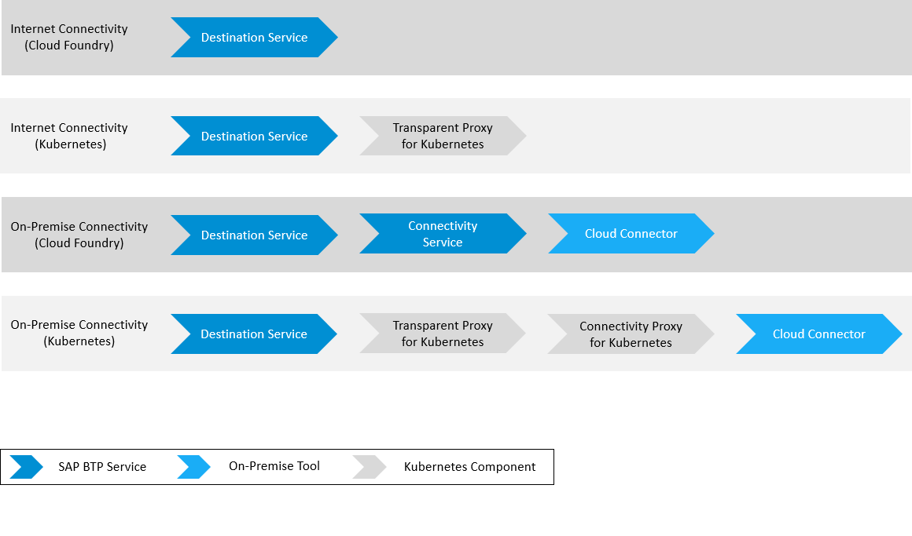

<!-- loiodaca64dacc6148fcb5c70ed86082ef91 -->

# Getting Started

Use SAP BTP Connectivity for your application in the Multi-Cloud Foundation: available services, components and use cases.

> ### Note:  
> You can use SAP BTP Connectivity for the Multi-Cloud Foundation and for the Neo environment. This documentation refers to SAP BTP, Multi-Cloud Foundation. If you are looking for information about the Neo environment, see [Connectivity for the Neo Environment](https://help.sap.com/viewer/b865ed651e414196b39f8922db2122c7/Cloud/en-US/5ceb84290d5644638f73d40fde3af5d0.html).

<a name="loiodaca64dacc6148fcb5c70ed86082ef91__section_ypp_lyv_x2c"/>

## Overview

SAP BTP provides robust connectivity features that let you establish reliable communication channels, ensuring data flows smoothly and securely across different environments. This capability is essential for enterprise applications and typically complex, needing to consume or push data to a variety of sources or destinations, including systems that are accessible directly, hosted in public or private clouds, or located on customer premises. SAP BTP Connectivity empowers businesses to extend, innovate, and optimize their digital landscapes effectively.

> ### Note:  
> The on-premise use cases described in this guide are also applicable to virtual private cloud \(VPC\) environments.

<a name="loiodaca64dacc6148fcb5c70ed86082ef91__section_ekl_lyv_x2c"/>

## Services and Components

**Basic Use Cases**

*Hover over the elements for a description. Click an element for more information.*

<table>
<tr>
<th valign="top">

Service/Component

</th>
<th valign="top">

Use Cases

</th>
</tr>
<tr>
<td valign="top">

Destination Service

</td>
<td valign="top">

The Destination service lets you find the information that is required to access a remote service or system from your cloud application.

-   For the connection to an on-premise system, you can use this service together with the Connectivity service.
    -   For Kubernetes environments, use the Destination service, the Connectivity Proxy and the Transparent Proxy for connections to the target system.

-   For the connection to any other Web application, you can use the Destination service without the Connectivity service.
    -   For Kubernetes environments, use the Destination service and the Transparent Proxy for automated and seamless connections to the target system.

-   Manages routing and authentication details, as well as custom scenario-specific parameters.
-   Performs authentication flows based on the configured details.

</td>
</tr>
<tr>
<td valign="top">

Connectivity Service

</td>
<td valign="top">

The Connectivity service offers a set of services and software components which allow SAP BTP applications to securely access remote services that run on premises. It:

-   Allows you to make connections to on-premise systems.
-   Provides, together with the Cloud Connector, a secure tunnel from your on-premise network to applications on SAP BTP, while you keep full control and auditability of what is exposed to the cloud. This way, no network ports need to be exposed on the on-premise side.
-   Supports various communication protocols towards the target system.

</td>
</tr>
<tr>
<td valign="top">

Connectivity Proxy for Kubernetes

</td>
<td valign="top">

The Connectivity Proxy is a Kubernetes component that connects workloads running on a Kubernetes cluster to on-premise systems, which are exposed via the Cloud Connector. The Connectivity Proxy must be paired to an SAP BTP region to grant access to the Cloud Connectors connected to that region. The SAP BTP domain model \(subaccounts\) is used to target a particular Cloud Connector.

</td>
</tr>
<tr>
<td valign="top">

Transparent Proxy for Kubernetes

</td>
<td valign="top">

The Transparent Proxy lightens the way your Kubernetes workloads connect to remote systems using BTP destinations. It provides authentication, user principal propagation, automated Connectivity Proxy handshakes, and easy access to the destination target systems by exposing them as Kubernetes services and routing the traffic to them:

-   Directly for Internet-accessible solutions/applications/systems
-   Via the Connectivity Proxy and the Cloud Connector for on-premise systems

</td>
</tr>
<tr>
<td valign="top">

Cloud Connector

</td>
<td valign="top">

The Cloud Connector serves as a secure link between cloud applications and on-premise systems, allowing controlled access to them. It functions as a reverse invoke proxy within a secured network, providing fine-grained control over both accessible on-premise resources and cloud applications using it.

</td>
</tr>
</table>

> ### Note:  
> -   The Connectivity service and the Destination service are built-in SAP BTP services in the Multi-Cloud environment.
> -   The Transparent Proxy and the Connectivity Proxy are available in two different versions: as modules \(to be deployed\) in SAP BTP, Kyma environment, and as standalone components.
> -   The Cloud Connector is a standalone component to be installed and configured locally \(in your on-premise network\).

<a name="loiodaca64dacc6148fcb5c70ed86082ef91__section_rkg_lyv_x2c"/>

## Recommendations

-   Use the Destination service to store and manage your connection configuration data \(including credentials, certificates, URL, headers, queries, etc.\) at design time, and automate the OAuth2 token retrieval process at runtime for your application.
-   Use the Transparent Proxy for Kubernetes to enhance developers' user experience and simplify the consumption of end systems by automating the retrieval of destinations from the Destination service, as well as integration with the Connectivity Proxy and authentication with end systems.
-   Use the Cloud Connector and the Connectivity service to establish a secure connection between Cloud Foundry applications and on-premise systems.
-   Use the Cloud Connector and the Connectivity Proxy \(for Kubernetes environments\) to establish a secure connection between Kubernetes applications and on-premise systems.

<a name="loiodaca64dacc6148fcb5c70ed86082ef91__section_of1_lyv_x2c"/>

## Scenarios

To find examples of typical Connectivity scenarios, see [Connectivity Scenarios](connectivity-scenarios-1e4b878.md).

**Related Information**  

[Connectivity Service](connectivity-service-bd2d4f4.md "Learn how to manage and consume the Connectivity service in SAP BTP, Multi-Cloud Foundation.")

[Destination Service](destination-service-8ff5483.md "Learn how to manage destinations and consume the Destination service in SAP BTP, Multi-Cloud Foundation.")

[Cloud Connector](cloud-connector-e6c7616.md "Learn more about the Cloud Connector: features, scenarios and setup.")

[Connectivity Proxy for Kubernetes](connectivity-proxy-for-kubernetes-e661713.md "Use the Connectivity Proxy for Kubernetes to connect workloads on a Kubernetes cluster to on-premise systems.")

[Transparent Proxy for Kubernetes](transparent-proxy-for-kubernetes-acc64ad.md "Use the Transparent Proxy for Kubernetes to connect workloads on a Kubernetes cluster to Internet and on-premise applications.")

