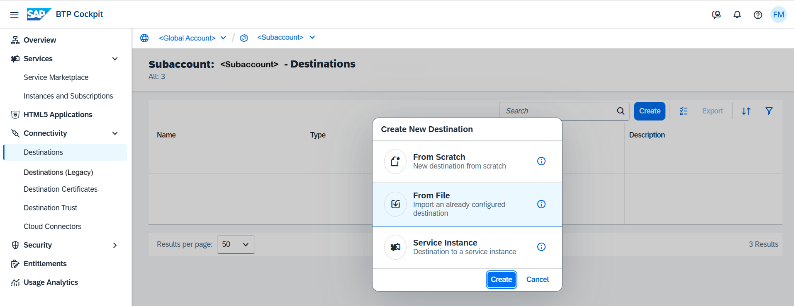

<!-- loio91ee9db4737d43b798997ab93e7f3d6e -->

# Import Destinations

How to import destinations in the *Destinations* editor \(SAP BTP cockpit\).

## Prerequisites

You have previously stored a destination configuration as JSON, YAML, or Properties file.

## Procedure

1.  Log into the cockpit and open the *Destinations* editor.

2.  Choose *Create* \> *From File* \> *Create*.

    

3.  Browse to a configuration file that contains the destination configuration.

4.  Select the file and upload it.

5.  Review and save the destination.

**Related Information**  

[Edit and Delete Destinations](edit-and-delete-destinations-372dee2.md "How to edit and delete destinations in the Destinations editor (SAP BTP cockpit).")

[Destination Examples](destination-examples-3a2d575.md "Find configuration examples for HTTP and RFC destinations in SAP BTP, using different authentication types.")

