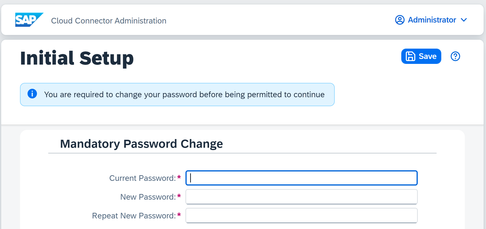
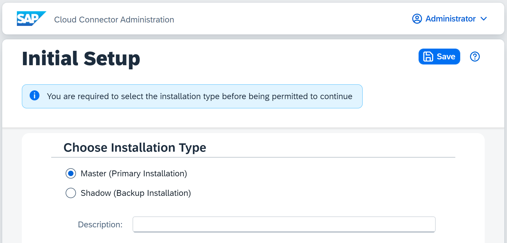
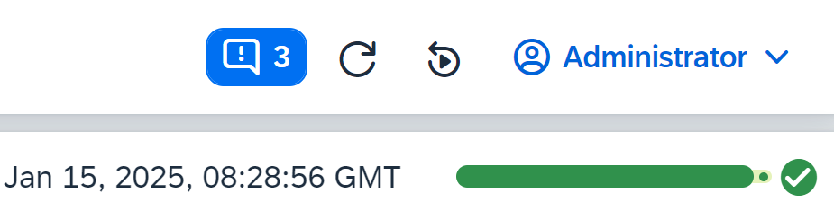
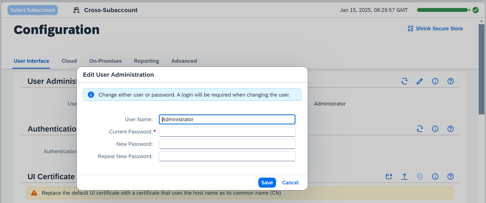
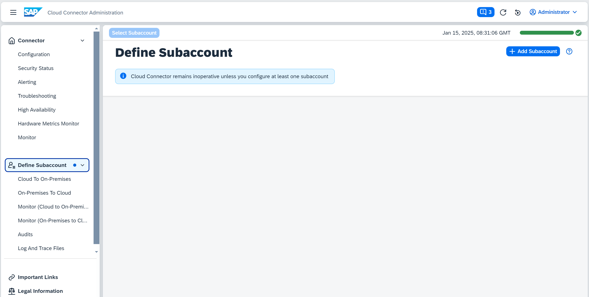
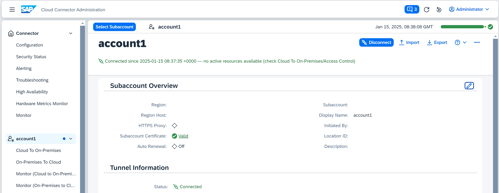

<!-- loiodb9170a7d97610148537d5a84bf79ba2 -->

# Initial Configuration

After installing and starting the Cloud Connector, log on to the administration UI and perform the required configuration to make your Cloud Connector operational.

<a name="loiodb9170a7d97610148537d5a84bf79ba2__context"/>

## Tasks

[Prerequisites](initial-configuration-db9170a.md#loiodb9170a7d97610148537d5a84bf79ba2__prereq)

[Log on to the Cloud Connector](initial-configuration-db9170a.md#loiodb9170a7d97610148537d5a84bf79ba2__log_in)

[Initial Setup](initial-configuration-db9170a.md#loiodb9170a7d97610148537d5a84bf79ba2__change_password)

[Adding the First Subaccount](initial-configuration-db9170a.md#loiodb9170a7d97610148537d5a84bf79ba2__configure_proxy)

[Establish Connections to SAP BTP](initial-configuration-db9170a.md#loiodb9170a7d97610148537d5a84bf79ba2__establish_cloud_conection)

<a name="loiodb9170a7d97610148537d5a84bf79ba2__prereq"/>

## Prerequisites

-   You have downloaded and installed the Cloud Connector, see [Installation](installation-57ae3d6.md).
-   You have assigned one of these roles/role collections to the subaccount user that you use for initial Cloud Connector setup, depending on the SAP BTP environment in which your subaccount is running:

    <table>
    <tr>
    <th valign="top">

    Environment
    
    </th>
    <th valign="top">

    Required Roles/Role Collections
    
    </th>
    <th valign="top">

    More Information
    
    </th>
    </tr>
    <tr>
    <td valign="top">
    
    **Multi-Cloud**
    
    </td>
    <td valign="top">
    
    Assign at least one of these *default role collections* \(all of them including the role `Cloud Connector Administrator`\):

    -   `Subaccount Administrator`
    -   `Cloud Connector Administrator`
    -   `Connectivity and Destination Administrator`

    Alternatively, you can assign a *custom role collection* to the user that includes the role `Cloud Connector Administrator`.
    
    </td>
    <td valign="top">
    
    [Default Role Collections](getting-started-daca64d.md#loiodaca64dacc6148fcb5c70ed86082ef91__table_default_role_collections_setB) 

    [Role Collections and Roles in Global Accounts, Directories, and Subaccounts](https://help.sap.com/viewer/65de2977205c403bbc107264b8eccf4b/Cloud/en-US/0039cf082d3d43eba9200fe15647922a.html "SAP BTP provides a set of role collections to set up administrator access to your global account and subaccounts.") :arrow_upper_right:
    
    </td>
    </tr>
    <tr>
    <td valign="top">
    
    **Neo**
    
    </td>
    <td valign="top">
    
    Assign at least one of these *default roles*:

    -   `Cloud Connector Admin` 
    -   `Administrator`

    Alternatively, you can assign a *custom role* to the user that includes the permission `manageSCCTunnels`.
    
    </td>
    <td valign="top">
    
    [Managing Member Authorizations in the Neo Environment](https://help.sap.com/viewer/ea72206b834e4ace9cd834feed6c0e09/Cloud/en-US/a1ab5c4cc117455392cd0a512c7f890d.html "SAP BTP includes predefined platform roles that support the typical tasks performed by users when interacting with the platform. In addition, subaccount administrators can combine various scopes into a custom platform role that addresses their individual requirements.") :arrow_upper_right:
    
    </td>
    </tr>
    </table>
    
    After establishing the Cloud Connector connection, this user is not needed any more, since it serves only for initial connection setup. You may revoke the corresponding role assignment then and remove the user from the *Members* list \( **Neo** environment\), or from the *Users* list \(**Multi-Cloud** environment\).

    > ### Note:  
    > If the Cloud Connector is installed in an environment that is operated by SAP, SAP provides a user that you can add as member in your SAP BTP subaccount and assign the required role.

-   We strongly recommend that you read and follow the steps described in [Recommendations for Secure Setup](recommendations-for-secure-setup-e7ea82a.md). For operating the Cloud Connector securely, see also [Security Guidelines](security-guidelines-8db6945.md).

Back to [Tasks](initial-configuration-db9170a.md#loiodb9170a7d97610148537d5a84bf79ba2__context) 

<a name="loiodb9170a7d97610148537d5a84bf79ba2__log_in"/>

## Log on to the Cloud Connector

To administer the Cloud Connector, you need a Web browser. To check the list of supported browsers, see [Prerequisites and Restrictions](https://help.sap.com/viewer/65de2977205c403bbc107264b8eccf4b/Cloud/en-US/e6ddaefcbb571014b70fa01fc6a3f818.html "Find a list of the product prerequisites and restrictions for SAP BTP.") :arrow_upper_right: → section *Browser Support*.

1.  In a Web browser, enter: `https://<hostname>:<port>` 
    -   *<hostname\>* refers to the machine on which the Cloud Connector is installed. If installed on your machine, you can simply enter `localhost`.
    -   *<port\>* is the Cloud Connector port specified during installation \(the default port is `8443`\).

2.  On the logon screen, enter `Administrator` / `manage` \(case sensitive\) for *<User Name\>* / *<Password\>*.

    > ### Note:  
    > By default, the Cloud Connector includes a self-signed UI certificate. Browsers may show a security warning because they don't trust the issuer of this certificate. In this case, you can skip the warning message.

Back to [Tasks](initial-configuration-db9170a.md#loiodb9170a7d97610148537d5a84bf79ba2__context) 

<a name="loiodb9170a7d97610148537d5a84bf79ba2__change_password"/>

## Initial Setup

1.  When you first log in, you must change the password before you continue.

    

2.  Afterwards, you can choose between master and shadow installation. Select *Master* if you are installing a single Cloud Connector instance or the main instance of a *high availability* setup. For more information, see [High Availability Setup](high-availability-setup-2f9250b.md).

    

3.  \(Optional\): When configuring a master, you can provide a \(free-text\) *Description* for this Cloud Connector instance that helps you distinguish different Cloud Connectors. This information will also be shown in the *Cloud Connectors* view in the SAP BTP cockpit.

4.  Afterwards, you are forwarded to the main page. In the top right corner you can always see how long your current session is still valid until you need to login again before proceeding.

    

**User Administration**

To edit the password for the `Administrator` user, choose *Configuration* from the main menu, tab *User Interface*, section *User Administration*:

> ### Note:  
> User name and password cannot be changed at the same time. If you want to change the user name, you must enter only the current password in a first step. Do not enter values for *<New Password\>* or *<Repeat New Password\>* when changing the user name. To change the password in second step, enter the old password, the new one, and the repeated \(new\) password, but leave the user name unchanged.

Back to [Tasks](initial-configuration-db9170a.md#loiodb9170a7d97610148537d5a84bf79ba2__context) 

<a name="loiodb9170a7d97610148537d5a84bf79ba2__configure_proxy"/>

## Adding the First Subaccount

When logging in for the first time, the following screen is displayed every time you choose an option from the main menu that requires a configured subaccount:

Press *Add Subaccount* to define a subaccount. For details, see [Adding and Managing Subaccounts](adding-and-managing-subaccounts-f16df12.md).

Back to [Tasks](initial-configuration-db9170a.md#loiodb9170a7d97610148537d5a84bf79ba2__context) 

<a name="loiodb9170a7d97610148537d5a84bf79ba2__establish_cloud_conection"/>

## Establish Connections to SAP BTP

As soon as the initial setup is complete, the tunnel to the cloud endpoint is open, but no requests are allowed to pass until you have performed the *Access Control* setup, see [Configure Access Control](configure-access-control-f42fe44.md).

To manually close \(and reopen\) the connection to SAP BTP, choose your subaccount from the main menu and select the *Disconnect* button \(or the *Connect* button to reconnect to SAP BTP\).

-   The green icon next to *Region Host* indicates that it is valid and can be reached.
-   If an *HTTPS Proxy* is configured, its availability is shown the same way. In the screenshot, the grey diamond icon next to *HTTPS Proxy* indicates that connectivity is possible without proxy configuration.

In case of a timeout or a connectivity issue, these icons are yellow \(warning\) or red \(error\), and a tooltip shows the cause of the problem. *Initiated By* refers to the user that has originally established the tunnel. During normal operations, this user is no longer needed. Instead, a certificate is used to open the connection to a subaccount.

-   The status of the certificate is shown next to *Subaccount Certificate*. It is shown as valid \(green icon\), if the expiration date is still far in the future, and turns to yellow if expiration approaches according to your alert settings. It turns red as soon as it has expired. This is the latest point in time, when you should [Update the Certificate for Your Subaccount](renew-the-certificate-for-a-subaccount-071708a.md).

> ### Note:  
> When connected, you can monitor the Cloud Connector also in the *Connectivity* section of the SAP BTP cockpit. There, you can track attributes like version, description and high availability set up. Every Cloud Connector configured for your subaccount automatically appears in the *Connectivity* section of the cockpit.

Back to [Tasks](initial-configuration-db9170a.md#loiodb9170a7d97610148537d5a84bf79ba2__context) 

**Related Information**  

[Adding and Managing Subaccounts](adding-and-managing-subaccounts-f16df12.md "Add and connect your SAP BTP subaccounts to the Cloud Connector.")

[Initial Configuration \(HTTP\)](initial-configuration-http-3f974ea.md "Configure the Cloud Connector for HTTP communication.")

[Initial Configuration \(RFC\)](initial-configuration-rfc-f09eefe.md "Configure a Secure Network Connection (SNC) to set up the Cloud Connector for RFC communication to an ABAP backend system.")

[Configuring the Cloud Connector for LDAP](configuring-the-cloud-connector-for-ldap-f94810a.md "Configure the Cloud Connector to support LDAP in different scenarios (cloud applications using LDAP or Cloud Connector authentication).")

[Managing Member Authorizations in the Neo Environment](https://help.sap.com/viewer/ea72206b834e4ace9cd834feed6c0e09/Cloud/en-US/a1ab5c4cc117455392cd0a512c7f890d.html "SAP BTP includes predefined platform roles that support the typical tasks performed by users when interacting with the platform. In addition, subaccount administrators can combine various scopes into a custom platform role that addresses their individual requirements.") :arrow_upper_right:

[Use a Custom IDP for Subaccount Configuration](use-a-custom-idp-for-subaccount-configuration-2022612.md "Enable custom identity provider (IDP) authentication to configure a Multi-Cloud subaccount in the Cloud Connector by using a one-time passcode.")

[Use LDAP for User Administration](use-ldap-for-user-administration-120ceec.md "You can use LDAP (Lightweight Directory Access Protocol) to manage Cloud Connector users and authentication.")

