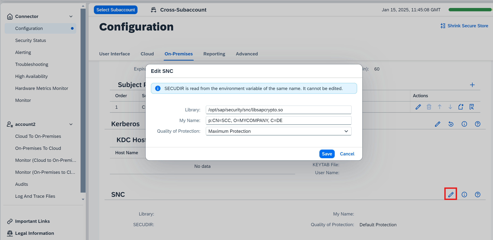

<!-- loiof09eefe71d1e4d4484e1dd4b121585fb -->

# Initial Configuration \(RFC\)

Configure a Secure Network Connection \(SNC\) to set up the Cloud Connector for RFC communication to an ABAP backend system.

<a name="loiof09eefe71d1e4d4484e1dd4b121585fb__section_N1001A_N10011_N10001"/>

## SNC Configuration for Mutual Authentication

To set up a mutual authentication between Cloud Connector and an ABAP backend system \(connected via RFC\), you can configure SNC for the Cloud Connector. It will then use the associated PSE for all RFC SNC requests. This means that the SNC identity, represented by this PSE, must:

-   Be trusted by all backend systems to which the Cloud Connector is supposed to connect
-   Play the role of a trusted external system by adding the SNC name of the Cloud Connector to the SNCSYSACL table. You can find more details in the SNC configuration documentation for the release of your ABAP system.

## Prerequisites

-   You have configured your ABAP system\(s\) for SNC. For detailed information on configuring SNC for an ABAP system, see also [Configuring SNC on AS ABAP](http://help.sap.com/saphelp_nw75/helpdata/en/0d/482bb8013243f1b6e2439091e3022f/content.htm).
-   You have configured the ABAP System to trust the Cloud Connector's system SNC identity. To do this, or to establish trust for principal propagation, follow the steps described in [Configure Identity Propagation for RFC](configure-identity-propagation-for-rfc-33a2f37.md).

<a name="loiof09eefe71d1e4d4484e1dd4b121585fb__section_N10034_N10011_N10001"/>

## Configuration Steps

1.  Logon to the Cloud Connector
2.  Choose *Configuration* from the main menu and go to tab *On Premise*, section *SNC*.
3.  Enter the corresponding values in the fields *Library Name*, *My Name*, and *Quality of Protection*
4.  Press *Save*.

    **Example:**

    

    -   *Library Name*: Provides the location of the SNC library you are using for the Cloud Connector.

        > ### Note:  
        > Bear in mind that you must use one and the same security product on both sides of the communication.

    -   *My Name*: The SNC name that identifies the Cloud Connector. It represents a valid scheme for the SNC implementation that is used.
    -   *Quality of Protection*: Determines the level of protection that you require for the connectivity to the ABAP systems.

> ### Note:  
> When using **CommonCryptoLibrary** as SNC implementation, note [1525059](https://me.sap.com/notes/1525059) will help you to configure the PSE to be associated with the user running the Cloud Connector process.

<a name="loiof09eefe71d1e4d4484e1dd4b121585fb__section_rdz_q34_fsb"/>

## Using the SAP Cryptographic Library

> ### Note:  
> This procedure is available as of Cloud Connector version 2.14.1

When using the SAP Cryptographic Library as SNC implementation, you can use the interactive setup scripts which can be found in the Cloud Connector's installation folder to ease the setup process.

> ### Note:  
> Using the scripts mentioned below is not mandatory for using the SAP cryptographic library. If you are familiar with the necessary steps needed for running a process with the desired identity, you can also configure the SNC setup for the SAP cryptographic library on your own.

**Linux/Mac scripts**: *snc\_create\_pse.sh, snc\_import\_ca\_response.sh*

**Windows scripts**: *snc\_create\_pse.bat, snc\_import\_ca\_response.bat*

> ### Note:  
> These scripts are located in the Cloud Connector installation directory.

1.  Download and extract the SAP Cryptographic Library from the [Download Center](https://support.sap.com/en/my-support/software-downloads.html) \(search for *sapcryptolib*\).
2.  Copy the respective scripts depending on your OS to the SAP Cryptographic Library folder.
3.  Make sure the Cloud Connector process is running.
4.  Make sure the environment variable `SECUDIR` is properly set.
    1.  For Linux, you can set it solely for the Cloud Connector process by extending the daemon as described in [Installation on Linux OS](installation-on-linux-os-f069840.md).

5.  Copy the partner's certificate you have [exported](https://help.sap.com/viewer/e73bba71770e4c0ca5fb2a3c17e8e229/7.5.22/en-US/86834d3c807b8048e10000000a11402f.html) to your `SECUDIR` folder. You must specify this to import it into your PSE.
6.  Run the script *snc\_create\_pse* now. You should see the `SECUDIR` and the Cloud Connector user:

    *SECUDIR D:\\sec found.*

    *Cloud Connector is running with user NT AUTHORITY\\SYSTEM*

7.  Specify the certificate name for the Cloud Connector:

    *Specify the own certificate name in the format as CN=host,OU=org,O=comp,C=lang: CN=SCC*

    *Specify the PSE password: <enter secure PW here\>*

8.  Specify the exported certificate of the partner from step 5:

    *Specify the import certificate file of the partner contained in D:\\sec: exported\_abap\_cert.cer*

    *Creating PSE now...*

    *...*

    *PSE creation finished.*

9.  Now, a PSE with name `scc.pse` has been created in your `SECUDIR` folder. Additionally, a file `sccCertificateRequest.p10` has been created. This is the CSR you can use to get a signed certificate by your CA now. You can import the response certificate from your CA directly, or use the other script `import_ca_response` later. If you don't want to sign your certificate by a CA and use it as a self-signed certificate, choose *no*. Depending on your CA, you might need to provide, besides the signed certificate, all other intermediate certificates and the root certificate for the import. Copy them to the `SECUDIR` folder and specify them in the order shown below.

    *Do you want to import a CA response now? \[y/n\] y*

    *Specify the CA response file contained in D:\\sec: ca\_response.crt*

    *Specify further Root CAs \(PEM, Base64 or DER binary\) in D:\\sec needed to complete the chain \(separated by blanks\), otherwise press enter: intermediate.crt root.crt*

    *Importing CA response now...*

    *...*

    *CA-Response successfully imported into PSE "D:\\sec\\scc.pse"*

10. Now, all other required steps are done, such as creating the credentials file `cred_v2`, importing the partner certificate and exporting the Cloud Connector's certificate to `SECUDIR` with the name `scc.crt` \(which must be [imported](https://help.sap.com/viewer/e73bba71770e4c0ca5fb2a3c17e8e229/7.5.22/en-US/57834d3c807b8048e10000000a11402f.html) at the partner's side\).

    *Create SSO server credentials...*

    *...*

    *Creation finished.*

    *Export own certificate...*

    *...*

    *Export finished.*

    *Import partner certificate into PSE file...*

    *...*

    *Completed.*

11. Restart the Cloud Connector and check the above screen if `SECUDIR` is set correctly. SNC setup for SAP Cryptographic Library should be complete now. In a next step, you must [Configure Access Control](configure-access-control-rfc-ca58689.md) and, if needed, [Configure Identity Propagation for RFC](configure-identity-propagation-for-rfc-33a2f37.md).

If you have further issues, check SAP note [1525059](https://me.sap.com/notes/1525059).

**Related Information**  

[Configure Identity Propagation for RFC](configure-identity-propagation-for-rfc-33a2f37.md "Find step-by-step instructions to configure principal propagation to an ABAP server for RFC.")

