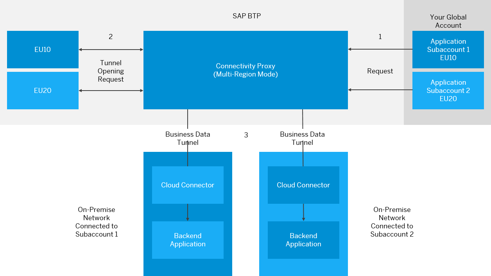

<!-- loio72072ca49d944d9186c007d51bf66e0a -->

# Installing the Connectivity Proxy in Multi-Region Mode

Use a single Connectivity Proxy installation for your global account.


<a name="loio72072ca49d944d9186c007d51bf66e0a__section_fwy_zfq_rzb"/>

## Overview

The Connectivity Proxy can operate in multi-region mode.

SAP BTP regions represent locations \(of data centers\) like eu10, eu20, us10, us20, and so on. Using the multi-region mode, a single Connectivity Proxy installation can operate in different regions which, however, must be part of the same landscape \(global account\). Otherwise, the uniqueness of subaccount IDs is not guaranteed.




<a name="loio72072ca49d944d9186c007d51bf66e0a__section_xvd_zfq_rzb"/>

## Why is the Multi-Region Mode Valuable?

Using the multi-region mode, you can install *a single Connectivity Proxy* for your global account. Applications - deployed in different regions or in different subaccounts within the same region - can consume the Connectivity service through this single Connectivity Proxy instance.

Without multi-region mode, you must install *one Connectivity Proxy for every region* where applications on cloud side need to consume the Connectivity service. This setup requires considerably more maintenance effort and consumes a lot more resources than just a single \(multi-region\) instance.


<a name="loio72072ca49d944d9186c007d51bf66e0a__section_eh1_zfq_rzb"/>

## Install the Connectivity Proxy in Multi-Region Mode

1.  *Without multi-region mode*, the service keys for integration with other services are provided through the *values.yaml* file in the following way:

    ```
    secretConfig:
      integration:
        connectivityService:
          secretData: <base64 encoded service key>
    ```

    In ***multi-region mode***, you can assign different regions to a single Connectivity Proxy instance. Consequently, the service keys for each region are needed. In this case, you cannot configure the keys through the *values.yaml* file. Instead, you must put them into secrets, and then specify them in a *ConfigMap*.

    Let's create a *ConfigMap* containing two region configurations.

    First, we configure the two secrets holding the service keys for each region:

    ```
    apiVersion: v1
    kind: Secret
    metadata:
      name: <secret-name-region1>
    data:
      serviceKey: <base64 encoded service key for region1>
    ```

    ```
    apiVersion: v1
    kind: Secret
    metadata:
      name: <secret-name-region2>
    data:
      serviceKey: <base64 encoded service key for region2>
    ```

    > ### Caution:  
    > The `serviceCredentialsKey` property for each service type specified under `config.integration` must be used in all secrets that will hold service keys for the respective service type. For example, if the following `serviceCredentialsKey` is configured for the Connectivity service in the *values.yaml*...
    > 
    > ```
    > config:
    >   integration:
    >     connectivityService:
    >       serviceCredentialsKey: serviceKey
    > ```
    > 
    > ...then it must be used in all secrets holding service keys for the Connectivity service.

    In a second step, we create a *ConfigMap* that contains two region configuration IDs \(*region1* and *region2*\), which may have any value. Each region configuration contains the Connectivity service as dependency, and the secret name holding the specified service key.

    ```
    apiVersion: v1
    kind: ConfigMap
    metadata:
      name: regionConfigurations
    data:
      region1: "{\"dependencies\":{\"connectivity\": \"<secret-name-region1>\"}}"
      region2: "{\"dependencies\":{\"connectivity\": \"<secret-name-region2>\"}}"
    ```

    > ### Note:  
    > Region configuration IDs do not require any specific naming pattern.

2.  To enable the multi-region mode, add the following in the *values.yaml* file and specify the name of the *ConfigMap* containing the region configurations:

    ```
    config:
      tenantMode: shared
      multiRegionMode:
        enabled: true
        configMapName: "regionConfigurations"
    ```

    > ### Note:  
    > When multi-region mode is enabled, the Connectivity Proxy operates in multi-tenant mode. Therefore, you must set the `tenantMode` property to *shared*.


> ### Caution:  
> If the Connectivity Proxy is installed in [non-trusted mode](operational-modes-148bbad.md) \(or proxy authorization is enabled\), the [allowed client IDs](security-proxy-authorization-96fc958.md) for all region configurations must be specified in the *ConfigMap*:
> 
> ```
> apiVersion: v1
> kind: ConfigMap
> metadata:
>   name: regionConfigurations
> data:
>   region1: "{\"allowedClientId\":\"<allowed-client-id>\", \"dependencies\":{\"connectivity\": \"<secret-name>\"}}"
>   region2: "{\"allowedClientId\":\"<allowed-client-id>\", \"dependencies\":{\"connectivity\": \"<secret-name>\"}}"
> ```

> ### Caution:  
> The connectivity poxy cannot be installed if both **multi-region mode** and **[service channels](service-channels-on-premise-to-cloud-connectivity-bbd3040.md)** are enabled.


<a name="loio72072ca49d944d9186c007d51bf66e0a__section_msr_yfq_rzb"/>

## Consume the Connectivity Proxy in Multi-Region Mode

If multi-region mode is enabled, you must send the header `SAP-Connectivity-Region-Configuration-Id` with every request made to the Connectivity Proxy.

> ### Remember:  
> Keep in mind that the correct token for each region configuration must be sent. Sending an access token/authorization token to the proxy is required with every request, because the Connectivity Proxy is working in multi-tenant mode.

An example for a request with curl through the HTTP protocol:

> ### Sample Code:  
> ```
> curl -x connectivity-proxy:20003 "http://<virtual_host>:<virtual_port>/<path>" --header "SAP-Connectivity-Region-Configuration-Id: region1" --header "SAP-CP-Connectivity-Service-Token: <base64_encoded_jwt_for_the_subaccount_in_the_specified_region_configuration>"
> ```

In this case, the request is for a region configuration with ID *region1* in the *ConfigMap*.

> ### Note:  
> The access token must be issued for the subaccount that corresponds to the region configuration, identified by the region ID that has been sent with the request.

> ### Caution:  
> If the proxy is installed in non-trusted mode, the authorization token must be provided via the `Proxy-Authorization` header.
> 
> Example:
> 
> > ### Sample Code:  
> > ```
> > curl -x connectivity-proxy:20003 "http://<virtual_host>:<virtual_port>/<path>" --header "SAP-Connectivity-Region-Configuration-Id: region1" --header "Proxy-Authorization: Bearer <base64_encoded_jwt_for_the_subaccount_in_the_specified_region_configuration>"
> > ```


<a name="loio72072ca49d944d9186c007d51bf66e0a__section_h2g_yfq_rzb"/>

## Change Region Configuration

As an operator of the Connectivity Proxy, at some point you might need to make a change in the region configurations *ConfigMap* or in any of the secrets containing service credentials. For example, add or remove a region configuration, or change the service credentials in a secret. This can be done any time, and no further actions are needed to make the Connectivity Proxy start working with the performed changes:

-   After a short period of time, the changes will be picked up automatically by the Connectivity Proxy.
-   A potentially required restart is also done automatically.
-   The restart of the Connectivity Proxy's pods is rolling.
-   If high availability mode is enabled, no downtime is expected.

