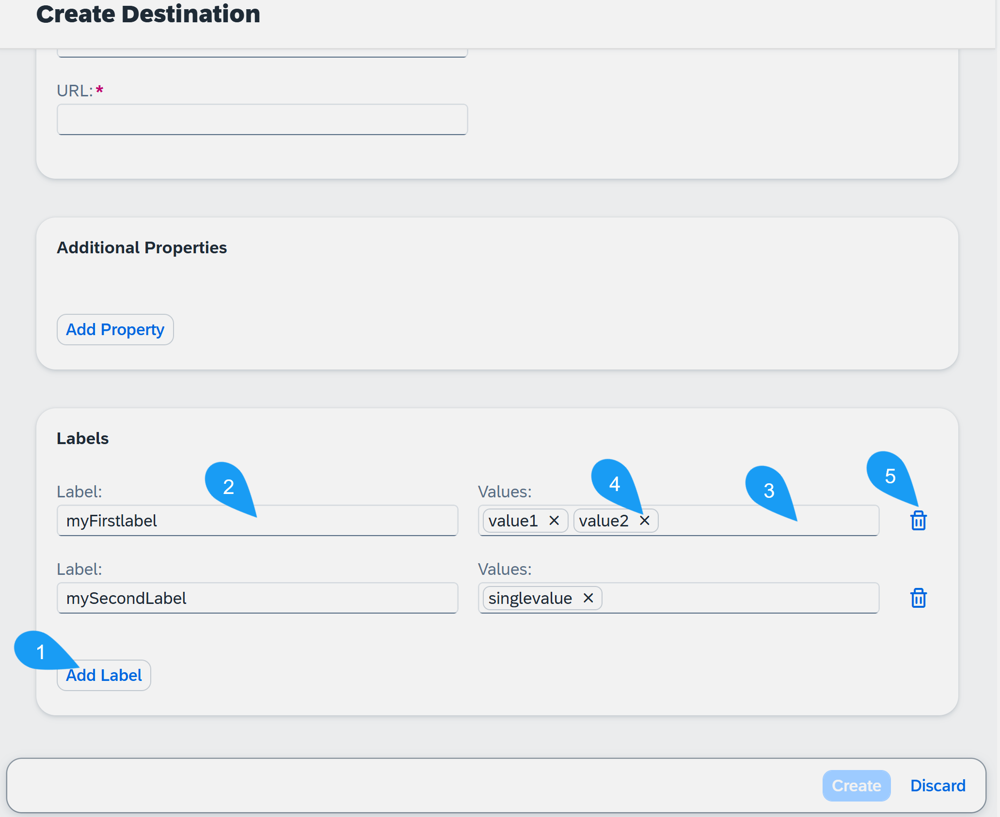
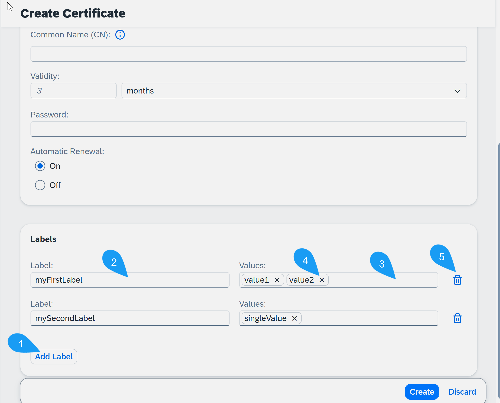
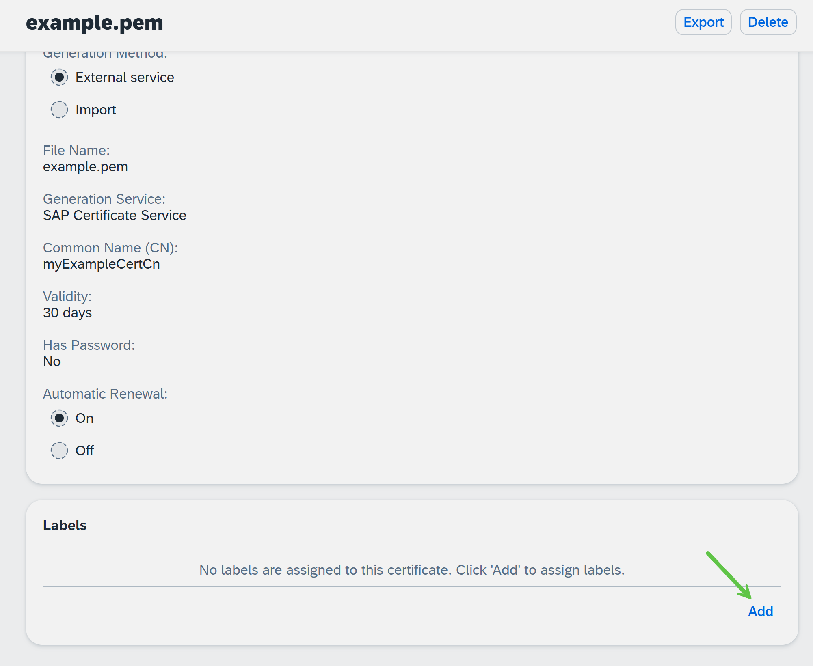
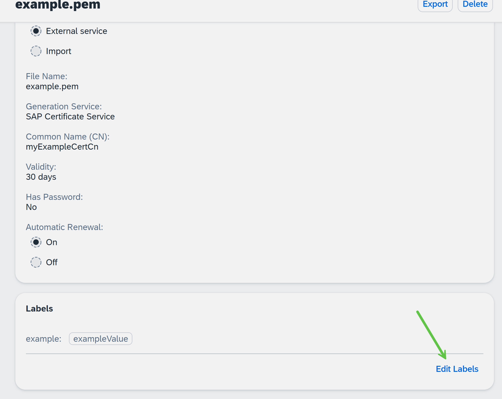
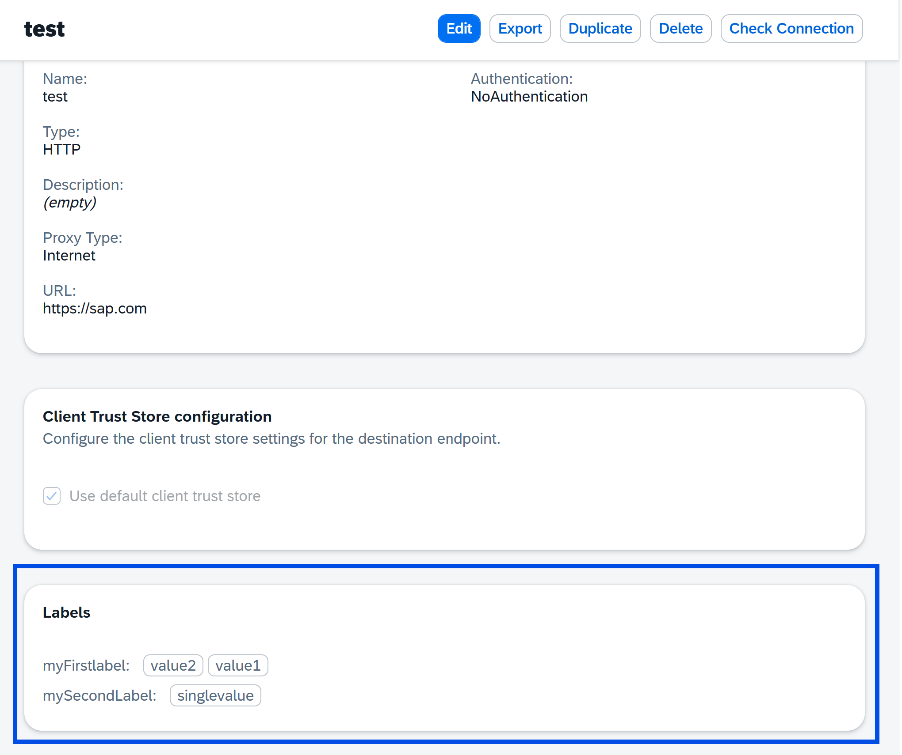

<!-- loio90f0f67eea1c44b39a0f0f943131ef38 -->

# Labeling Destination Service Entities

You can assign labels to some of the configurations that you can manage within the Destination service. Currently, this is supported for destinations and certificates.

## What are Labels?

Labels are **strictly non-sensitive** *key:multi-value pairs* that can be assigned to Destination service [entities](connectivity-entities-e723277.md). The exact key and values are custom, and based on your needs and preferences. The purpose of labels is to add additional semantics to the service entities. These semantics can be used for filtering, selecting, and grouping entities. It lets you assign metadata related to the modeling of the entities to improve efficiency in both administrative and runtime operations.

## Labels vs Additional Properties

At first glance, labels may look somewhat similar to *additional properties*, which can be used in the SAP BTP cockpit to configure a destination. However, there are some key differences.

Additional properties can be interpreted as "additional information needed by the client to know how to connect to the remote system". They are considered part of the actual destination configuration and may be *sensitive* or *non-sensitive*. Therefore, they are stored encrypted. As a consquence, they are not suitable for searching, filtering, and grouping.

Labels are *outside* metadata, with clear guidance that **sensitive values should never be placed in them**. This allows to store them unencrypted, which enables searching, filtering and grouping on them. Also, labels are applicable for other service entities, as their purpose is organizational and not related to the concrete type of the entity.

## Managing Labels

You can manage labels via REST API or SAP BTP cockpit.

**Destinations**

-   **REST API**:

    In the entity-specific APIs on the subaccount and instance/subscription levels, there are endpoints for reading all labels, overriding all labels and inserting/deleting individual labels.

    For more information on the REST API, see [Calling the Destination Service REST API](calling-the-destination-service-rest-api-84c5d38.md).

-   **Cockpit**:

    You can add labels via the UI both while creating destinations and while editing existing ones.

    Labels are shown in a separate section of the destination details panel. You can perform the following operations:

    1.  Add new labels via the *Add Label* button.
    2.  Type in a key for the label in the *Label* field \(or change the previous key\).
    3.  Add values for the label. Type a value and press *Enter* when done. You can add more values \(up to 10\) for the same label.
    4.  Remove an individual value from a label by pressing on its token in the text box.
    5.  Remove the entire label by pressing the *Delete* button.

    

**Certificates**

-   **REST API**:

    In the entity-specific APIs on the subaccount and instance/subscription levels, there are endpoints for reading all labels, overriding all labels and inserting/deleting individual labels.

    For more information on the REST API, see [Calling the Destination Service REST API](calling-the-destination-service-rest-api-84c5d38.md).

-   **Cockpit**:

    You can add labels via the UI both while creating certificates and to an existing one.

    *During Creation*

    1.  Add new labels via the *Add Label* button.
    2.  Enter a key for the label in the *Label* field \(or change the previous key\).
    3.  Add values for the label. Enter a value and press *Enter* when done. You can add more values this way for the same label \(up to 10\).
    4.  Remove an individual value from a label by pressing on its token in the text box.
    5.  Remove the whole label by pressing the *Delete* button.

    

    *Existing Certificate* 

    Labels are in a separate section of the *Certificate Details* panel. Choose *Add* \(if there are no labels yet\) or *Edit Labels* \(if there are already some labels\) and manage the labels in the same way as while creating the certificate. Choose *Save* once done.

    

    

## Using Labels

Labels are visualized in the cockpit for managing the different entities that support them. This lets you understand better what the entity is used for, or what its status is. For example, you may have a *scenario* label and some destinations assigned to it with value *order\_processing*, while others have the value *invoice\_management* for the same label. Like this, the UI clearly shows the assignment of a destination to a specific scenario.

In addition, labels can be used in various REST APIs. This includes getting the labels as metadata during lookup and filtering in the *Get All* APIs based on having a label with desired value\(s\).

For more information on the REST API, see [Calling the Destination Service REST API](calling-the-destination-service-rest-api-84c5d38.md).

## Limits

-   An individual entity can have up to 10 labels.
-   An individual label can have up to 10 values.

