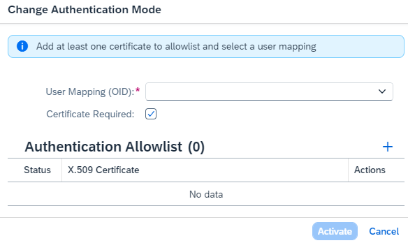

<!-- loiodaa547fae1f4402e9a0b6d82da9f007a -->

# Logon to the Cloud Connector via Client Certificate

Switch from default logon to client certificate logon to access the Cloud Connector.

> ### Caution:  
> If *high availability* \(HA\) setup is active, this feature only works if a separate HA port has been specified \(for information on how to specify a separate port for *high availability*, see [Install a Failover Instance for High Availability](install-a-failover-instance-for-high-availability-c697705.md)\).
> 
> Otherwise, a shadow will not be able to connect due to missing trust which will result in this error: *There is no trust with Cloud Connector on https://<host\>:<port\>. Reset shadow configuration and try to connect shadow again*.

> ### Restriction:  
> Configuring the logon with a certificate is not allowed for SAP-operated Cloud Connectors, for example in the context of *Enterprise Cloud Services* or *S/4HANA Private Cloud Edition*.

Instead of authenticating with user and password as configured by default \(see [Initial Configuration](initial-configuration-db9170a.md)\), you can employ client certificate authentication and logon. To do so, choose *Configuration* \(or *Shadow Configuration*\) from the main menu, and tab *User Interface*, section *Authentication*.

In the pop-up dialog, specify an object identifier \(OID\) to extract the user name from subject of any given client certificate.

You must add at least one trusted certificate to the *Authentication Allowlist*. These certificates are used by Cloud Connector to validate an incoming client certificate. Use root or issuer or intermediate certificates of eligible client certificates, or the client certificates themselves if they are self-signed. Use the *Certificate Required* checkbox for strict certificate logon \(checked\) or a mixed mode that also permits user/password logon if no client certificate is supplied by the browser \(unchecked\).

After activation, a restart is required.

The login works as follows:

1.  \(Prerequisite\): Your browser \(or your REST client\) must provide a suitable client certificate. In particular, the user extracted from such a client certificate as per the selected *User Mapping \(OID\)* must be a member of the current user store \(local or LDAP\).
2.  When accessing the Cloud Connector, an mTLS handshake is performed, that is, the Cloud Connector checks your selected client certificate against the CAs from the authentication allowlist.

    > ### Caution:  
    > If your client certificate is not self-signed, you must provide \(one of\) the issuer certificates in the *authentication allowlist*, not the client certificate from your browser.

3.  If trust can be established, the Cloud Connector extracts the user from the subject as per the specified user mapping OID. This user will be logged on if it can be found in the current user store. If LDAP is used, the respective roles are checked and assigned.

If you select, for example, *CN* as OID, and have a client certificate with a subject containing *CN=Administrator*, the user *Administrator* is used after mutual trust was established.

