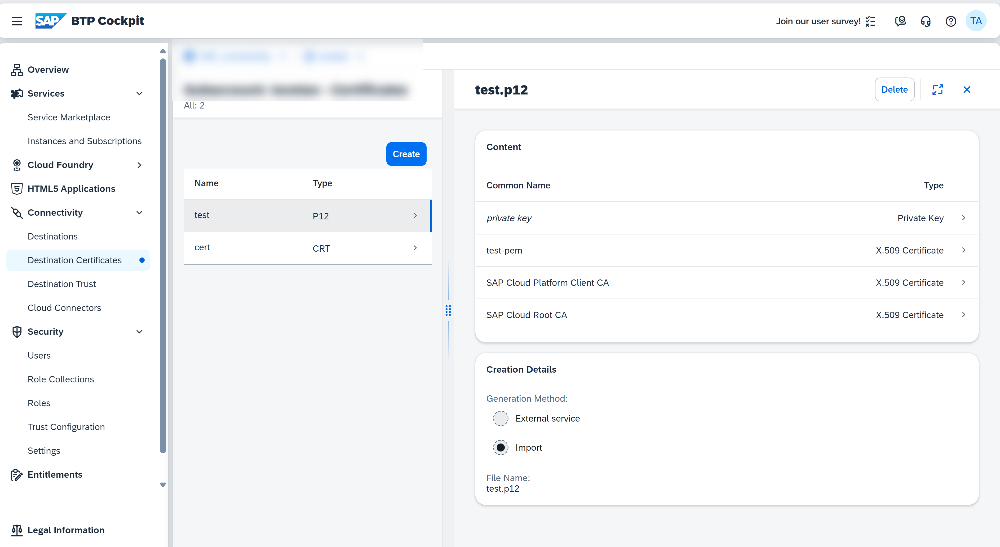

<!-- loiodf1bb55a526942b9bee78fea2ebb3162 -->

# Manage Destination Certificates

To use certificate-based authentication methods for a specific destination, you can maintain the corresponding certificates \(X.509 client certificates, trusted certificates, CA certificates, trust store and key store certificates\) in the **Destination Certificates** UI \(SAP BTP cockpit\).

## Prerequisites

You have logged on to the cockpit and opened the *Certificate* view by choosing *Connectivity* \> *Destination Certificates*.

## Context

> ### Note:  
> You can manage certificates also via the [Destination Service REST API](destination-service-rest-api-23ccafb.md).

> ### Caution:  
> Uploaded certificates are accessible via the [Destination Service REST API](destination-service-rest-api-23ccafb.md), including any private data they may contain.

You can maintain truststore and keystore certificates in the *Destinations* editor. You can upload, generate, view and delete certificates for your destinations and destination fragments.

-   You can use JKS, PFX, PEM, CER, CRT, and P12 files.
-   Certificates can both be used as standalone entities or referenced in various destination types.

-   An uploaded certificate file must contain the entire certificate chain.

> ### Note:  
> If you generate a certificate using the **Destination Certificates** UI or the **Destinations** editor in the cockpit, the certificate includes only the public key. You can obtain the private key from the [Destination Service REST API](destination-service-rest-api-23ccafb.md).

<a name="concept_qmm_jqt_f4"/>

<!-- concept\_qmm\_jqt\_f4 -->

## Procedure

## Upload Certificates

> ### Caution:  
> Certificates added through the *Upload Certificate* option cannot be automatically renewed.

1.  Choose *Create*.

    

2.  Select *Import* and choose the *Upload* button.

    

3.  From your file system, select \(or drag and drop\) the certificate file you want to upload.
4.  Choose *Create*.

    

## Generate a Certificate

1.  Choose *Create*.

    

2.  Select *External service* as method.

    

3.  Enter certificate name and type. You can optionally enter the certificate CN and certificate validity. In addition, you can optionally select the *Enable automatic renewal* checkbox to automatically renew the certificate when close to expiration. Choose *Create* to generate the desired certificate.

    

4.  The certificate will be generated and its detail view is shown.

<a name="concept_qmm_jqt_f4__section_nkl_gtq_bgc"/>

## View a Certificate

1.  Once the certificate view is opened, it will display a table of all available certificates and keystores.

    

2.  Click on the certificate you want to view. A panel to the right will open with the details.
3.  Depending on the entity \(single certificate or key store\), the information is displayed differently:
    1.  If it is a **single certificate**, you will see information about the validity and the subject and issuer DNs. In addition, you will also see the method used to create it.

        

    2.  If it is a **keystore**, you will see all entries in the keystore, and the method used to create it.

        

        You can also click on each entry to view the details.

        

        

## Export a Certificate

1.  From the certificate list, select the one you want to export.
2.  Choose *Export*.

    

3.  The certificate will be exported to your download folder.

<a name="concept_qmm_jqt_f4__section_zh2_tcz_5cc"/>

## Delete a Certificate

1.  From the certificate list, select the one you want to delete.
2.  Choose *Delete*.

    

3.  Confirm deletion.

    

