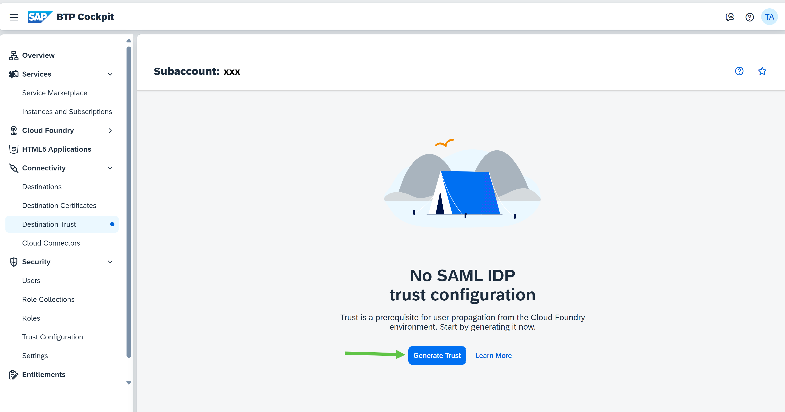
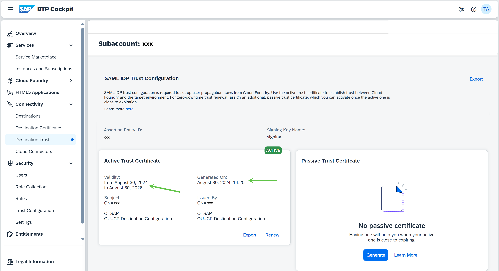
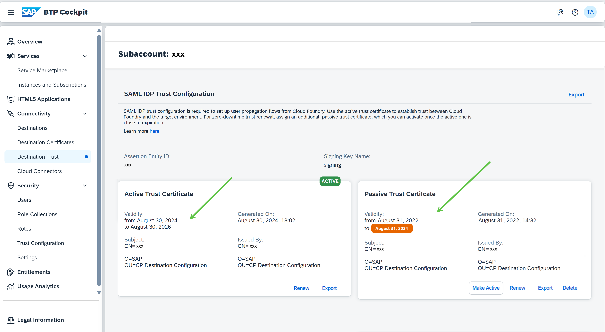

<!-- loio82dbecae3454493782d16a79e30f1a6d -->

# Manage Trust

Download and configure X.509 certificates as a prerequisite for user propagation from the Multi-Cloud environment.

Setting up a trust scenario for user propagation requires the exchange of public keys and certificates between the affected systems, as well as the respective trust configuration within these systems. This enables you to use an HTTP destination with authentication type `OAuth2SAMLBearerAssertion` or or `SAMLAssertion` for the communication.

> ### Note:  
> The described procedures are focused on doing them via the *Destinations* editor in the cockpit. However, they are also fully automatable via the [Destination Service REST API](destination-service-rest-api-23ccafb.md). References to the respective API endpoints are added to the relevant steps bellow.

A trust scenario can include user propagation from the Multi-Cloud environment to another SAP BTP environment, to another Multi-Cloud subaccount, or to a remote system outside SAP BTP, like S/4HANA Cloud, C4C, Success Factors, and others.

<a name="loio82dbecae3454493782d16a79e30f1a6d__setup_cert"/>

## Set Up a Certificate

Download and save locally the X.509 certificate of the subaccount in the Multi-Cloud environment.

1.  In the cloud cockpit, log on with `Administrator` permission.
2.  Navigate to your subaccount in the Multi-Cloud environment.
3.  From the left-side menu, choose *Connectivity* \> *Destination Trust*.
4.  If the subaccount does not yet have a *SAML Trust* configuration for the Destination service, choose *Generate Trust*:

    

    > ### Note:  
    > Respective API endpoints:
    > 
    > -   Generate or renew the active X.509 trust certificate: `POST /saml2Metadata/certificate`.

5.  Once generated, you have an active trust certificate, and its details are visible in the UI:

    

6.  Export the public part of this certificate, which downloads a *.pem* certificate file:

    > ### Tip:  
    > We recommend that you also note down the values of *Assertion Entity ID* and *Signing Key Name* which may be required by the target system\(s\) when establishing trust.

    

    > ### Note:  
    > Respective API endpoints:
    > 
    > -   Retrieve the active X.509 trust certificate: `GET /saml2Metadata/certificate`.

7.  Configure the downloaded X.509 certificate **in the target system\(s\)** to which you want to propagate the user.

<a name="loio82dbecae3454493782d16a79e30f1a6d__renew_cert"/>

## Renew a Certificate

If the X.509 certificate validity is about to expire, you can renew the certificate and extend its validity by another 2 years.

1.  In the cloud cockpit, log on with `Administrator` permission.
2.  Navigate to your subaccount in the Multi-Cloud environment.
3.  From the left-side menu, choose *Connectivity* \> *Destination Trust*.
4.  Choose *Renew* for the certificate you want to update:

    > ### Caution:  
    > It is not recommended to renew an active certificate directly. Consider using the [Rotate Certificates](manage-trust-82dbeca.md#loio82dbecae3454493782d16a79e30f1a6d__rotate) feature below if you want a zero-downtime procedure.

    

    > ### Note:  
    > Respective API endpoints:
    > 
    > -   Generate or renew the active X.509 trust certificate: `POST /saml2Metadata/certificate`.
    > 
    > -   Generate or renew the passive X.509 trust certificate: `POST /saml2Metadata/certificate/passive`.

5.  Confirm the renewal:

    

6.  You will now see that the warnings are gone, and the certificate details reflect the new dates:

    

7.  Get the required details to establish trust in the target system\(s\) based on the new certificate, by performing an *Export* of the certificate:

    

    > ### Note:  
    > Respective API endpoints:
    > 
    > -   Retrieve the active X.509 trust certificate: `GET /saml2Metadata/certificate`.
    > 
    > -   Retrieve the passive X.509 trust certificate: `GET /saml2Metadata/certificate/passive`.

8.  Configure the renewed X.509 certificate **in the target system\(s\)** to which you want to propagate the user.

<a name="loio82dbecae3454493782d16a79e30f1a6d__rotate"/>

## Rotate Certificates

If you renew an active certificate, the Destination service will immediately start signing new SAML assertions with the new one. While this is fast and suitable for development scenarios, for productive scenarios you will have a downtime until you manage to re-establish the trust in all target systems. Therefore, we recommend that you perform the *rotate* procedure described in this section instead.

Rotation is done by creating a passive X.509 certificate for the subaccount, configuring it in the target system\(s\) to which you want to propagate the user, and rotating it with the active one. After rotation is performed, the active X.509 certificate becomes passive and the passive one active.

> ### Note:  
> You should execute this procedure *before* the expiration date of the currently active certificate.

**Procedure**

1.  Generate or renew the passive X.509 certificate:

    

    > ### Note:  
    > Respective API endpoints:
    > 
    > -   Generate or renew the passive X.509 certificate: `POST /saml2Metadata/certificate/passive`.

2.  Download and save locally the passive X.509 certificate:

    

    > ### Note:  
    > Respective API endpoints:
    > 
    > -   Retrieve the passive X.509 certificate: `GET /saml2Metadata/certificate/passive`.

3.  Configure the downloaded X.509 passive certificate **in the target system\(s\)** you want to propagate the user to.
4.  Rotate the active certificate, making the active one passive and the passive one active:

    

    > ### Note:  
    > Respective API endpoints:
    > 
    > -   Switch the roles of the active and passive certificates: `POST /saml2Metadata/rotateCertificate`.

5.  Confirm the action:

    

6.  Check if the two certificates have now switched places. Your scenarios should continue working with no disruption.

    

7.  \(Optional\): Delete the passive X.509 certificate, which used to be active before rotation.

    > ### Note:  
    > Respective API endpoints:
    > 
    > -   Delete the passive X.509 certificate: `DELETE /saml2Metadata/certificate/passive`.

8.  \(Optional\): Delete the passive X.509 certificate, which used to be active before rotation, from the target system\(s\).

**Related Information**  

[Principal Propagation from the Cloud Foundry to the Neo Environment](https://help.sap.com/viewer/65de2977205c403bbc107264b8eccf4b/Cloud/en-US/391e9ed92ff448e0b4bacac69f853516.html#loio391e9ed92ff448e0b4bacac69f853516 "Enable an application in your subaccount in the Cloud Foundry environment to access an OAuth-protected application in a subaccount in the Neo environment without user login (and user interaction) in the second application. For this scenario to work, the two subaccounts need to be in mutual trust, and in trust with the same identity provider. The first application will propagate its logged-in user to the second application using an OAuth2SAMLBearer destination.") :arrow_upper_right:

[User Propagation from the Cloud Foundry Environment to SAP S/4HANA Cloud](user-propagation-from-the-cloud-foundry-environment-to-sap-s-4hana-cloud-9af03a0.md "Configure user propagation (single sign-on), using OAuth communication from the SAP BTP Cloud Foundry environment to S/4HANA Cloud. As OAuth mechanism, you use the OAuth 2.0 SAML Bearer Assertion Flow.")

[User Propagation from the Cloud Foundry Environment to SAP SuccessFactors](user-propagation-from-the-cloud-foundry-environment-to-sap-successfactors-67a3b83.md "Configure user propagation from the SAP BTP Cloud Foundry environment to SAP SuccessFactors.")

[SAP BTP Destination Service Expiring Certificate Notification](https://help.sap.com/viewer/5967a369d4b74f7a9c2b91f5df8e6ab6/Cloud/en-US/92e3840b38824ea28f8c9be692ca5f83.html "This event is triggered for expiring certificates with no automatic renewal. It is triggered a few times for each expiring certificate - 14 days before certificate expiration, 7 days before certificate expiration and 3 days before certificate expiration.") :arrow_upper_right:

