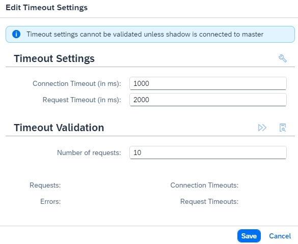

<!-- loio7f57de170fbd4405ab485880772af1f1 -->

# Master and Shadow Administration

Manage the Cloud Connector master and shadow instances in a high availability setup.

## Administration of Shadow Instances

There are several administration activities you can perform on the shadow instance. All configuration of tunnel connections, host mappings, access rules, and so on, must be maintained on the master instance; however, you can replicate them to the shadow instance for display purposes. You may want to modify the **check interval** \(time between checks of whether the master is still alive\) and the **takeover delay** \(time the shadow waits to see whether the master would come back online, before taking over the master role itself\).

Also, you can configure the timeout for the connection check, by pressing the gear icon in the section *Connection To Master* of the shadow connector main page.

The *<Connection Timeout\>* field specifies the maximum time allowed for establishing the technical connection to the master, the *<Request Timeout\>* defines the maximum time allowed for executing the check over this connection. In the *Timeout Validation* section, you can check the current settings by pressing the *Execute* button. If the timeouts are hit, you might want to increase the settings accordingly.

Keep in mind the following points:

-   The log level on master and shadow instances can be different.
-   Configuration for check interval and takeover delay is maintained only on the shadow instance, and is transferred to the master for display purposes.
-   Audit logs are only written on the master instance and are not transferred to the shadow. However, if the shadow becomes the master for some time, the audit log is potentially distributed over both master and shadow instances.

You can use the *Reset* button to drop all the configuration information on the shadow that is related to the master, but only if the shadow is not connected to the master.

As of version 2.17, the shadow instance lets you monitor [Hardware Metrics](hardware-metrics-6684f08.md) just like the master instance.

<a name="loio7f57de170fbd4405ab485880772af1f1__section_gpl_5vr_v4b"/>

## Required Configuration on the Shadow Instance

Once connected to the master, the shadow instance receives the configuration from the master instance. Yet, there are some aspects you must configure on the shadow instance separately:

-   **User administration** is configured separately on master and shadow instances. Generally, it is not required to have the same configuration on both instances. In most cases, however, it is suitable to configure master and shadow in the same way.
-   The **UI certificate** is not shared. Each host can have its own certificate, so you must maintain the UI certificates on master and shadow. You can use the same certificate though.
-   **SNC configuration**: If secure RFC communication or principal propagation for RFC calls is used, you must configure SNC on each instance separately.

## Failover Process

The shadow instance regularly checks whether the master instance is still alive. If a check fails, the shadow instance first attempts to reestablish the connection to the master instance for the time period specified by the takeover delay parameter.

-   If no connection becomes possible during the takeover delay time period, the shadow tries to take over the master role. At this point, it is still possible for the master to be alive and the trouble to be caused by a network issue between the shadow and master.

    The shadow instance next attempts to establish a tunnel to the given SAP BTP subaccount. If the connection attempt fails to all configured subaccounts \(for whatever reason\), the shadow instance remains in "shadow status", periodically pinging the master and trying to connect to the cloud, while the master is not yet reachable.

-   Otherwise, if the the tunnel to the cloud side can be opened, the shadow instance will take over the master role. From this moment, the shadow instance displays the UI of a master instance and offers the usual operations of a master instance, for example, starting/stopping tunnels, modifying the configuration, an so on.

    This is, in particular, also the case if the master is still alive, but the network connection between shadow and master is corrupted. This leads to a *master-master* setup, which is automatically detected on the former master once the network between the two instances recovers. The former master will then automatically relinquish its master role and assume the shadow role to get back to the desired setup.

When the original master instance restarts, it first checks whether the registered shadow instance has taken over the master role. If it has, the master registers itself as a shadow instance on the former shadow \(now master\) instance. Thus, the two Cloud Connector installations, in fact, have switched their roles.

> ### Note:  
> Only one shadow instance is supported. Any further shadow instances that attempt to connect are declined by the master instance.

The master considers a shadow as lost, if no check/ping is received from that shadow instance during a time interval that is equal to three times the check period. Only after this much time has elapsed can another shadow system register itself.

> ### Note:  
> On the master instance, you can manually trigger failover \(if a shadow instance is present\) by selecting the *Switch Roles* button.
> 
> A zero downtime is not guaranteed. Depending on various aspects and timings there can be short time slots in which establishing new connections fails. All requests currently being active on the master will be aborted when switching the role as the sockets will be closed.

> ### Note:  
> An attempt to switch roles will be rejected if none of the subaccounts can be connected on the shadow side as this may indicate that the shadow, which is to take over as master, will not be able to process requests. However, the inability to connect subaccounts may simply be due to expired subaccount certificates which is not necessarily an issue while subaccounts are connected, but will most certainly become an issue when attempting to connect. Therefore, make sure the subaccount certificates are valid before switching roles.

> ### Note:  
> On the master instance, you can force a role switch to assume the shadow role even if no shadow is connected. To do so, press the *Become Shadow* button \(which is the re-labeled *Switch Roles* button\). Enforce the role change only if you are absolutely sure that this is the correct procedure. Should you end up without any master instance after all, use the script *changerole* located in the root installation directory to fix the issue.

> ### Caution:  
> In the rare situation when both master and shadow are not functional, and the shadow instance is being started while the master instance is still not available, the shadow doesn't trigger the failover process for technical reasons. In this case you must \(depending on the situation\) either convert the shadow into master, or connect the shadow to the master manually once the the master instance is recovered.

<a name="loio7f57de170fbd4405ab485880772af1f1__section_xhb_4mf_32c"/>

## Take-Over Settings

When the shadow instance takes over, by default service channels are immediately closed by the outgoing master instance. This may cause some disruption. It is possible to keep service channels open for a period of time that can be configured as **Service Channel Termination Grace Period** on the **High Availability** screen \(master instance\). Service channels will remain active during the configured grace period, and will be closed once the grace period expires.

