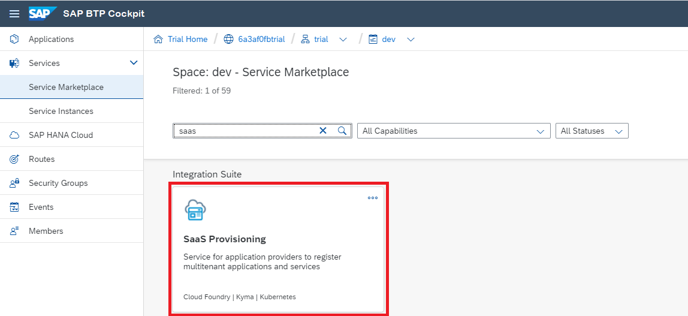
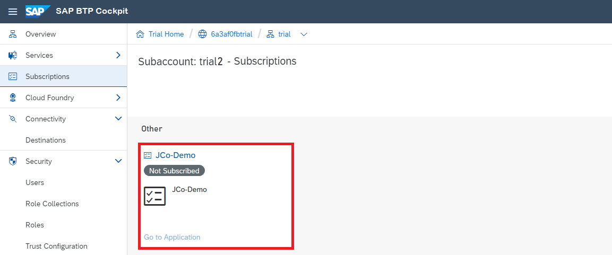
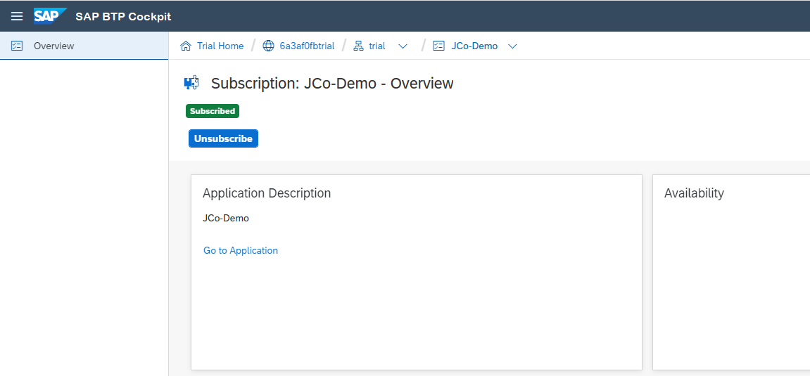

<!-- loio93c1e031e2434fc09a13bbd8ea87d1db -->

# Multitenancy for JCo Applications \(Advanced\)

Learn about the required steps to make your Cloud Foundry JCo application tenant-aware.

Using this procedure, you can enable the sample JCo application created in [Invoke ABAP Function Modules in On-Premise ABAP Systems](invoke-abap-function-modules-in-on-premise-abap-systems-bfcb54c.md) or [Invoke ABAP Function Modules in Cloud ABAP Systems](invoke-abap-function-modules-in-cloud-abap-systems-55c9d13.md), for multitenancy.


<a name="loio93c1e031e2434fc09a13bbd8ea87d1db__steps"/>

## Steps

1.  [Prerequisites](multitenancy-for-jco-applications-advanced-93c1e03.md#loio93c1e031e2434fc09a13bbd8ea87d1db__prereq)
2.  [Adjust the Application Router](multitenancy-for-jco-applications-advanced-93c1e03.md#loio93c1e031e2434fc09a13bbd8ea87d1db__approuter)
3.  [Adjust the XSUAA Service Instance and Roles](multitenancy-for-jco-applications-advanced-93c1e03.md#loio93c1e031e2434fc09a13bbd8ea87d1db__xsuaa)
4.  [Make the Application Subscribable](multitenancy-for-jco-applications-advanced-93c1e03.md#loio93c1e031e2434fc09a13bbd8ea87d1db__subscribable)
5.  [Create the SAAS Provisioning Service](multitenancy-for-jco-applications-advanced-93c1e03.md#loio93c1e031e2434fc09a13bbd8ea87d1db__saas)
6.  [Subscribe to the Application](multitenancy-for-jco-applications-advanced-93c1e03.md#loio93c1e031e2434fc09a13bbd8ea87d1db__subscribe)
7.  [Create a New Route](multitenancy-for-jco-applications-advanced-93c1e03.md#loio93c1e031e2434fc09a13bbd8ea87d1db__route)


<a name="loio93c1e031e2434fc09a13bbd8ea87d1db__prereq"/>

## Prerequisites

-   Your runtime environment uses SAP Java Buildpack version 1.9.0 or higher.
-   You have successfully completed one of these precedures:

    [Invoke ABAP Function Modules in On-Premise ABAP Systems](invoke-abap-function-modules-in-on-premise-abap-systems-bfcb54c.md)

    [Invoke ABAP Function Modules in Cloud ABAP Systems](invoke-abap-function-modules-in-cloud-abap-systems-55c9d13.md)

-   You have created a second subaccount \(in the same global account\), that is used to subscribe to your application.

Back to [Steps](multitenancy-for-jco-applications-advanced-93c1e03.md#loio93c1e031e2434fc09a13bbd8ea87d1db__steps)


<a name="loio93c1e031e2434fc09a13bbd8ea87d1db__approuter"/>

## Adjust the Application Router

The application router needs to be tenant-aware with a `TENANT_HOST_PATTERN` to recognize different tenants from the URL, see [Multitenancy](https://help.sap.com/viewer/65de2977205c403bbc107264b8eccf4b/Cloud/en-US/5310fc31caad4707be9126377e144627.html "") :arrow_upper_right:. `TENANT_HOST_PATTERN` should have the following format: "`^(.*).<application domain>`". The application router extracts the token captured by "`(.*)`" to use it as the subscriber tenant. The manifest file might look like this:

> ### Sample Code:  
> ```
> manifest.yml
> 
> ---
> applications:
>   
> - name: approuter-jco-demo-p42424242
>   path: ./
>   buildpacks:
>   - nodejs_buildpack
>   memory: 120M
>   routes:
>   - route: approuter-jco-demo-p42424242.cfapps.eu10.hana.ondemand.com
>   env:
>     TENANT_HOST_PATTERN: "^(.*).approuter-jco-demo-p42424242.cfapps.eu10.hana.ondemand.com"
>     NODE_TLS_REJECT_UNAUTHORIZED: 0
>     destinations: >
>       [
>          {"name":"dest-to-example", "url" :"https://jco-demo-p42424242.cfapps.eu10.hana.ondemand.com/ConnectivityRFCExample", "forwardAuthToken": true }
>       ]
>   services:
>     - xsuaa_jco
> ```

Back to [Steps](multitenancy-for-jco-applications-advanced-93c1e03.md#loio93c1e031e2434fc09a13bbd8ea87d1db__steps)


<a name="loio93c1e031e2434fc09a13bbd8ea87d1db__xsuaa"/>

## Adjust the XSUAA Service Instance and Roles

To call the XSUAA in a tenant-aware way, you must adjust the configuration JSON file. The tenant mode must now have the value "shared". Also, you must allow calling the previously defined REST APIs \(callbacks\).

> ### Sample Code:  
> ```
> {
>     "xsappname" : "jco-demo-p42424242",
>     "tenant-mode": "shared",
>     "scopes": [
>         { 
>          "name":"$XSAPPNAME.Callback",
>          "description":"With this scope set, the callbacks for tenant onboarding, offboarding and getDependencies can be called.",
>          "grant-as-authority-to-apps":[ 
>             "$XSAPPNAME(application,sap-provisioning,tenant-onboarding)"
>          ]
>           },
>         {
>             "name": "$XSAPPNAME.access",
>             "description": "app access"
>         },
>         {
>             "name": "uaa.user",
>             "description": "uaa.user"
>         }
>     ],
>     "role-templates": [
>         { 
>          "name":"MultitenancyCallbackRoleTemplate",
>          "description":"Call callback-services of applications",
>          "scope-references":[ 
>             "$XSAPPNAME.Callback"
>          ]
>           },
>         {
>             "name": "UAAaccess",
>             "description": "UAA user access",
>             "scope-references": [
>                 "uaa.user",
>                 "$XSAPPNAME.access"
>             ]
>         }
>     ]
> }
> ```

**Add Roles**

1.  In the cloud cockpit, navigate to the subaccount view and go the tab *Role Collections* under *Security* \(see step [Configure Roles and Trust](configure-roles-and-trust-e862ab7.md) from the previous procedure\).
2.  Click on the role collection name.
3.  Choose *Add Role*.
4.  In the popup window, select the demo application as *<Application Identifier\>*.
5.  For *<Role Template\>* and *<Role\>*, use `MultitenancyCallbackRoleTemplate` and choose *Save*.
6.  Choose *Add Role* again.
7.  Select the demo application as *<Application Identifier\>*.
8.  For *Role Template* and *Role* use `UAAaccess` and choose *Save*.

Back to [Steps](multitenancy-for-jco-applications-advanced-93c1e03.md#loio93c1e031e2434fc09a13bbd8ea87d1db__steps)


<a name="loio93c1e031e2434fc09a13bbd8ea87d1db__subscribable"/>

## Make the Application Subscribable

Firstly, in order to make the application subscribable, it must provide at least the following REST APIs:

-   [GET dependent services of an application](multitenancy-for-jco-applications-advanced-93c1e03.md#loio93c1e031e2434fc09a13bbd8ea87d1db__get)
-   [PUT tenant subscription to an application](multitenancy-for-jco-applications-advanced-93c1e03.md#loio93c1e031e2434fc09a13bbd8ea87d1db__put)

In our sample application, we implement new servlets for each of these APIs.

The following servlets need additional maven dependencies:

> ### Sample Code:  
> ```
> <dependency>
>     <groupId>com.google.code.gson</groupId>
>     <artifactId>gson</artifactId>
>     <version>2.8.5</version>
> </dependency>
> <dependency>
>     <groupId>com.unboundid.components</groupId>
>     <artifactId>json</artifactId>
>     <version>1.0.0</version>
> </dependency>
> <dependency>
>     <groupId>javax.ws.rs</groupId>
>     <artifactId>javax.ws.rs-api</artifactId>
>     <version>2.1.1</version>
> </dependency>
> ```

**GET Dependencies**

The current JCo dependencies are the Connectivity and Destination service. Thus, the GET API must return information about these two services:

> ### Sample Code:  
> ```
> import java.io.IOException;
> import java.util.Arrays;
> import java.util.List;
>  
> import javax.servlet.ServletException;
> import javax.servlet.annotation.WebServlet;
> import javax.servlet.http.HttpServlet;
> import javax.servlet.http.HttpServletRequest;
> import javax.servlet.http.HttpServletResponse;
> import javax.ws.rs.core.MediaType;
>  
> import org.json.JSONException;
> import org.json.JSONObject;
>  
> import com.google.gson.Gson;
>  
> @WebServlet("/callback/v1.0/dependencies")
> public class GetDependencyServlet extends HttpServlet {
>     private static final long serialVersionUID = 1L;
>  
>     private static final String DESTINATION_SERVICE_NAME = "destination";
>     private static final String CONNECTIVITY_SERVICE_NAME = "connectivity";
>     private static final String XSAPPNAME_PROPERTY = "xsappname";
>  
>     protected void doGet(HttpServletRequest request, HttpServletResponse response) throws ServletException, IOException {
>         try {
>             DependantServiceDto destinationService = createLPSDependency(DESTINATION_SERVICE_NAME);
>             DependantServiceDto connectivityService = createLPSDependency(CONNECTIVITY_SERVICE_NAME);
>             List<DependantServiceDto> dependenciesList = Arrays.asList(destinationService, connectivityService);
>  
>             response.setStatus(200);
>             response.setContentType(MediaType.APPLICATION_JSON);
>  
>             String json = new Gson().toJson(dependenciesList);
>             response.getWriter().println(json);
>         } catch (JSONException e) {
>             response.sendError(HttpServletResponse.SC_INTERNAL_SERVER_ERROR, e.getMessage());
>         }
>     }
>  
>     private static DependantServiceDto createLPSDependency(String serviceName) throws JSONException {
>         JSONObject credentials = EnvironmentVariableAccessor.getServiceCredentials(serviceName);
>         String xsappname = credentials.getString(XSAPPNAME_PROPERTY);
>         return new DependantServiceDto(serviceName, xsappname);
>     }
> }
> ```

Find the code of the two helper classes below:


### **DependantServiceDto.java**

```
public class DependantServiceDto {

	private String appName;

	private String appId;

	public DependantServiceDto() {}

	public DependantServiceDto(String appName, String appId) {
		this.appName = appName;
		this.appId = appId;
	}

	public String getAppName() {
		return appName;
	}

	public void setAppName(String appName) {
		this.appName = appName;
	}

	public String getAppId() {
		return appId;
	}

	public void setAppId(String appId) {
		this.appId = appId;
	}

	@Override public boolean equals(Object o) {
		if (this == o)
			return true;
		if (!(o instanceof DependantServiceDto))
			return false;

		DependantServiceDto that = (DependantServiceDto) o;

		if (!appName.equals(that.appName))
			return false;
		return appId.equals(that.appId);
	}

	@Override public int hashCode() {
		int result = appName.hashCode();
		result = 31 * result + appId.hashCode();
		return result;
	}
}
```


### **EnvironmentVariableAccessor.java**

```
import java.text.MessageFormat;

import org.json.JSONArray;
import org.json.JSONException;
import org.json.JSONObject;

/**
 * Methods for extracting configurations from the environment variables
 */
public final class EnvironmentVariableAccessor
{
    public static final String BEARER_WITH_TRAILING_SPACE="Bearer ";

    private static final String VCAP_SERVICES=System.getenv("VCAP_SERVICES");
    private static final String VCAP_SERVICES_CREDENTIALS="credentials";
    private static final String VCAP_SERVICES_NAME="name";

    private static final String PROP_XSUAA_CONNECTIVITY_INSTANCE_NAME="xsuaa_connectivity_instance_name";

    private static final String DEFAULT_XSUAA_CONNECTIVITY_INSTANCE_NAME="conn-xsuaa";

    private EnvironmentVariableAccessor()
    {
    }

    /**
     * Returns service credentials for a given service from VCAP_SERVICES
     *
     * @see <a href= "https://docs.run.pivotal.io/devguide/deploy-apps/environment-variable.html#VCAP-SERVICES">VCAP_SERVICES</a>
     */
    public static JSONObject getServiceCredentials(String serviceName) throws JSONException
    {
        return new JSONObject(VCAP_SERVICES).getJSONArray(serviceName).getJSONObject(0).getJSONObject(VCAP_SERVICES_CREDENTIALS);
    }

    /**
     * Returns service credentials for a given service instance from VCAP_SERVICES
     *
     * @see <a href= "https://docs.run.pivotal.io/devguide/deploy-apps/environment-variable.html#VCAP-SERVICES">VCAP_SERVICES</a>
     */
    public static JSONObject getServiceCredentials(String serviceName, String serviceInstanceName) throws JSONException
    {
        JSONArray jsonarr=new JSONObject(VCAP_SERVICES).getJSONArray(serviceName);
        for (int i=0; i<jsonarr.length(); i++)
        {
            JSONObject serviceInstanceObject=jsonarr.getJSONObject(i);
            String instanceName=serviceInstanceObject.getString(VCAP_SERVICES_NAME);
            if (instanceName.equals(serviceInstanceName))
            {
                return serviceInstanceObject.getJSONObject(VCAP_SERVICES_CREDENTIALS);
            }
        }
        throw new RuntimeException(MessageFormat.format("Service instance {0} of service {1} not bound to application", serviceInstanceName, serviceName));
    }

    /**
     * Returns service credentials attribute for a given service from VCAP_SERVICES
     *
     * @see <a href= "https://docs.run.pivotal.io/devguide/deploy-apps/environment-variable.html#VCAP-SERVICES">VCAP_SERVICES</a>
     */
    public static String getServiceCredentialsAttribute(String serviceName, String attributeName) throws JSONException
    {
        return getServiceCredentials(serviceName).getString(attributeName);
    }

    /**
     * Returns the name of the xsuaa service for connectivity service.
     */
    public static String getXsuaaConnectivityInstanceName()
    {
        String xsuaaConnectivityInstanceName=System.getenv(PROP_XSUAA_CONNECTIVITY_INSTANCE_NAME);
        return xsuaaConnectivityInstanceName!=null?xsuaaConnectivityInstanceName:DEFAULT_XSUAA_CONNECTIVITY_INSTANCE_NAME;
    }
}
```

Back to [Make the Application Subscribable](multitenancy-for-jco-applications-advanced-93c1e03.md#loio93c1e031e2434fc09a13bbd8ea87d1db__subscribable)

**PUT Tenant Subscription**

This API is called whenever a tenant is subscribing. In our example, we just read the received JSON, and return the tenant-aware URL of the application router which points to our application. Also, if a tenant wants to unsubscribe, DELETE does currently nothing.

> ### Sample Code:  
> ```
> SubscribeServlet
> 
> 
> import java.io.IOException;
>  
> import javax.servlet.ServletException;
> import javax.servlet.annotation.WebServlet;
> import javax.servlet.http.HttpServlet;
> import javax.servlet.http.HttpServletRequest;
> import javax.servlet.http.HttpServletResponse;
>  
> import com.google.gson.Gson;
>  
> @WebServlet("/callback/v1.0/tenants/*")
> public class SubscribeServlet extends HttpServlet {
>     private static final long serialVersionUID = 1L;
>  
>     protected void doPut(HttpServletRequest request, HttpServletResponse response) throws ServletException, IOException {
>         PayloadDataDto payload = new Gson().fromJson(request.getReader(), PayloadDataDto.class);
>         response.getWriter().println("https://" + payload.getSubscribedSubdomain() + ".approuter-jco-demo.cfapps.eu10.hana.ondemand.com");
>     }
>  
>     @Override
>     protected void doDelete(HttpServletRequest req, HttpServletResponse resp) throws ServletException, IOException {
>         super.doDelete(req, resp);
>     }
> }
> ```

Here is the helper class:


### **PayloadDataDto.java**

```
import java.util.Map;

public class PayloadDataDto {

	private String subscriptionAppName;
	private String subscriptionAppId;
	private String subscribedTenantId;
	private String subscribedSubdomain;
	private String subscriptionAppPlan;
	private long subscriptionAppAmount;
	private String[] dependantServiceInstanceAppIds = null;

	private Map<String, String> additionalInformation;

	public PayloadDataDto() {}

	public PayloadDataDto(String subscriptionAppName, String subscriptionAppId,
			String subscribedTenantId, String subscribedSubdomain, String subscriptionAppPlan,
			Map<String, String> additionalInformation) {
		this.subscriptionAppName = subscriptionAppName;
		this.subscriptionAppId = subscriptionAppId;
		this.subscribedTenantId = subscribedTenantId;
		this.subscribedSubdomain = subscribedSubdomain;
		this.subscriptionAppPlan = subscriptionAppPlan;
		this.additionalInformation = additionalInformation;

	}

	public String getSubscriptionAppName() {
		return subscriptionAppName;
	}

	public void setSubscriptionAppName(String subscriptionAppName) {
		this.subscriptionAppName = subscriptionAppName;
	}

	public String getSubscriptionAppId() {
		return subscriptionAppId;
	}

	public void setSubscriptionAppId(String subscriptionAppId) {
		this.subscriptionAppId = subscriptionAppId;
	}

	public String getSubscribedTenantId() {
		return subscribedTenantId;
	}

	public void setSubscribedTenantId(String subscribedTenantId) {
		this.subscribedTenantId = subscribedTenantId;
	}

	public String getSubscribedSubdomain() {
		return subscribedSubdomain;
	}

	public void setSubscribedSubdomain(String subscribedSubdomain) {
		this.subscribedSubdomain = subscribedSubdomain;
	}

	public String getSubscriptionAppPlan() {
		return subscriptionAppPlan;
	}

	public void setSubscriptionAppPlan(String subscriptionAppPlan) {
		this.subscriptionAppPlan = subscriptionAppPlan;
	}

	public Map<String, String> getAdditionalInformation() {
		return additionalInformation;
	}

	public void setAdditionalInformation(Map<String, String> additionalInformation) {
		this.additionalInformation = additionalInformation;
	}

	public long getSubscriptionAppAmount() {
		return subscriptionAppAmount;
	}

	public void setSubscriptionAppAmount(long subscriptionAppAmount) {
		this.subscriptionAppAmount = subscriptionAppAmount;
	}

	public String[] getDependantServiceInstanceAppIds() {
		return dependantServiceInstanceAppIds;
	}

	public void setDependantServiceInstanceAppIds(
			String[] dependantServiceInstanceAppIds) {
		this.dependantServiceInstanceAppIds = dependantServiceInstanceAppIds;
	}

	public String toString() {
		return String.format("Payload data: subscriptionAppName=%s, subscriptionAppId=%s, subscribedTenantId=%s,"
				+ "subscribedSubdomain=%s subscriptionAppPlan=%s subscriptionAppAmount=%s dependantServiceInstanceAppIds=%s", this.subscriptionAppName, this.subscriptionAppId,
				this.subscribedTenantId, this.subscribedSubdomain, this.subscriptionAppPlan, this.getSubscriptionAppAmount(), dependantServiceInstanceAppIds);
	}
}
```

Back to [Make the Application Subscribable](multitenancy-for-jco-applications-advanced-93c1e03.md#loio93c1e031e2434fc09a13bbd8ea87d1db__subscribable)

Back to [Steps](multitenancy-for-jco-applications-advanced-93c1e03.md#loio93c1e031e2434fc09a13bbd8ea87d1db__steps)


<a name="loio93c1e031e2434fc09a13bbd8ea87d1db__saas"/>

## Create the SAAS Provisioning Service

For the subscription of other tenants, your application must have a bound SAAS provisioning service instance. You can do this using the cockpit:

1.  Go to the *Service Marketplace* in the cloud cockpit:

    

2.  Choose *Saas Provisioning* \> *Instances* \> *New Instance*.
3.  Select `application` as *<Service Plan\>* and choose *Next*.
4.  In the step *Specify Parameters \(Optional\)*, insert the following as a JSON file:

    > ### Sample Code:  
    > ```
    > {
    >     "xsappname" : "jco-demo-p42424242",
    >     "appName" : "JCo-Demo",
    >     "appUrls": {
    >             "getDependencies": "https://jco-demo-p42424242.cfapps.eu10.hana.ondemand.com/callback/v1.0/dependencies",
    >             "onSubscription" : "https://jco-demo-p42424242.cfapps.eu10.hana.ondemand.com/callback/v1.0/tenants/{tenantId}"
    >     }
    > }
    > ```

5.  Choose *Next*, and select the sample application `jco-demo-p42424242` in the drop-down menu to assign the SAAS service to it.
6.  Choose *Next*, insert an instance name, for example, `saas_jco`, and confirm the creation by pressing *Finish*.

Back to [Steps](multitenancy-for-jco-applications-advanced-93c1e03.md#loio93c1e031e2434fc09a13bbd8ea87d1db__steps)


<a name="loio93c1e031e2434fc09a13bbd8ea87d1db__subscribe"/>

## Subscribe to the Application

1.  To subscribe the new application from a different subaccount, go to *Subscriptions* in the cockpit:

    

2.  Click on *JCo-Demo*.
3.  In the next window, choose *Subscribe*:

    

4.  If the subscription was successful, your window should look like that:

    


Back to [Steps](multitenancy-for-jco-applications-advanced-93c1e03.md#loio93c1e031e2434fc09a13bbd8ea87d1db__steps)


<a name="loio93c1e031e2434fc09a13bbd8ea87d1db__route"/>

## Create a New Route

1.  To call the application with a new tenant, you must create a new route \(URL\). In the cockpit, choose *Routes* \> *New Route*:

    

2.  For *<Domain\>*, select the landscape your application is deployed in \(e.g. `cfapps.eu10.hana.ondemand.com`\).
3.  For *<Host Name\>*, choose the tenant-specific link. In our example it would be `<tenant-subdomain-name>.approuter-jco-demo-p42424242`.
4.  Choose *Save*.
5.  Choose *Map Route* of the newly created route where the field *<Mapped Applications\>* is empty \(value ***none***\):

    

6.  Select the approuter application and choose *Save*.
7.  Congratulations, you are done, now you are able to call the sample application with this newly created route from the other subaccount!

Back to [Steps](multitenancy-for-jco-applications-advanced-93c1e03.md#loio93c1e031e2434fc09a13bbd8ea87d1db__steps)

