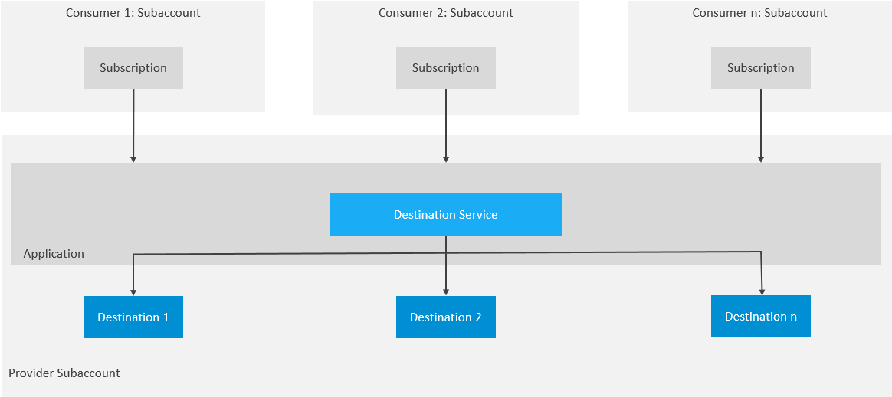
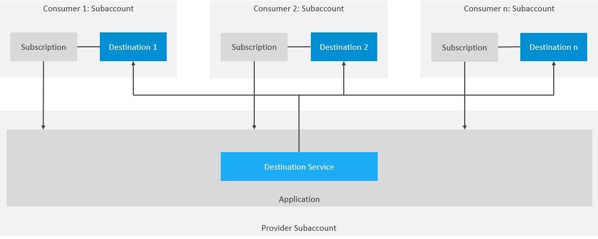

<!-- loio9c0bdd0efc8640739c9d2fa5cfe56cbd -->

# Multitenancy in SAP BTP Connectivity

Using multitenancy for applications that require a connection to a remote service or on-premise application.

This section describes the Connectivity-specific usage of multitenancy in SAP BTP, multi-cloud foundation.

> ### Note:  
> Multitenancy connectivity scenarios are fully applicable also for *cloud-to-on-premise* connectivity. The on-premise use cases described in this guide include connections to virtual private cloud \(VPC\) environments.

<a name="loio9c0bdd0efc8640739c9d2fa5cfe56cbd__top"/>

## Endpoint Configuration

Applications that require a connection to a remote service can use the Destination service to configure HTTP or RFC endpoints. Endpoints on the cloud side \(SAP BTP\) are configured as destinations. On-premise destinations correspond to the backend systems exposed in the Cloud Connector.

In a provider-managed application, such an endpoint can either be once defined by the application provider \([Provider-Specific Destination](multitenancy-in-sap-btp-connectivity-9c0bdd0.md#loio9c0bdd0efc8640739c9d2fa5cfe56cbd__provider)\), or by each application subscriber \([Subscriber-Specific Destination](multitenancy-in-sap-btp-connectivity-9c0bdd0.md#loio9c0bdd0efc8640739c9d2fa5cfe56cbd__consumer)\).

If the application needs to use the same endpoint, regardless of the current application subscriber, the destination that contains the endpoint configuration is provisioned by the application provider. If the endpoint should be different for each application subscriber, the destination can be provisioned by each particular application subscriber.

<a name="loio9c0bdd0efc8640739c9d2fa5cfe56cbd__section_d35_c1b_x2b"/>

## Destination Levels

You can configure destinations simultaneously on two levels: *subaccount* and *service instance*. This means that it is possible to have one and the same destination on more than one configuration level. For more information, see [Managing Destinations](managing-destinations-84e45e0.md).

Destination lookup according to the level, when configured on:

<table>
<tr>
<th valign="top">

Level

</th>
<th valign="top">

Lookup

</th>
</tr>
<tr>
<td valign="top">

Subaccount level

</td>
<td valign="top">

Looked up on subaccount level, no matter which destination service instance is used.

</td>
</tr>
<tr>
<td valign="top">

Service instance level

</td>
<td valign="top">

Lookup via particular service instance \(in provider or subscriber subaccount associated with this service instance\).

</td>
</tr>
</table>

When the application accesses the destination at runtime, the Destination service does the following:

-   For a destination associated with a **provider** subaccount:
    1.  Checks if the destination is available on the *service instance* level. If there is no destination found, it
    2.  Searches the destination on *subaccount* level.

-   For a destination associated with a **subscriber** subaccount:
    1.  Checks if the destination is available on the *subscription* level. If there is no destination found, it
    2.  Searches the destination on *subaccount* level.

Back to [Top](multitenancy-in-sap-btp-connectivity-9c0bdd0.md#loio9c0bdd0efc8640739c9d2fa5cfe56cbd__top)

<a name="loio9c0bdd0efc8640739c9d2fa5cfe56cbd__provider"/>

## Provider-Specific Destination

Back to [Top](multitenancy-in-sap-btp-connectivity-9c0bdd0.md#loio9c0bdd0efc8640739c9d2fa5cfe56cbd__top)

<a name="loio9c0bdd0efc8640739c9d2fa5cfe56cbd__consumer"/>

## Subscriber-Specific Destination

Back to [Top](multitenancy-in-sap-btp-connectivity-9c0bdd0.md#loio9c0bdd0efc8640739c9d2fa5cfe56cbd__top)

**Related Information**  

[Developing Multitenant Applications in the Cloud Foundry Environment](https://help.sap.com/viewer/65de2977205c403bbc107264b8eccf4b/Cloud/en-US/5e8a2b74e4f2442b8257c850ed912f48.html "In the Cloud Foundry environment, you can develop and run multitenant applications, and share them with multiple consumers simultaneously on SAP BTP.") :arrow_upper_right:

