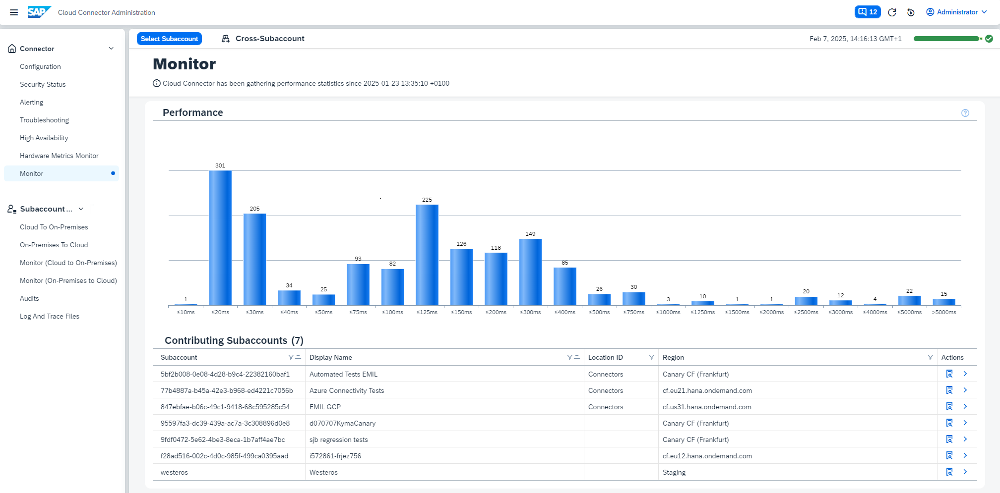

<!-- loiob288cd931d57475997982b65c3168d43 -->

# Performance Monitor

Monitor the cross-subaccount performance of the Cloud Connector.

The cross-subaccount performance monitor aggregates the performance data of all subaccounts for *cloud to on-premises* traffic, displayed in a single bar chart like the subaccount-specific counterpart \(see [Monitoring \(Cloud to On-Premises\)](monitoring-cloud-to-on-premises-ec3c3d7.md)\).

All contributing subaccounts are listed in the table below the bar chart. Use the buttons in column **Action** to view details of a subaccount, or navigate to its *cloud to on-premises* monitor, respectively.

