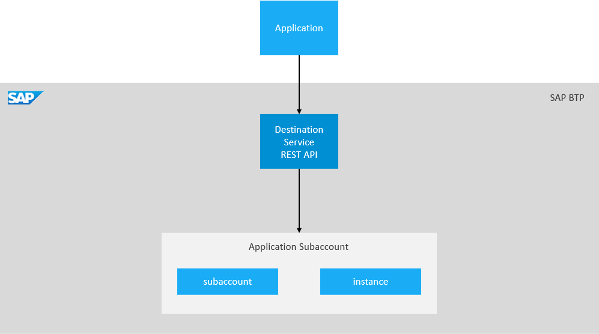
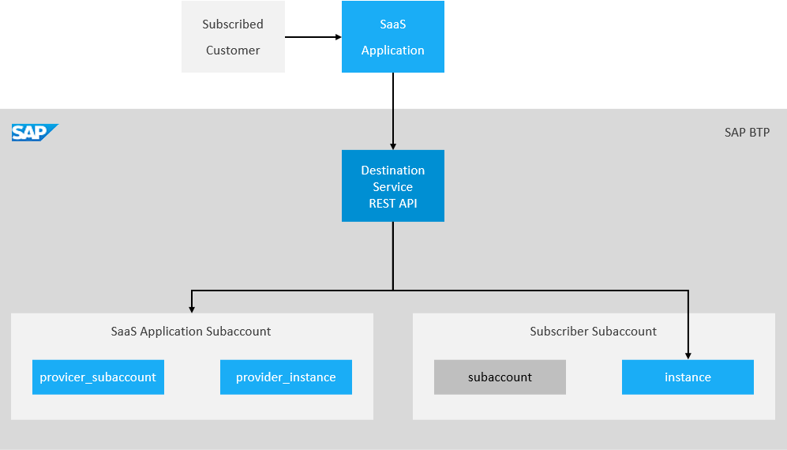
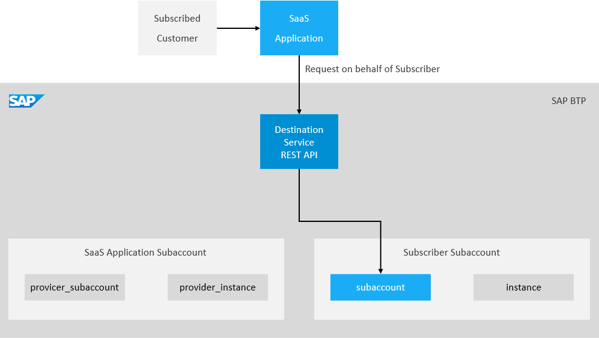

<!-- loio78ba73a91da94c03baecfaa47313b854 -->

# Referring Resources Using the REST API

Select a level for destinations and destination fragments when using the Destination service *Consume* REST API in a single-tenant or multi-tenant scenario.

The Destination service *Consume* REST API lets you retrieve a destination in a consumption-ready state. When calling the API, you must provide the level \(see usage options below\) where the destination is located \(*subaccount* or *instance*\). In multi-tenant scenarios, the destination can also be located on the levels *provider\_subaccount* or *provider\_instance*.

In addition to the destination level, you can also provide a fragment level. If not specified, the level of the destination is assumed.

> ### Caution:  
> In contrast to the *Find a Destination* API, a fallback between levels is not performed.

> ### Caution:  
> Authorization with a token from the Identity Authentication service \(IAS\) is currently not supported.


<a name="loio78ba73a91da94c03baecfaa47313b854__section_qvb_z1s_pfc"/>

## Single-Tenant Usage

**Supported Levels**

-   `subaccount`: resources accessible on subaccount level by applications using any Destination service instance in the subaccount
-   `instance`: resources accessible on instance level by applications using the concrete Destination service instance




The following sample request shows how you can retrieve a destination with name `dest1` on `subaccount` level.

> ### Sample Code:  
> ```
> curl --request GET
>   --url https://<destination-service-url>/destination-configuration/v2/destinations/dest1@subaccount
>   --header 'Authorization: Bearer {{account token}}'
> ```

**Support for Fragments**

When calling the API, you can also provide the level where the fragment is located \(`subaccount` or `instance`\). The destination and fragment can either be on the same level, or on different levels.

The following sample request shows how you can retrieve a destination with name `dest1` on `subaccount` level, enriched with a fragment with name `fragment2` on `instance` level.

> ### Sample Code:  
> ```
> curl --request GET
>   --url https://<destination-service-url>/destination-configuration/v2/destinations/dest1@subaccount
>   --header 'Authorization: Bearer {{account token}}'
>   --header 'X-fragment-name: fragment2@instance'
> ```


<a name="loio78ba73a91da94c03baecfaa47313b854__section_u3t_y1s_pfc"/>

## Multi-Tenant Usage

The API supports multi-tenant scenarios in which it is being called with an authorization token on behalf of the subscriber.

**Supported Levels**

-   `provider_subaccount`: resources accessible on provider subaccount level
-   `provider_instance`: resources accessible on provider instance level
-   `subaccount`: resources accessible on subscriber subaccount level
-   `instance`: resources accessible on subscriber instance level

**Support for Fragments**

*Requesting Destination and Fragment on Different Levels*



When calling the API, you can also provide the level where the fragment is located \(`provider_subaccount`, `provider_instance` or `instance`\). The destination and fragment can either be on the same level, or on different levels.

> ### Caution:  
> Due to security considerations, retrieving one resource from subaccount level and another resource from any other level is forbidden.

The following sample request shows how you can retrieve a destination with name `dest1` on `provider_subaccount` level, enriched with a fragment with name `fragment2` on `instance` level.

> ### Sample Code:  
> ```
> curl --request GET
>   --url https://<destination-service-url>/destination-configuration/v2/destinations/dest1@provider_subaccount
>   --header 'Authorization: Bearer {{subscriber token}}'
>   --header 'X-fragment-name: fragment2@instance'
> ```

Requesting resources on a single level has no restrictions.

*Requesting Destination and Fragment on the Same Level*



The following sample request shows how you can retrieve a destination with name `dest1` on `subaccount` level, enriched with a fragment with name `fragment2` on the same level.

> ### Sample Code:  
> ```
> curl --request GET
>   --url https://<destination-service-url>/destination-configuration/v2/destinations/dest1@subaccount
>   --header 'Authorization: Bearer {{subscriber token}}'
>   --header 'X-fragment-name: fragment2@subaccount'
> ```


<a name="loio78ba73a91da94c03baecfaa47313b854__section_of4_y1s_pfc"/>

## Response Structure

The response structure of the *Consume* REST API is identical to the *Find a Destination* response structure with one difference: the destination owner. By default, the "owner" would not be present in the response, but if required, it can be included by providing the query parameter `includeMetadata` with value `owner`. The `owner` section \(if requested\) is located inside the `destinationConfiguration` section, under the `$metadata` key. The semantics remain the same, but since our final result could be constructed from resources located on different levels, the structure is extended, in order to accommodate multiple owners. Additionally, a reference was added to the name of the resource used for extracting.

Here is an example:

> ### Sample Code:  
> ```
> {
>     "destinationConfiguration":
>     {
>         "Name": "dest1",
>         "Type": "HTTP",
>         "URL": "http://sap.com",
>         "Authentication": "BasicAuthentication",
>         "ProxyType": "OnPremise",
>         "User": "test",
>         "Password": "pass12345",
>         "FragmentName": "fragment2",
>         "$metadata":
>         {
>             "owner":
>             {
>                 "destinations":
>                 [
>                     {
>                         "Name": "dest1",
>                         "SubaccountId": "9acf4877-5a3d-43d2-b67d-7516efe15b11",
>                         "InstanceId": null
>                     }
>                 ],
>                 "certificates":
>                 [
>                     {
>                         "Name": "cert1",
>                         "SubaccountId": "9acf4877-5a3d-43d2-b67d-7516efe15b11",
>                         "InstanceId": null
>                     }
>                 ],
>                 "fragments":
>                 [
>                     {
>                         "FragmentName": "fragment2",
>                         "SubaccountId": "7516efe15b11-b67d-43d2-5a3d-9acf4877",
>                         "InstanceId": "255de9a7-64d9-496d-9a6d-2151ccf97264"
>                     }
>                 ]
>             }
>         }
>     },
>     "authTokens":
>     [
>         {
>             "type": "Basic",
>             "value": "dGVzdDpwYXNzMTIzNDU=",
>             "http_header":
>             {
>                 "key": "Authorization",
>                 "value": "Basic dGVzdDpwYXNzMTIzNDU="
>             }
>         }
>     ]
> }
> ```

**Related Information**  


[Multitenancy in the Destination Service](multitenancy-in-the-destination-service-4e07f25.md "Establish multitenancy in the Destination service using subscription-level destinations.")

[Calling the Destination Service REST API](calling-the-destination-service-rest-api-84c5d38.md "Prerequisites and steps to get access to the Destination service REST API.")

[Extending Destinations with Fragments](extending-destinations-with-fragments-f56600a.md "Use the “Find Destination” API to extend your destination with a destination fragment.")

