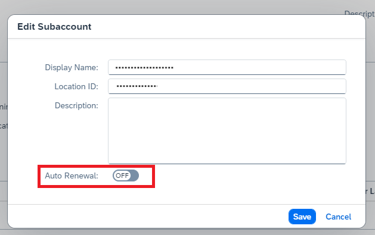
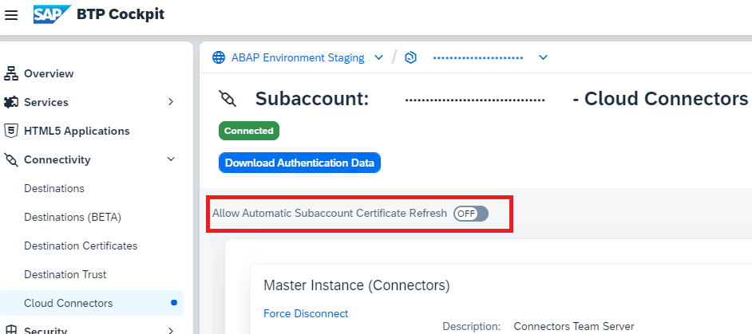

<!-- loio071708a655de4486b498cf5b16fb8ea8 -->

# Renew the Certificate for a Subaccount

Certificates used by the Cloud Connector are issued with a limited validity period. To prevent a downtime while refreshing the certificate, you can renew it for your subaccount directly from the administration UI.

> ### Note:  
> As of version 2.18.0, the Cloud Connector provides an automatic renewal option for the *Multi-Cloud environment*.

<a name="loio071708a655de4486b498cf5b16fb8ea8__section_f1x_j5y_vmb"/>

## Prerequisites

You must have the required subaccount authorizations on SAP BTP to renew certificates for your subaccount.

See:

-   [Connectivity: Technical Roles](getting-started-daca64d.md#loiodaca64dacc6148fcb5c70ed86082ef91__technical) \(**Cloud Foundry** environment\)

<a name="loio071708a655de4486b498cf5b16fb8ea8__section_lrc_k5y_vmb"/>

## Manual Renewal

> ### Tip:  
> Check the validity of the subaccount certificate in section **Subaccount Overview** of the overview page of the respective subaccount. You can use the procedure described below even if the certificate has already expired.

Proceed as follows to renew your subaccount certificate:

1.  Choose *Select Subaccount* at the top of the screen, select your subaccount, and navigate to the subaccount overview.
2.  Choose the *Certificate* button. Depending on the cloud environment, you can renew using authentication data from a file or manually by providing the subaccount user and password, or only the latter. The respective dialog or wizard is shown.

    > ### Tip:  
    > You can download an authentication data file from the *Cloud Connectors* view in your subaccount. Choose *Connectivity* \> *Cloud Connectors* \> *Download Authentication Data* from your subaccount menu. This feature is available for subaccounts in Multi-Cloud Foundation, feature set B only.

3.  Enter *<Subaccount User\>* and *<Password\>* \(or use the file with authentication data if the option is offered\) and choose *Renew* \(or *Finish*\). The certificate assigned to your subaccount is renewed.

    > ### Note:  
    > In the **Cloud Foundry** environment, you must provide your `Login E-mail` instead of a user ID as *<User Name\>*. The label of the respective input field is adapted accordingly.

    > ### Tip:  
    > When using SAP Cloud Identity Services - Identity Authentication \(IAS\) as platform identity provider with two-factor authentication \(2FA / MFA\) for your subaccount, you can simply append the required token to the regular password. For example, if your password is "eX7?6rUm" and the one-time passcode is "123456", you must enter "eX7?6rUm123456" into the *<Password\>* field.
    > 
    > **Appending the two-factor authentication** \(2FA / MFA\) token to the regular password **is not required** when updating the Cloud Connector subaccount certificate in the **Neo environment**.

<a name="loio071708a655de4486b498cf5b16fb8ea8__section_imj_vnj_m2c"/>

## Automatic Renewal

> ### Note:  
> This feature is only supported for SAP BTP, *Multi-Cloud environment*.

As of Cloud Connector version 2.18.0, you can schedule the renewal of subaccount certificates to renew them automatically before they expire. This feature is subaccount-specific, therefore you must enable it for each subaccount you want to use it for. You must activate this feature for the respective subaccounts also on the cloud side \(SAP BTP cockpit\).

In the **Cloud Connector UI**, activate the feature for a subaccount by opening the *Edit* dialog for that subaccount and switching on *Auto Renewal*:

In the **SAP BTP cockpit**, activate the feature via *Connectivity* \> *Cloud Connectors* of the respective subacount by switching on *Allow Automatic Subaccount Certificate Refresh*:

If automatic renewal is active, the date and time of the first renewal attempt is scheduled to occur n + 7 days before the certificate expires, where n is the minimal \(remaining\) validity period \(in days\) before an expiration alert is triggered. The minimal validity period is an alerting threshold that can be configured through the **Observation Configuration** of [Alerting](alerting-87bffd9.md). A failed renewal attempt will be rescheduled and retried 12 hours later. If automatic renewal is not successful within 7 days it will be cancelled.

> ### Restriction:  
> The automatic renewal is not available for all cloud regions from the very beginning. It will be activated one by one and will work once the toggle button becomes visible in the concrete region. If the button does not exist, you cannot use the feature.

