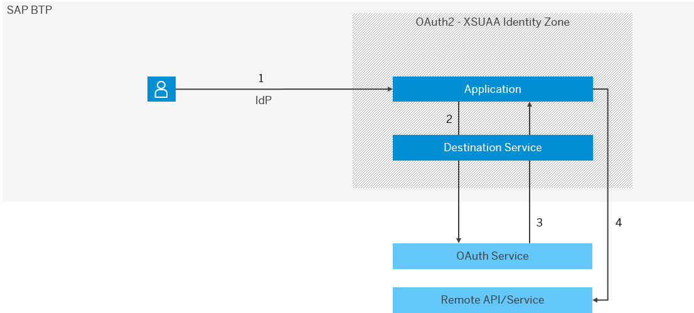

<!-- loio65b11d4ed333450ebebb8a2e25e805b7 -->

# Scenario: Cloud to Cloud

Forward the identity of cloud users from SAP BTP to remote systems on the Internet, enabling single sign-on \(SSO\).

<a name="loio65b11d4ed333450ebebb8a2e25e805b7__section_sw5_1qt_wpb"/>

## Concept

The Destination service provides a secure way of forwarding the identity of a cloud user to another remote system or service using a destination configuration with authentication type `OAuth2SAMLBearerAssertion`. This enables the cloud application to consume OAuth-protected APIs exposed by the target remote system.

<a name="loio65b11d4ed333450ebebb8a2e25e805b7__scenario_other"/>

## Scenario: Cloud to Cloud

1.  A user logs in to the cloud application. Its identity is established by an identity provider \(this can be the default IdP for the subaccount or another trusted IdP\).
2.  When the application retrieves an `OAuthSAMLBearer` destination, the user is made available to the Destination Service by means of a user exchange JWT. The service then wraps the user identity in a SAML assertion, signs it with the subaccount's private key and sends it to the specified OAuth token service.
3.  The OAuth token service accepts the SAML assertion and returns an OAuth access token. In turn, the Destination service returns both the destination and the access token to the requesting application.
4.  The application uses the destination properties and the access token to consume the remote API.

You can set up user propagation for connections to applications in different cloud systems or environments.

## Configuration: Cloud to Cloud

<table>
<tr>
<th valign="top">

Task Type

</th>
<th valign="top">

Task

</th>
</tr>
<tr>
<td valign="top">

Operator

</td>
<td valign="top">

[Set up Trust Between Systems](set-up-trust-between-systems-82dbeca.md)

</td>
</tr>
<tr>
<td valign="top">

Operator and/or Developer

</td>
<td valign="top">

[User Propagation via SAML 2.0 Bearer Assertion Flow](user-propagation-via-saml-2-0-bearer-assertion-flow-3cb7b81.md) \(Destination service\)

</td>
</tr>
</table>

**Use Cases: Cloud to Cloud**

-   [User Propagation from the Cloud Foundry Environment to SAP S/4HANA Cloud](user-propagation-from-the-cloud-foundry-environment-to-sap-s-4hana-cloud-9af03a0.md)
-   [User Propagation from the Cloud Foundry Environment to SAP SuccessFactors](user-propagation-from-the-cloud-foundry-environment-to-sap-successfactors-67a3b83.md)
-   [User Propagation between Cloud Foundry Applications](user-propagation-between-cloud-foundry-applications-8ebf60c.md)
-   [User Propagation from the Cloud Foundry Environment to the Neo Environment](user-propagation-from-the-cloud-foundry-environment-to-the-neo-environment-95dde76.md)

