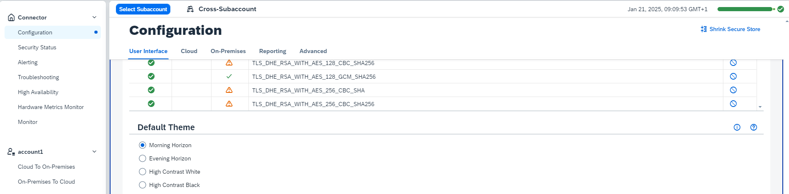
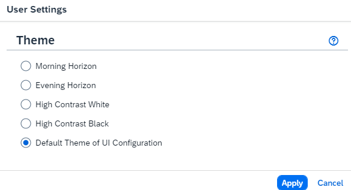

<!-- loioe7e8197957bf40ad94c393419802bf76 -->

# Theming

Theming in the Cloud Connector lets you customize UI design by choosing from four Horizon themes.

Theming or themes determine the general design or look of a UI. As of version 2.18.0, the Cloud Connector supports the Horizon themes *Morning Horizon*, *Evening Horizon*, as well as the two *High Contrast* variants *Black* and *White*. The default is *Morning Horizon*.

To change the default theme, choose *Configuration* from the main menu, go to tab *User Interface*, and select the desired theme from the *Default Theme* section \(you may have to scroll down\):

The default theme is applied to all pages that are not associated with a user \(such as the login page\) as well as pages associated with a user \(that is, any page displayed while a user is logged in\) unless you override the default theme through the respective user settings. To do this, open the drop-down button in the top right corner of the UI labeled with the user name and select *Settings*, which will open the following dialog:

Choose any of the four themes to override the default theme. You may revert to the default theme \(chosen by the administrator\) at any time.

> ### Note:  
> Changes to the default theme or to the user-specific theme that you made in one browser will not take effect in the UI of another browser unless you log out or press the *Reload* button of the browser \(that is, the *Reload* button typically located in the top *left* corner, not to be confused with the *Reload* button of the *Cloud Connector UI* located in the top *right* corner\).

