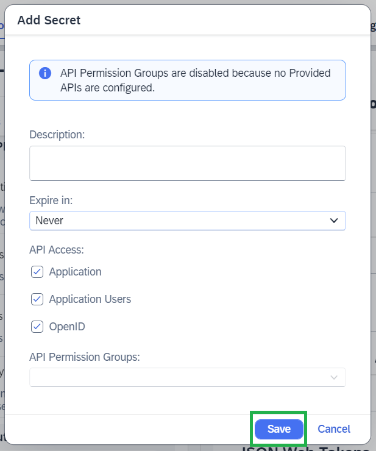

<!-- loioa943bb7457cf474d991a67acefe64557 -->

# Token Retrieval Using IAS-Signed SAML2.0 Assertions

Retrieve access tokens from token servers using IAS \(Identity Authentication service\)-signed SAML2.0 assertions.

The Destination service lets you retrieve access tokens from token servers using IAS-signed SAML2.0 assertions. This process can be simplified by the use of [Destination Chaining](destination-chaining-08a09f5.md), which automates the generation of the IAS-signed SAML2.0 assertion and its subsequent consumption by sending a single request to the Destination service. The specific chain used for this scenario is the [IAS-generated SAML Assertion to OAuth2 Bearer Token Chain](ias-generated-saml-assertion-to-oauth2-bearer-token-chain-d716d41.md).

> ### Note:  
> For more information on identity authentication, see [SAP Cloud Identity Services](https://help.sap.com/docs/cloud-identity-services/cloud-identity-services/landing-page?version=Cloud).

Find below the step-by-step description of a sample procedure using an *OpenID Connect* \(OIDC\) application.

> ### Note:  
> For more information on OIDC, see [OpenID Specifications](https://openid.net/developers/specs/).


<a name="loioa943bb7457cf474d991a67acefe64557__section_rpj_cfw_c2c"/>

## Prerequisites

**IAS**

*Create a New OIDC Application*

In your IAS account, choose the *Applications & Resources* tab and press the *Create* button.


Enter any **Display Name** for your application, and select `OpenID Connect` as your `Protocol Type`.


Press the *Create* button to finish creating your application.

*Configure the OIDC Application*

In the *Applications* section, select your new OIDC application. A window for your application will open on the right side of the screen. In the *Single Sign-On* section, select *OpenID Connect Configuration*.


Enter any name for the new configuration.


Scroll down to the **Grant Types** section. Select the *Token Exchange \(RFC 8693\)* checkbox, and press the *Save* button to save your configuration.


*Create a Client Secret for the OIDC Application*

In the application window, go to the *Application APIs* section and select *Client Authentication*. Then press the *Add* button to open the secret creation form.


No configurations are necessary here. Press the *Save* button to create the client secret.



A window will open, displaying the `Client ID` and the `Client Secret`. Save them as the window suggests, and then press *OK* to close the window.


*Create a New SAML2.0 Application*

In your IAS account, under the *Applications & Resources* tab, select the *Create* button in the same way as in the step for *OpenId Connect* application creation. Enter any **Display Name** for your application, and select SAML2.0 as your **Protocol Type**. Then press the *Create* button to finish creating your application.


*Configure the SAML2.0 Application*

Select your new SAML2.0 application from the *Applications* list. From the application window on the right, in the *Single Sign-On* section, select `SAML2.0 Configuration`.


Set any name for the configuration, press *Add URL*, and set the recipient endpoint of the generated SAML2.0 assertions.

> ### Note:  
> **SAML2.0 Recipient Info**
> 
> The recipient of a SAML2.0 assertion represents the token endpoint URL of the authorization server \(or an acceptable alias\). For more information, see [RFC7522](https://datatracker.ietf.org/doc/html/rfc7522#section-3).

Once the configuration is complete, press the *Save* button to apply it.


In the application window, go to the *Application APIs* section and select `Provided APIs`. In the newly opened window, select the `Allow all APIs for principal propagation` checkbox, and press the *Save* button to apply your change.


*Create a SAML2.0 Dependency*

Select your OIDC application. In the application window, go to the *Application APIs* section and select `Dependencies`. In the newly opened window, press the *Add* button.


In the *Add API* form, choose any name for your dependency, select your application from the drop down menu, and press the *Save* button to create the dependency.


**Destinations Service**

*Create an IAS-signed SAML2.0 Assertion Provider Destination*

> ### Caution:  
> The *OAuth Token Exchange* authentication is currently supported only by the Destination service REST API. For information on how to access it, see [Calling the Destination Service REST API](calling-the-destination-service-rest-api-84c5d38.md).

Request to the Destination service REST API:

> ### Sample Code:  
> ```
> curl https://<destination-service-host>/destination-configuration/v1/subaccountDestinations --request POST \
>   --header 'Authorization: Bearer <destination-service-access-token>' \
>   --header 'Content-Type: application/json' \
>   --data '{
>     "Name": "samlAssertionProviderDest",
>     "Type": "HTTP",
>     "ProxyType": "Internet",
>     "URL": "<any-backend-url>",
>     "Authentication": "OAuth2TokenExchange",
>     "tokenServiceURL": "<URL-of-your-IAS-tenant>/oauth2/token",
>     "clientId": "<IAS-client-id>",
>     "clientSecret": "<IAS-client-secret>",
>     "tokenServiceURL.queries.requested_token_type" : "urn:ietf:params:oauth:token-type:saml2",
>     "tokenServiceURL.queries.resource" : "urn:sap:identity:application:provider:name:<SAML-application-dependency-name>"
> }'
> ```

*Create an IAS-signed SAML2.0 Assertion Consumer Destination*

Request to the Destination service REST API:

> ### Sample Code:  
> ```
> curl https://<destination-service-host>/destination-configuration/v1/subaccountDestinations --request POST \
>   --header 'Authorization: Bearer <destination-service-access-token>' \
>   --header 'Content-Type: application/json' \
>   --data '{
>     "Name": "samlAssertionConsumerDest",
>     "Type": "HTTP",
>     "ProxyType": "Internet",
>     "URL": "<backend-system-host>",
>     "Authentication": "OAuth2SAMLBearerAssertion",
>     "tokenServiceURLType": "Dedicated",
>     "tokenServiceURL": "<SAML-assertion-consumer-token-service-URL>",
>     "clientKey": "<client-key>",
>     "SAMLAssertionProvider": "ClientProvided"
> }'
> ```


<a name="loioa943bb7457cf474d991a67acefe64557__section_n5f_jfw_c2c"/>

## Execution

To run the flow, the *Find a Destination* endpoint of the Destination service REST API must be called. For information on how to access the REST API, see [Calling the Destination Service REST API](calling-the-destination-service-rest-api-84c5d38.md).

Request to the Destination service REST API:

> ### Sample Code:  
> ```
> curl https://<destination-service-host>/destination-configuration/v1/destinations/samlAssertionConsumerDest --request GET \
>   --header 'Accept: */*' \
>   --header 'Authorization: Bearer <destination-service-access-token>' \
>   --header 'X-chain-name: com.sap.iasGeneratedOAuth2SamlBearerAssertion' \
>   --header 'X-chain-var-samlProviderDestinationName: samlAssertionProviderDest' \
>   --header 'X-chain-var-subjectToken: <subject-token-value>' \
>   --header 'X-chain-var-subjectTokenType: urn:ietf:params:oauth:token-type:access_token'
> ```

Where:

-   `X-chain-name`: The name of the chain, which will be processed as part of the request flow. The value will always equal "*com.sap.iasGeneratedOAuth2SamlBearerAssertion*".

    This chain is a predefined chain configured to support the successful execution of this particular flow.

    For more information, see [Predefined Destination Chains](predefined-destination-chains-3c82ad5.md).

-   `X-chain-var-samlProviderDestinationName`: The name of the `OAuth2TokenExchange` authentication destination, which will be processed in order to generate the IAS-signed SAML2.0 assertion.
-   `X-chain-var-subjectToken`: Represents the value of the subject token \(an access token usually associated with the user principal\), which will be provided to the IAS token server endpoint and exchanged for an IAS-signed SAML2.0 assertion.
-   `X-chain-var-subjectTokenType`: Represents the type of the subject token, which will be provided to the IAS token server endpoint and exchanged for an IAS-signed SAML2.0 assertion.

Example response:

> ### Sample Code:  
> ```
> {
>     "owner": {
>         "SubaccountId": "<subaccount-id>",
>         "InstanceId": "<instance-id>"
>     },
>     "destinationConfiguration": {
>         "Name": "samlAssertionConsumerDest",
>         "Type": "HTTP",
>         "ProxyType": "Internet",
>         "URL": "https://example.com",
>         "Authentication": "OAuth2SAMLBearerAssertion",
>         "tokenServiceURLType": "Dedicated",
>         "tokenServiceURL": "https://example-token-service.com/oauth/token",
>         "clientKey": "test-client-key",
>         "SAMLAssertionProvider": "ClientProvided"
>     },
>     "authTokens": [
>         {
>             "type": "Bearer",
>             "value": "<token-value>",
>             "http_header": {
>                 "key": "Authorization",
>                 "value": "Bearer <token-value>"
>             },
>             "expires_in": "3600"
>         }
>     ]
> }
> ```


<a name="loioa943bb7457cf474d991a67acefe64557__section_obq_w3w_c2c"/>

## Related Information

[Destination Chaining](destination-chaining-08a09f5.md)

[IAS-generated SAML Assertion to OAuth2 Bearer Token Chain](ias-generated-saml-assertion-to-oauth2-bearer-token-chain-d716d41.md)

[Configure Secrets for API Authentication](https://help.sap.com/docs/cloud-identity-services/cloud-identity-services/dev-configure-secrets-for-api-authentication?version=Cloud)

[Consuming APIs from Other Applications](https://help.sap.com/docs/cloud-identity-services/cloud-identity-services/consume-apis-from-other-applications?version=Cloud)

[Create OpenID Connect Application for Token Exchange](https://help.sap.com/docs/cloud-identity-services/cloud-identity-services/oidc-create-openid-connect-application-for-token-exchange?version=Cloud)

[Configure OpenID Connect Application for Token Exchange](https://help.sap.com/docs/cloud-identity-services/cloud-identity-services/token-exchange-configure-openid-connect-application-for-token-exchange?version=Cloud)

[Calling the Destination Service REST API](calling-the-destination-service-rest-api-84c5d38.md)

[OAuth Token Exchange Authentication](oauth-token-exchange-authentication-f4d28ea.md)

[OAuth SAML Bearer Assertion Authentication](oauth-saml-bearer-assertion-authentication-c69ea6a.md)

