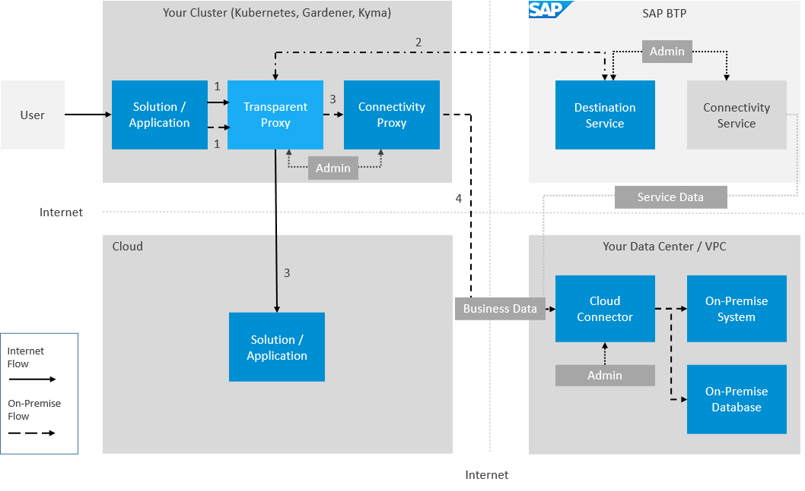

<!-- loioacc64ada71e34f98867f16fbcc471b5e -->

# Transparent Proxy for Kubernetes

Use the Transparent Proxy for Kubernetes to connect workloads on a Kubernetes cluster to Internet and on-premise applications.

> ### Note:  
> The on-premise use cases described in this guide are also applicable to virtual private cloud \(VPC\) environments.

The Transparent Proxy routes to SAP BTP destinations configured in the Destination service. On-premise applications must be exposed via [Cloud Connector](cloud-connector-e6c7616.md) \(installed in the same network right next to the on-premise system\) and [Connectivity Proxy for Kubernetes](connectivity-proxy-for-kubernetes-e661713.md) \(installed in the Kubernetes cluster\).

The Transparent Proxy is delivered as Docker images and a Helm chart. You need to run the image on your Kubernetes cluster with appropriate configurations. The Helm chart simplifies the installation process.

The Transparent Proxy handles the HTTP\(s\) protocol for Internet connections. For on-premise destinations, the Transparent Proxy handles the protocols HTTP, LDAP, MAIL \(SMTP, IMAP, POP3\), and TCP. It also supports IPv4, IPv6 and Dual-Stack client workloads, Kubernetes environments, and target systems.

The Transparent Proxy creates a Kubernetes service for each SAP BTP destination configuration exposed by a *destination custom resource*.

When an application tries to reach the desired system defined as a destination configuration, the Transparent Proxy:

-   Intercepts the traffic \(1\)
-   Calls the SAP BTP Destination service \(or uses the cached response for the destination value\) to obtain the configuration for the requested destination \(2\)
-   Enriches the request by providing a handshake with the Connectivity Proxy and authentication mechanism, and routes the traffic to the desired remote system:
    -   Directly for Internet-accessible solutions/applications/systems \(3\)

    -   Via the Connectivity Proxy \(3\) and the Cloud Connector \(4\) for on-premise systems

**Related Information**  

[Using the Transparent Proxy](using-the-transparent-proxy-c5257cf.md "Use the Transparent Proxy for Kubernetes in different SAP BTP communication scenarios.")

[Integration with SAP BTP Connectivity](integration-with-sap-btp-connectivity-aa9fc26.md "Integrate the Transparent Proxy with other SAP BTP Connectivity services.")

[Lifecycle Management](lifecycle-management-1c18e0c.md "Find informationn on installation, configuration, and sizing of the Transparent Proxy for Kubernetes.")

[Monitoring](monitoring-ba6f417.md "Check the availability, status, and destination custom resources of the Transparent Proxy for Kubernetes.")

[Troubleshooting](troubleshooting-fce292a.md "Find troubleshooting information for the Transparent Proxy for Kubernetes.")

[Recommended Actions](recommended-actions-20b1a62.md "To resolve issues with the Transparent Proxy for Kubernetes, follow the recommendations below.")

[Resilience](resilience-43b90bc.md "Improve resilience of the Transparent Proxy for Kubernetes.")

[Verification and Testing](verification-and-testing-86dde3e.md "Check the Transparent Proxy for Kubernetes after installation.")

[Transparent Proxy in the Kyma Environment](transparent-proxy-in-the-kyma-environment-1700cfe.md "Use the Transparent Proxy in the Kyma environment.")

[Concepts](concepts-3f9e8f1.md "Find information on basic concepts of the Transparent Proxy for Kubernetes.")

[Local Development](local-development-bcbcd9f.md "Find a local development guide for the Transparent Proxy for Kubernetes.")

[Transparent Proxy Operator](transparent-proxy-operator-2d826aa.md "Use the Transparent Proxy Operator for the Transparent Proxy for Kubernetes.")

[Integration with Zero Trust Identity Service \(ZTIS\)](integration-with-zero-trust-identity-service-ztis-4f7bb27.md "The Transparent Proxy architecture aligns with zero trust principles by enforcing the concept of &quot;never trust, always verify&quot; through its integration with workload identity frameworks.")

[Security Considerations](security-considerations-ac0c9e9.md "Recommended security measures for the Transparent Proxy for Kubernetes.")

